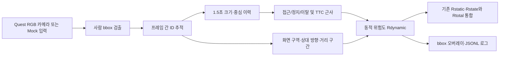

# 동적 객체 인식·위험도 Unity 구현 및 검증 문서

## 1. 구현 목표

중간보고서의 동적 객체 MVP를 Unity 앱 안에서 끝까지 실행할 수 있도록 구현했다.
현재 완성된 데이터 흐름은 다음과 같다.



Quest 3가 없어도 `DynamicRiskMock` 장면에서 B~I 전체를 검증할 수 있다.
실제 기기가 있어야만 확인 가능한 부분은 카메라 영상 취득, 권한 팝업, 영상 방향
및 실제 기기 성능뿐이다.

## 2. 중간보고서 반영 기준

### Bounding box와 상대 위치

- bbox 형식: 화면 정규화 중심 좌표 `(cx, cy, width, height)`, 범위 0~1
- 화면 구역:
  - `cx < 0.4`: Left
  - `0.4 <= cx <= 0.6`: Center
  - `cx > 0.6`: Right
- 사용자 기준 방향: `front-left`, `front-center`, `front-right`
- 방위각 근사: `(cx - 0.5) × 150°`
- bbox 면적 기반 거리 구간:
  - `area < 0.03`: Far
  - `0.03 <= area < 0.06`: Mid
  - `area >= 0.06`: Near

거리 구간은 미터 단위 실측값이 아니라 영상상 크기를 이용한 proxy다.

### 움직임과 TTC

- 최근 1.5초의 `sqrt(width × height)` 이력을 사용한다.
- 최소 4개 관측치와 0.25초의 관측 시간이 확보되기 전에는 `Unknown`이다.
- 연속 샘플의 로그 크기 변화율을 구한 뒤 중앙값과 지수 평활을 적용한다.
- 변화율 `>= 0.04/s`: Approaching
- 변화율 `<= -0.04/s`: Receding
- 그 외: Steady
- 접근 중일 때 `TTC proxy = 1 / scaleRate`를 사용한다.

이 TTC 역시 실제 충돌까지 남은 물리적 시간이 아니라 영상 기반 근사값이다.

### 동적 위험도

중간보고서의 수식을 그대로 사용한다.

```text
Rdynamic =
    0.30 Rproximity
  + 0.30 Rapproach
  + 0.15 RTTC
  + 0.10 Rpath
  + 0.05 Rtype
  + 0.10 Rproximity Rapproach
```

후처리로 검출 confidence 보정값 `0.5 + 0.5 × confidence`를 곱하고,
이탈 중인 객체에는 `0.55`를 곱한다.

위험 등급은 다음과 같다.

| 점수 | 등급 |
|---:|---|
| `< 0.25` | Safe |
| `< 0.50` | Caution |
| `< 0.75` | Warning |
| `>= 0.75` | Danger |

현재 객체 유형은 보고서의 중간 MVP 범위에 맞춰 `person`만 검출한다.

## 3. Unity 구현 구성

핵심 코드는
`unity-client/Assets/Scripts/AdaptivePassthrough` 아래에 있다.

| 구성 요소 | 역할 |
|---|---|
| `SimpleObjectTracker` | IoU와 중심 거리 기반으로 사람 ID 유지 |
| `HistoryMotionEstimator` | 접근/정지/이탈, TTC proxy 산출 |
| `RelativeLocationEstimator` | 화면 구역, 상대 방향, 거리 구간 산출 |
| `DynamicRiskEstimator` | 보고서 기반 동적 위험도와 등급 산출 |
| `DynamicRiskPipeline` | 검출부터 위험도까지 순차 처리 |
| `DynamicRiskController` | Unity 입력 소스와 파이프라인 연결 |
| `MockPersonDetectionSource` | Quest 없이 접근·정지·이탈 시퀀스 생성 |
| `DynamicRiskDebugOverlay` | bbox, ID, 방향, 움직임, TTC, 위험도 표시 |
| `DynamicRiskSessionLogger` | 결과를 JSONL 형식으로 기록 |
| `QuestPersonDetectionRunner` | Quest 카메라와 Unity Inference Engine 연결 |
| `QuestCameraPermissionCoordinator` | `HEADSET_CAMERA` 런타임 권한 요청 |

기존 `QuestRiskExperimentLogger`도 더 이상 `Rdynamic = 0`으로 고정하지 않는다.
현재 추적 중인 사람 가운데 최대 동적 위험도를 받아 다음 총위험도에 합친다.

```text
Rtotal =
    0.40 Rstatic
  + 0.20 Rstate
  + 0.40 Rdynamic
  + 0.00 Rintent
```

중간보고서는 총위험도의 구성식을 정의하지만 항목별 최종 가중치는 확정하지
않았으므로 위 값은 기기 실험을 위한 임시값이다. `Rintent`도 보고서의 중간 MVP
범위 밖이어서 현재 0이다.

## 4. 설치된 Quest 연결 요소

- Meta MR Utility Kit `203.0.0`
- Unity Inference Engine `2.6.1`
- Meta 공식 샘플의 `yolov9sentis.sentis`
- COCO `person` class ID `0`
- Android 권한 `horizonos.permission.HEADSET_CAMERA`
- Custom Android Manifest 사용
- Meta 프로젝트 설정의 Passthrough 및 Passthrough Camera Access 활성화
- Android application ID `com.pnu.teamvr.adaptivepassthrough`

### 생성된 Quest 테스트 APK

- 파일: `unity-client/Builds/Android/AdaptivePassthrough.apk`
- 앱 이름: `Adaptive Passthrough Safety`
- 버전: `0.1.0` (`versionCode 1`)
- ABI: `arm64-v8a`
- 최소/대상 Android SDK: 32/34
- 서명: Android debug key, APK Signature Scheme v2
- 포함 권한: `horizonos.permission.HEADSET_CAMERA`
- SHA-256:
  `DDA891CA8749609E5A2EE7FC1F3A9005DDE458CD6F285911C459F07F559A35C2`

이 APK는 현장 시험을 위한 Development Build이다. Meta Store 배포 전에는 릴리스
키로 다시 서명하고 Development Build를 해제해야 한다.

Quest의 개발자 모드와 USB 디버깅을 켠 뒤 다음 스크립트로 설치할 수 있다.

```powershell
cd unity-client
.\Tools\Install-Quest3.ps1 -Launch
```

기기가 여러 대 연결되어 있으면 `-Serial <기기 일련번호>`를 함께 지정한다.

`SampleScene`의 `Adaptive Dynamic Risk System`에는 다음 컴포넌트가 연결되어 있다.

1. `DynamicRiskController`
2. `DynamicRiskDebugOverlay`
3. `DynamicRiskSessionLogger`
4. `QuestCameraPermissionCoordinator`
5. `PassthroughCameraAccess`
6. `QuestPersonDetectionRunner`

모델, 카메라 접근 컴포넌트, 권한 관리자, 위험도 컨트롤러 참조도 장면에 저장되어
있다.

## 5. Quest 없이 실행하는 방법

1. Unity에서 `Assets/Scenes/DynamicRiskMock.unity`를 연다.
2. Play를 누른다.
3. 중앙 사람이 접근하면서 bbox가 커지고 위험도가 상승하는지 확인한다.
4. 5~7초에는 정지, 이후에는 이탈 상태로 전환되는지 확인한다.
5. 오른쪽의 두 번째 사람은 별도 ID로 유지되는지 확인한다.

검증 화면은
`unity-client/Assets/Validation/dynamic-risk-mock.png`에 저장되어 있다.

실행 로그는 다음 위치에 JSON Lines 형식으로 생성된다.

```text
Application.persistentDataPath/RiskLogs/dynamic-risk-YYYYMMDD-HHMMSS.jsonl
```

각 레코드는 track ID, bbox, confidence, 방향, 거리 구간, 움직임 상태, TTC proxy,
충돌 경로 계수, 동적 위험도, 등급, 판정 이유를 포함한다.

## 6. 자동 검증

Unity EditMode 테스트는 다음을 검증한다.

- 사람의 프레임 간 ID 유지
- 화면 구역 및 거리 구간 임계값
- 접근 판정과 TTC proxy
- 중간보고서 위험도 수식의 정확한 값
- 이탈 위험 감소 계수
- 총위험도 가중 합
- Sentis 모델의 1입력·3출력 계약
- `SampleScene`의 Quest 카메라·모델·위험도 연결 상태

Unity 메뉴의 `Window > General > Test Runner > EditMode`에서
`TeamVR.AdaptivePassthrough.Tests`를 실행할 수 있다.

Python 참조 구현도 같은 위험도 가중치로 맞췄다.

```powershell
cd ml-dynamic-object
python -m pytest
```

최종 자동 검증 결과는 Unity EditMode 9/9, Python 16/16 통과이다. Mock 장면에서도
접근하는 중앙 사람은 `Danger`, 측면의 정지한 사람은 `Safe`로 분리되는 것을
확인했다.

## 7. Quest 3에서만 남은 검증

다음 항목은 실제 Quest 3/3S가 있어야 검증할 수 있다.

1. Horizon OS에서 카메라 권한 허용 및 카메라 스트림 시작 확인
2. 좌/우 카메라 중 선택한 영상과 사용자의 실제 시야 정렬 확인
3. bbox 상하 반전 여부 확인 후 `Flip Vertical` 조정
4. 1280×960 입력에서 bbox 위치와 크기 보정 확인
5. 10 Hz 추론 시 앱 프레임 속도와 발열 측정
6. 사람 접근/정지/이탈 실험으로 임계값 및 `Rtotal` 가중치 조정
7. 로그를 이용한 오검출, ID 전환, 위험도 지연 분석

Meta 문서상 Passthrough Camera API는 XR Simulator에서 지원되지 않으므로 카메라
단계만은 모의 입력으로 완전히 대체할 수 없다.

## 8. 안전 관련 해석 제한

현재 위험도는 연구용 휴리스틱이다. bbox 크기에 기반한 거리를 실제 거리로,
TTC proxy를 실제 충돌 시각으로 해석하면 안 된다. 실제 안전 기능으로 사용하려면
기기별 카메라 보정, 실제 거리 또는 깊이 정보, 다양한 보행 방향 데이터, 지연과
오검출에 대한 안전 여유, 사용자 실험이 추가로 필요하다.
