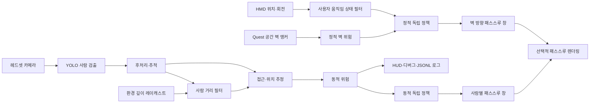

# Adaptive Passthrough Safety 구현 기반 역기획서

> 작성 기준일: 2026-08-07  
> 기준 버전: Unity Player `0.1.0`  
> 분석 원칙: 기획 문서의 주장보다 소스 코드, 활성 씬, 직렬화된 설정, 빌드 설정, 테스트 코드를 우선한다.

## 1. 문서 목적과 판정 기준

이 문서는 저장소에 실제로 존재하는 구현을 역으로 분석해 현재 제품의 동작 명세를 정리한다. 기존 README, 보고서, 명세서에만 있고 코드 또는 활성 씬에서 확인되지 않는 내용은 제품 기능으로 간주하지 않았다.

기능 상태는 다음 네 단계로 구분한다.

| 상태 | 판정 기준 |
|---|---|
| 활성 구현 | Android 빌드에 포함되는 `SampleScene`에 컴포넌트와 참조가 연결되어 있음 |
| 코드 구현 | 실행 가능한 코드와 테스트가 있으나 활성 빌드 씬에는 연결되지 않음 |
| 독립 프로토타입 | Unity 실행 경로와 분리된 Python 도구 또는 비활성 테스트 씬 |
| 구현 없음 | 실행 코드, 런타임 연결, 산출물이 없음 |

## 2. 제품 요약

현재 구현은 Meta Quest용 XR 안전 보조 프로토타입이다. 가상 환경을 유지하다가 아래 두 위험원을 독립적으로 평가해 필요한 화면 영역에서만 실제 환경을 노출한다.

- 정적 위험: 사용자가 공간 설정에서 인식된 벽에 가까워지거나 벽 쪽으로 이동하는 상황
- 동적 위험: 헤드셋 카메라로 검출한 사람이 가까이 있거나 사용자 쪽으로 접근하는 상황

두 위험원은 현재 하나의 총위험 점수로 합쳐지지 않는다. 정적 정책은 벽 방향 창을, 동적 정책은 사람별 창을 각각 제어한다. 둘 중 하나라도 보이는 창이 있으면 패스스루 레이어가 활성화된다.

핵심 제품 특성은 다음과 같다.

| 항목 | 현재 구현 |
|---|---|
| 실행 플랫폼 | Unity 6 Android XR, Meta Quest 계열 선언 |
| 기본 씬 | `Assets/Scenes/SampleScene.unity` 한 개만 빌드 활성 |
| 실제 환경 입력 | Quest 공간 앵커, 헤드셋 카메라, 환경 깊이 레이캐스트 |
| 동적 객체 대상 | COCO class ID 0인 `person`만 런타임 파이프라인에 전달 |
| 추론 위치 | Unity Inference Engine을 이용한 온디바이스 CPU 추론 |
| 시각화 방식 | 위험 방향 또는 사람 바운딩박스 부근의 제한된 화면 창으로 패스스루 노출 |
| 조작 | 오른쪽 컨트롤러 포인터와 A 버튼으로 정적/동적 표시 기능 개별 ON/OFF |
| 기록 | 동적 위험 프레임과 객체 평가 결과를 기기 로컬 JSONL로 저장 |
| 네트워크 | 서버 전송, 계정, 동기화 없음 |
| 개인화 | 오프라인 Python 실험 코드만 존재하며 Unity 런타임에는 미연결 |

## 3. 구현 범위

### 3.1 활성 빌드 기능

| 기능 | 상태 | 설명 |
|---|---|---|
| Quest 카메라 권한 요청 | 활성 구현 | 앱 시작 시 `horizonos.permission.HEADSET_CAMERA` 요청 |
| 공간 데이터 권한 및 방 로드 | 활성 구현 | `com.oculus.permission.USE_SCENE` 요청 후 방의 벽 앵커 로드 |
| 사용자 움직임 상태 분류 | 활성 구현 | HMD 위치·회전으로 Static/Dynamic/Agitated 안정 상태 계산 |
| 정적 벽 위험 계산 | 활성 구현 | 최근접 벽 평면까지 거리, TTC, 접근 가속도, 사각 위험을 결합 |
| 사람 온디바이스 검출 | 활성 구현 | 3출력 Sentis 모델에서 boxes/classes/scores를 읽음 |
| 사람 추적 안정화 | 활성 구현 | tentative/confirmed/lost 생명주기와 저신뢰 추적 유지 |
| 사람 깊이 추정 | 활성 구현 | 바운딩박스 내부 7개 환경 레이캐스트 표본을 필터링 |
| 동적 위험 계산 | 활성 구현 | 거리, 접근, TTC, 충돌 경로, 객체 종류, 신뢰도를 결합 |
| 선택적 패스스루 | 활성 구현 | 벽 1개 창과 사람 최대 3개 창을 독립 표시 |
| 기능 토글/HUD | 활성 구현 | 정적·동적 표시 기능 독립 토글 및 5 Hz 상태 표시 |
| 동적 위험 디버그 오버레이 | 활성 구현 | Editor 또는 Development Build에서 바운딩박스와 위험 표시 |
| 동적 위험 로깅 | 활성 구현 | `RiskLogs/dynamic-risk-*.jsonl` 생성 |

### 3.2 코드만 존재하거나 독립된 기능

| 기능 | 상태 | 활성 제품과의 관계 |
|---|---|---|
| 총위험 스냅샷 융합 | 코드 구현 | Static/State/Dynamic/Intent를 합치는 코드가 있으나 `SampleScene`에 없음 |
| 총위험 HUD/로그 | 코드 구현 | 컴포넌트는 있으나 활성 씬에 없음 |
| Intent 위험 | 코드 골격 | 스냅샷 컨트롤러가 항상 `IntentReady=false`를 넣음 |
| 동적 위험 Mock 씬 | 독립 프로토타입 | `DynamicRiskMock.unity`가 있으나 빌드 비활성 |
| USB 카메라 위험 분석 | 독립 프로토타입 | `ml-dynamic-object` Python 패키지로 Unity와 미연결 |
| 개인화 학습/ONNX 변환 | 독립 프로토타입 | `ml-personalization` 오프라인 스크립트만 존재 |
| Backend | 구현 없음 | 폴더에 14바이트 README만 존재 |
| Dashboard | 구현 없음 | 폴더에 16바이트 README만 존재 |

## 4. 사용자 경험

### 4.1 정상 사용 흐름

1. 사용자가 Quest에서 앱을 실행한다.
2. 앱이 헤드셋 카메라와 공간 데이터 권한을 요청한다.
3. 앱은 공간 설정에서 벽 평면을 불러오고 헤드셋 카메라 스트림을 연다.
4. 사용자가 가상 환경을 이용하는 동안 시스템은 다음을 병렬로 수행한다.
   - HMD 움직임과 벽 관계로 정적 위험 계산
   - 카메라 영상에서 사람 검출, 추적, 거리·접근 분석, 동적 위험 계산
5. 정적 정책이 켜지면 현재 시야 안의 위험 벽 방향에 세로형 패스스루 창을 연다.
6. 동적 정책이 켜지면 위험한 사람 위치에 사람별 패스스루 창을 연다.
7. 사용자는 HUD에서 두 정책 상태, 위험 점수, 사람 수, 깊이·접근 정보를 확인한다.
8. 사용자는 오른쪽 컨트롤러로 `STATIC PASSTHROUGH` 또는 `DYNAMIC PASSTHROUGH` 버튼을 눌러 해당 표시만 시험적으로 끌 수 있다.

### 4.2 입력이 준비되지 않은 경우

- 공간 권한이 없거나 공간 설정에 방이 없으면 정적 위험은 `unavailable`이며 벽 창은 열리지 않는다.
- 카메라가 재생 중이 아니거나 동적 프레임이 0.5초보다 오래되면 동적 위험은 `unavailable`이며 사람 창은 열리지 않는다.
- 환경 깊이를 사용할 수 없으면 사람의 바운딩박스 크기를 거리 대체값으로 사용한다.
- 일시적으로 사람 검출이 끊기면 추적 위험을 짧게 유지하면서 화면 창은 0.6초간 유지한 뒤 0.3초 동안 사라진다.
- 표시할 창이 하나도 없으면 OVR 패스스루 레이어 자체를 숨긴다.

## 5. 활성 런타임 구조



활성 씬의 주요 GameObject는 `Adaptive Dynamic Risk System`, `RiskExperimentLogger`, `DistanceCanvas`, `CenterEyeAnchor`의 OVR 패스스루 레이어다. 동적 위험 시스템 오브젝트에는 카메라 권한, 카메라 접근, 사람 검출, 환경 깊이, 추적·위험 컨트롤러, 독립 정책, 선택적 표시, 디버그, 로거가 연결되어 있다.

## 6. 정적 위험 시스템

### 6.1 공간 데이터 수집

정적 위험은 Guardian 경계 도형이 아니라 Scene API의 방 앵커를 사용한다.

- `OVRRoomLayout` 앵커를 모두 조회한다.
- 각 방의 자식 앵커 중 `WallFace` 또는 `InvisibleWallFace` 라벨만 선택한다.
- 앵커의 월드 위치와 `forward` 방향을 벽 평면의 점과 법선으로 저장한다.
- 바닥, 천장, 문, 가구, 벽 폴리곤의 실제 너비·높이는 위험 계산에 쓰지 않는다.
- 활성 씬의 별도 `QuestBoundaryLogger`는 GameObject가 비활성이고 정적 정책에 사용되지 않는다.

### 6.2 사용자 움직임 상태

HMD 위치와 회전을 프레임마다 받아 속도, 가속도, 각속도에 지수 이동 평균을 적용한다.

| 필터 | 시간 상수 |
|---|---:|
| 속도 | 0.35초 |
| 가속도 | 0.45초 |
| 각속도 | 0.35초 |

상태는 임계값과 지속시간을 모두 충족해야 바뀐다.

| 전이 판단 | 속도 | 가속도 | 각속도 | 지속시간 |
|---|---:|---:|---:|---:|
| Static 진입 | `< 0.04 m/s` | `< 0.25 m/s²` | `< 0.25 rad/s` | 0.75초 |
| Static 이탈 | `> 0.08 m/s` | `> 0.50 m/s²` | `> 0.60 rad/s` | 0.25초 |
| Agitated 진입 | `> 1.00 m/s` | `> 5.00 m/s²` | `> 2.50 rad/s` | 0.25초 |
| Agitated 이탈 | 세 값이 각각 `< 0.75`, `< 3.50`, `< 1.80` |  |  | 0.75초 |

샘플 간격이 0.001초 미만이거나 0.1초를 초과하면 그 샘플은 상태 갱신에 사용하지 않고 운동 기준점만 재설정한다.

상태 위험은 다음 고정값이다.

| 상태 | 상태 위험 `Rstate` |
|---|---:|
| Static | 0.0 |
| Dynamic | 0.5 |
| Agitated | 1.0 |

### 6.3 벽 위험 계산

모든 벽을 무한 평면으로 보고 HMD와의 수직 거리 절댓값이 가장 작은 벽을 선택한다.

```text
distance = abs(dot(hmdPosition - wallPoint, wallNormal))
directionToWall = -sign(signedDistance) * wallNormal
towardSpeed = max(0, dot(filteredVelocity, directionToWall))
towardAcceleration = max(0, dot(filteredAcceleration, directionToWall))
TTC = distance / towardSpeed, 단 towardSpeed > 0.01 m/s일 때만 유효
```

위험 성분은 다음과 같다.

```text
Rd     = 1 - clamp01(distance / 0.8 m)
RTTC   = 1 - clamp01(TTC / 2.0 s), 접근 중이 아니면 0
Ra     = clamp01(towardAcceleration / 5.0 m/s²)
Rblind = 0.2  (벽 방향과 시선 각도 < 60°)
         0.5  (60° 이상 120° 미만)
         0.8  (120° 이상)

Rstatic = 0.35*Rd + 0.30*RTTC + 0.20*Ra + 0.15*Rblind
```

활성 씬의 가중치 합은 1.0이므로 별도 정규화 결과도 위 식과 같다.

### 6.4 정적 정책

정적 정책에 들어가는 최종 판단 위험은 다음과 같다.

```text
RstaticPolicy = 0.60*Rstatic + 0.40*Rstate
```

정책은 20 Hz로 평가되며 히스테리시스를 적용한다.

| 설정 | 값 |
|---|---:|
| ON 임계값 | 0.60 이상 |
| OFF 임계값 | 0.50 미만 |
| ON 이후 최소 유지 | 0.50초 |

공간 데이터와 정적 측정값이 준비되지 않으면 정책은 즉시 OFF가 된다.

### 6.5 벽 패스스루 창

- 최근접 벽 방향이 현재 카메라 앞쪽이고 뷰포트 가장자리 2% 안쪽에 있을 때만 표시한다.
- 뒤쪽 또는 시야 밖의 벽은 정책 위험이 높아도 창을 만들지 않는다.
- 창 너비는 위험에 따라 화면 폭의 24%에서 52%까지 선형 증가한다.
- 벽 방향이 화면 왼쪽 40%보다 작으면 왼쪽에, 오른쪽 40%보다 크면 오른쪽에 붙인다. 중앙 구간은 벽 방향을 중심으로 둔다.
- 위아래 8%를 제외한 세로 영역을 사용하고 가장자리에 0.16 feather를 적용한다.
- 정적 창은 최대 1개다.

## 7. 동적 사람 위험 시스템

### 7.1 카메라와 모델

활성 씬 설정은 다음과 같다.

| 항목 | 값 |
|---|---:|
| 카메라 요청 해상도 | 1280×960 |
| 카메라 최대 프레임레이트 | 60 fps |
| 추론 주기 | 10 Hz |
| 추론 백엔드 | CPU |
| 모델 | `Assets/Models/yolov9sentis.sentis` |
| 입력 계약 | 4차원 NCHW |
| 출력 계약 | 0: boxes, 1: class IDs, 2: scores |
| 대상 클래스 | class ID 0, 결과 라벨 `person` |

카메라 텍스처를 모델 입력 텐서로 변환하고 비동기 CPU readback 후 후처리한다. 한 추론이 진행 중일 때 다음 추론은 시작하지 않는다.

### 7.2 검출 후처리

| 설정 | 값 |
|---|---:|
| 신규 검출 신뢰도 | 0.55 |
| 기존 추적 유지용 신뢰도 | 0.35 |
| NMS IoU | 0.45 |
| 최대 후보 수 | 50 |
| 최대 최종 검출 수 | 10 |
| 화면 내 최소 가시 비율 | 15% |
| 허용 정규화 최대 변 길이 | 2.0 |
| 박스 형식 | center X/Y/width/height |
| 좌표 형식 | 모델 픽셀 좌표 |
| 수직 뒤집기 | 사용 안 함 |

0.35 이상 0.55 미만인 사람 검출은 기존 확정 트랙과의 연결에는 사용할 수 있지만 새 트랙은 만들 수 없다. 후보는 신뢰도 내림차순으로 정렬하고 NMS 후 최대 10명만 전달한다.

### 7.3 사람 추적

추적기는 프레임 간 바운딩박스를 탐욕적으로 매칭한다.

| 항목 | 값 |
|---|---:|
| 최소 IoU | 0.15 |
| 최대 중심 거리 | 0.22 |
| 최대 면적 비율 | 2.5배 |
| 일반 확정 | 최근 5프레임 중 3회 관측 |
| 빠른 확정 | 신뢰도 0.85 이상 2회 연속 |
| 최대 누락 프레임 | 8 |
| 최대 미관측 시간 | 0.75초 |

생명주기는 `Tentative → Confirmed → Lost`다.

- Tentative 객체는 위험 평가와 사람 수에서 제외한다.
- Confirmed 객체를 한 프레임 놓치면 Lost가 된다.
- Lost 객체가 다시 보이면 같은 ID로 Confirmed가 된다.
- Lost 동안 이전 평가 위험은 최대 40%까지 선형 감소해 유지된다.
- 8프레임을 초과해 놓치거나 0.75초를 넘기면 트랙을 제거한다.

### 7.4 깊이 기반 거리 추정

사람 바운딩박스 내부의 상체와 몸통을 중심으로 7개 지점에 환경 레이캐스트를 수행한다. 최대 레이 거리는 6 m다.

유효 거리 표본은 0.2~6.0 m 범위로 제한한다. 정렬된 표본에서 인접 간격이 0.35 m 이하인 군집을 만들고, 최소 3개 표본을 가진 가장 가까운 군집의 중앙값을 사람 거리로 선택한다. 이 방식은 사람 뒤 벽의 더 먼 표본을 배제하려는 동작이다.

필터 설정은 다음과 같다.

| 항목 | 값 |
|---|---:|
| 원시 거리 중앙값 창 | 최근 5개 |
| EMA 시간 상수 | 0.25초 |
| 점프 억제 기준 | 기존값과 1.5 m 초과 차이 |
| 점프 확정 | 같은 방향 2회 |
| 마지막 metric 값 유지 | 0.5초 |

거리 신뢰도는 `선택 표본 수 / 요청 표본 수 × exp(-군집 폭 / 0.35)`로 계산한다.

Metric 거리가 있으면 거리 구간은 다음과 같다.

| 거리 | 구간 |
|---|---|
| `≤ 1.5 m` | Near |
| `≤ 3.0 m` | Mid |
| `> 3.0 m` | Far |

깊이가 없으면 바운딩박스 면적을 대체값으로 사용한다.

| 바운딩박스 면적 | 구간 |
|---|---|
| `< 0.03` | Far |
| `< 0.06` | Mid |
| `≥ 0.06` | Near |

### 7.5 접근 상태와 TTC

Metric 거리가 있으면 최근 0.8초의 거리 표본에 선형 회귀를 적용한다.

| 항목 | 값 |
|---|---:|
| 최소 표본 | 3개 |
| 최소 관측시간 | 0.20초 |
| 접근 진입 | closing speed `≥ 0.15 m/s` |
| 이탈 진입 | closing speed `≤ -0.15 m/s` |
| 상태 유지 이탈선 | `±0.05 m/s` |
| closing speed EMA | 0.25초 |
| TTC 생성 조건 | closing speed `> 0.10 m/s` |
| TTC 상한 | 15초 |

Metric 거리가 없으면 최근 1.5초 동안의 바운딩박스 크기 변화율을 이용한다.

| 항목 | 값 |
|---|---:|
| 최소 표본 | 4개 |
| 최소 관측시간 | 0.25초 |
| 접근 임계값 | 로그 스케일 변화율 `≥ 0.04/s` |
| 이탈 임계값 | 로그 스케일 변화율 `≤ -0.04/s` |
| 근사 TTC | 접근 시 `1 / scaleRate` |

### 7.6 동적 위험 점수

사람별 위험은 아래 성분을 결합한다.

```text
RdynamicRaw =
    0.30*proximity
  + 0.30*approach
  + 0.15*ttc
  + 0.10*collisionPath
  + 0.05*objectType
  + 0.10*(proximity*approach)

confidenceFactor = 0.5 + 0.5*detectionConfidence
Rdynamic = clamp01(RdynamicRaw * confidenceFactor * recedingCorrection)
```

사람의 `objectType` 값은 0.65다. 런타임 입력이 사람만 통과시키므로 다른 객체 종류별 가중치는 현재 활성 경로에서 사용되지 않는다.

Metric 근접도는 다음 구간을 선형 보간한다.

| 거리 | 근접도 |
|---|---:|
| `≤ 0.60 m` | 1.00 |
| `0.60~1.50 m` | 1.00 → 0.55 |
| `1.50~3.00 m` | 0.55 → 0.15 |
| `> 3.00 m` | 0.15 |

바운딩박스 대체 모드에서는 Near/Mid/Far가 각각 1.00/0.55/0.15다.

접근도는 Metric 모드에서 `clamp01(closingSpeed / 1.2) × reliability`, 대체 모드에서 `clamp01(scaleRate / 0.15) × reliability`다. TTC 성분은 2초 이하 1.0, 15초 이상 0.0이며 그 사이를 선형 보간한다.

충돌 경로 성분은 화면 중심에 가까울수록 커지고, 객체 중심이 화면 중심으로 이동하는 속도로 최대 25% 보정된다.

이탈 중인 사람은 기본적으로 점수에 0.55를 곱한다. 단 Metric 거리가 0.6 m 이하인 매우 가까운 사람은 0.85를 곱해 위험을 덜 낮춘다.

| 동적 위험 점수 | 등급 |
|---|---|
| `< 0.25` | Safe |
| `< 0.50` | Caution |
| `< 0.75` | Warning |
| `≥ 0.75` | Danger |

프레임 대표 동적 위험은 확정된 모든 사람 중 최대 점수다.

### 7.7 동적 정책

동적 정책은 20 Hz로 평가한다.

| 설정 | 값 |
|---|---:|
| 입력 가용 조건 | 카메라 재생 중이며 최근 위험 프레임 나이 `≤ 0.50초` |
| ON 임계값 | 최대 동적 위험 `≥ 0.60` |
| OFF 임계값 | 최대 동적 위험 `< 0.45` |
| ON 이후 최소 유지 | 0.75초 |

### 7.8 사람 패스스루 창

동적 정책이 ON일 때 현재 프레임에서 실제 관측된 사람 중 점수 0.50 이상만 창 후보가 된다.

- 위험 점수 내림차순으로 최대 3명 선택
- 모든 사람 창 면적 합의 목표 상한은 화면의 45%
- 표시 뷰포트는 전체 화면 정규화 좌표 `(0.05, 0.18, 0.90, 0.72)`
- 창 너비 범위: 화면의 10~32%
- 창 높이 범위: 화면의 16~48%
- 위험이 커질수록 창 크기를 최대 약 5% 확대
- 위치 스무딩 시간 상수: 0.15초
- 크기 스무딩 시간 상수: 0.25초
- 페이드 인: 0.20초
- 검출 유실 유지: 0.60초
- 페이드 아웃: 0.30초
- 가장자리 feather: 0.08

동적 정책의 최소 유지시간이 끝나기 전에 위험 객체가 사라져도 사람 창 추적기의 유지·페이드 규칙이 별도로 적용된다.

## 8. 선택적 패스스루 렌더링

런타임에 clip-space quad와 전용 재질을 생성한다. 정적 벽 창 하나와 필요한 수의 사람 창을 각각 별도 `MeshRenderer`로 관리한다.

전용 셰이더는 창 중앙에서 가상 화면의 알파를 낮추고 가장자리에서 부드럽게 복원한다. 그 결과 뒤쪽의 OVR 패스스루 레이어가 지정된 화면 영역에서만 드러난다.

- 패스스루 레이어 opacity는 1.0으로 고정한다.
- 정적 창과 동적 창은 동시에 보일 수 있다.
- 하나 이상의 창이 보일 때만 패스스루 레이어의 `hidden`을 해제한다.
- 창이 없거나 컴포넌트가 비활성화되면 모든 렌더러와 패스스루 레이어를 숨긴다.
- 셰이더를 찾지 못하거나 지원하지 않으면 오류를 기록하고 선택적 렌더링을 초기화하지 않는다.

## 9. UI와 조작

### 9.1 월드 스페이스 HUD

`DistanceCanvas`는 1100×650 크기의 월드 스페이스 Canvas이며, 런타임에 HMD 정면 2 m, 아래쪽 0.15 m 위치로 이동하고 HMD 회전을 따른다.

HUD는 5 Hz로 다음 내용을 갱신한다.

- 정적 기능 활성/시험 OFF 상태
- 정적 정책 ON/OFF, 정책 위험, 벽 창 표시 상태
- 동적 기능 활성/시험 OFF 상태
- 동적 정책 ON/OFF, 최대 위험, 확정 사람 수
- 최고 위험 사람의 track ID
- Metric 깊이 또는 BBOX 대체 여부
- closing speed와 metric TTC
- 패스스루 레이어 활성 상태

별도의 기존 좌·우 텍스트 패널에는 벽 거리, HMD/손 움직임, 사용자 상태, 정적 위험 세부 성분도 표시한다.

### 9.2 기능 토글

초기 상태는 정적·동적 모두 ON이다.

- 오른쪽 컨트롤러 포인터와 A 버튼을 사용하도록 안내 문구가 표시된다.
- Canvas에는 `OVRRaycaster`, 씬에는 `OVRInputModule`과 `EventSystem`이 연결되어 있다.
- ON은 녹색, OFF는 적색으로 버튼 색을 바꾼다.
- 토글은 위험 계산, 카메라 추론, 로깅을 중지하지 않고 해당 패스스루 창 표시만 끈다.

### 9.3 개발용 동적 오버레이

Editor 또는 Development Build에서만 사람 바운딩박스와 다음 정보를 그린다.

- track ID
- 위험 점수와 등급
- 상대 방향
- 접근 상태
- 바운딩박스 기반 근사 TTC

색상은 Safe=녹색, Caution=노랑, Warning=주황, Danger=빨강이다. 활성 씬에서는 배경 패널과 헤더를 숨겨 주 HUD와 겹침을 줄인다.

## 10. 로깅과 데이터

### 10.1 활성 동적 위험 로그

앱 실행 중 `Application.persistentDataPath/RiskLogs`에 다음 파일을 생성한다.

```text
dynamic-risk-YYYYMMDD-HHmmss.jsonl
```

한 위험 프레임마다 `frame` 레코드 1개와 사람별 `assessment` 레코드를 기록하고 10개 레코드마다 flush한다.

주요 필드는 다음과 같다.

| 그룹 | 필드 |
|---|---|
| 공통 | UTC, 런타임 timestamp, record type, 확정 사람 수 |
| 검출 | track ID, label, confidence, center/width/height |
| 위치 | screen zone, user-relative direction, distance band |
| 깊이 | source, availability, raw/filtered distance, confidence |
| 움직임 | state, scale rate, closing speed, 근사 TTC, metric TTC |
| 위험 | collision path, dynamic risk, level, reasons |
| 표시 | observed 여부, 창 좌표·크기·opacity |

활성 씬에는 총위험 스냅샷 공급자가 없으므로 `latestRiskSnapshotSequence`는 0으로 기록된다.

### 10.2 외부 전송

로그 업로드, REST API, 데이터베이스 저장, 사용자 계정 연결 코드는 없다. 모든 활성 로그는 기기 로컬 파일에만 남는다.

## 11. 권한과 실패 처리

| 상황 | 구현된 처리 |
|---|---|
| 헤드셋 카메라 권한 거부 | 카메라가 준비되지 않아 동적 정책을 unavailable/OFF 처리 |
| Scene 권한 거부 | 정적 측정과 정적 정책을 unavailable/OFF 처리하고 UI에 거부 표시 |
| 공간 설정 없음 | `Run Space Setup` 안내, 정적 정책 OFF |
| OVRCameraRig 없음 | 정적 공간 로드 중단, 오류 문구 표시 |
| 모델 미할당 | 추론 Worker를 만들지 않음 |
| 모델 입력이 4D NCHW가 아님 | 오류 로그 후 Worker 생성 중단 |
| 모델 3출력 계약 불일치 | 오류 로그 후 해당 추론 결과 폐기 |
| 카메라 텍스처 없음 | 해당 추론 건너뜀 |
| 추론 예외 | 오류 로그 후 다음 주기에 재시도 가능 |
| 환경 깊이 미지원/미준비 | 최근 metric 값을 최대 0.5초 유지한 뒤 BBOX 대체 |
| 깊이 표본 부족 | BBOX 대체 |
| 동적 프레임 stale | 위험 0, 동적 정책 OFF |
| 위험 입력의 NaN/Infinity | 대부분 0 또는 안전한 기본값으로 정규화 |
| 패스스루 셰이더 없음 | 선택적 표시 비활성, 오류 로그 |

## 12. 코드가 있으나 활성 제품에 연결되지 않은 기능

### 12.1 총위험 스냅샷

`RiskSnapshotBuilder`, `QuestRiskSnapshotController`, `QuestRiskHud`, `RiskSnapshotSessionLogger`가 구현되어 있으나 활성 `SampleScene`에는 존재하지 않는다.

이 코드 경로의 기본 융합 가중치는 다음과 같다.

```text
Rtotal = 0.40*Rstatic + 0.20*Rstate + 0.40*Rdynamic + 0.00*Rintent
```

사용할 수 없는 입력은 가중치 합에서 제외하고 나머지를 재정규화한다. 기본 판단 모드는 단일 0.60 임계값인 `CompatibilityThreshold`다. 총위험 등급은 `<0.30 Safe`, `<0.60 Caution`, `<0.80 Warning`, 그 이상 Danger다.

그러나 현재 활성 UX와 패스스루 렌더링은 이 `Rtotal`을 사용하지 않는다. 정적·동적 독립 정책이 실제 표시를 제어한다.

### 12.2 Intent 위험

데이터 모델과 가중치 자리는 있으나 실제 Intent 추정기는 없다. 스냅샷 컨트롤러도 매 프레임 `IntentReady=false`, 위험과 신뢰도 0을 넣는다.

### 12.3 Mock 동적 위험 씬

`DynamicRiskMock.unity`는 빌드 비활성이다. 12초 주기로 한 사람이 접근했다 멀어지는 바운딩박스와 선택적인 두 번째 사람을 생성해 동적 위험 컨트롤러, 오버레이, 로그를 하드웨어 없이 시험한다. Android에서는 기본적으로 실행하지 않는다.

## 13. 독립 Python 동적 위험 프로토타입

`ml-dynamic-object`는 Unity와 별개의 Python 3.10+ 패키지다.

구현된 기능은 다음과 같다.

- 메모리 기반 Mock 카메라와 OpenCV USB 카메라 입력
- FakeDetector 또는 YOLOv8 스타일 ONNX 사람 검출
- 중심 거리 기반 간단 추적
- 바운딩박스 크기 이력 기반 접근/이탈/TTC 추정
- 화면 구역과 전방 상대 방향 추정
- Unity와 유사한 설명 가능한 가중 위험식
- stdout JSON, 누적 NDJSON, 최신 JSON 파일 출력
- 미리보기 창에 바운딩박스와 위험 표시
- Ultralytics YOLOv8n을 ONNX로 내보내는 스크립트

이 프로토타입은 깊이 레이캐스트, Quest 권한, 선택적 패스스루 렌더링, Unity 런타임 통신을 포함하지 않는다. ONNX 모델 파일도 저장소에 포함되어 있지 않고 `.gitkeep`만 존재한다.

하드웨어 없는 Mock 데모는 현재 환경에서 실행되었으며 마지막 프레임에서 접근 중인 사람을 Danger 0.784로 출력했다.

## 14. 독립 개인화 프로토타입

`ml-personalization`에는 합성 로그를 이용한 오프라인 실험 스크립트가 있다. 생성 데이터와 학습 모델은 저장소에 포함되어 있지 않다.

### 14.1 데이터와 라벨

합성 세션 30개를 만들고 세션별 20~50개 패스스루 이벤트를 생성한다. 이벤트 라벨 규칙은 다음과 같다.

| 조건 | 라벨 |
|---|---|
| 수동 해제이며 지속시간 `< 2초` | Negative |
| 수동 해제 없음이며 지속시간 `≥ 3초` | Positive |
| 그 외 | Neutral |

이벤트 10개, stride 5의 슬라이딩 창에서 7차원 feature를 만든다.

```text
[활성 빈도, 수동 해제 비율, 평균 지속시간,
 평균 HMD 속도, 최대 HMD 속도, 정규화 공간 크기, 정규화 세션 시간]
```

### 14.2 학습과 매핑

- RandomForestClassifier: 100 trees, max depth 5
- 출력 클래스: Positive/Negative/Neutral
- 학습 모델: `rf_personalization.joblib`
- 변환 모델: `rf_personalization.onnx`
- 변환 후 sklearn과 ONNX의 클래스·확률 일치 검증 코드 포함
- cold-start 기준: 세션 수 5 미만
- 기본 가중치: `w_c=0.30, w_s=0.20, w_d=0.30, w_i=0.20`
- 기본 시각화 임계값: `tau_viz=0.50`

`personalize.py`는 Negative 예측 확률이 0.5보다 높을 때 `w_c`를 최대 0.1 낮추고, 감소분을 다른 세 가중치에 비례 재분배하며 `tau_viz`를 같은 양만큼 올린다.

다만 다음 이유로 현재 제품 개인화 기능으로 볼 수 없다.

- Unity에서 개인화 ONNX를 로드하거나 결과를 정책 파라미터에 적용하는 코드가 없다.
- 활성 동적 JSONL과 개인화 학습 CSV 사이의 변환·수집 연결이 없다.
- `cold_start.get_personalized_params()`의 5세션 이상 분기는 아직 기본값 fallback을 반환한다.
- `test_personalization.py`만 `personalize.py`의 매핑을 직접 호출한다.
- `data`와 `models` 산출물이 저장소에 없다.

## 15. 빌드 및 기술 구성

| 항목 | 값 |
|---|---|
| Unity | 6000.4.2f1 |
| 렌더 파이프라인 | URP 17.4.0 |
| XR | OpenXR 1.17.1 + Meta XR SDK 203.0.0 |
| MRUK | 203.0.0 |
| 추론 | Unity AI Inference 2.6.1 |
| 입력 시스템 | Unity Input System 1.19.0 |
| Android 스크립팅 백엔드 | IL2CPP |
| 앱 이름 | Adaptive Passthrough Safety |
| 패키지 ID | `com.pnu.teamvr.adaptivepassthrough` |
| 버전 | 0.1.0, version code 1 |
| Android API | min 32, target 34 |
| Horizon OS SDK | min 60, target 203 |
| 선언 기기 | quest2, questpro, quest3, quest3s |
| 활성 빌드 씬 | `Assets/Scenes/SampleScene.unity` |

Manifest에 HEADSET_CAMERA, USE_SCENE, 선택적 HAND_TRACKING 권한이 선언되어 있다. 손 추적 지원은 설정에 있으나 현재 기능 토글은 오른쪽 컨트롤러 포인터를 기준으로 구성되어 있다.

## 16. 현재 구현의 명확한 제약

다음은 소스에서 직접 확인되는 현재 한계다.

1. 정적 위험은 벽을 무한 평면으로 계산하므로 벽의 실제 가로·세로 범위 밖에서도 해당 평면이 최근접으로 선택될 수 있다.
2. 뒤쪽 또는 시야 밖의 위험 벽을 표시하는 UI는 코드에서 의도적으로 보류되어 있다.
3. 동적 런타임은 사람만 통과시키므로 차량·자전거·반려동물용 객체 가중치 코드는 활성 입력에서 쓰이지 않는다.
4. 환경 깊이 레이캐스트가 사람 자체가 아니라 뒤쪽 환경에 맞을 수 있으며, 현재는 최근접 군집 선택으로만 완화한다.
5. 첫 번째 사람 창은 단독으로 45% 면적 상한을 넘더라도 표시될 수 있다. 면적 상한 검사는 이미 추가된 창이 있을 때만 후보를 건너뛴다.
6. 정적/동적 토글은 계산 비용을 줄이지 않고 표시만 숨긴다.
7. 활성 패스스루 의사결정에는 총위험 융합과 개인화가 사용되지 않는다.
8. 로컬 로그를 서버나 대시보드로 보내는 구현이 없다.
9. 실제 Quest 기기 E2E 자동 테스트와 PlayMode 테스트는 저장소에서 확인되지 않는다.
10. Python 개인화는 합성 데이터 생성과 오프라인 실험 단계이며 실제 사용자 로그 학습 파이프라인이 아니다.
11. 동적 로그는 위험 프레임 이벤트가 발생한 `Update` 시점에 창 상태를 조회하고, 실제 창은 이후 `LateUpdate`에서 갱신되므로 로그의 창 좌표·표시 여부는 직전 표시 상태일 수 있다.

## 17. 검증 현황

### 17.1 저장소에 존재하는 테스트

- Unity EditMode 테스트 53개
  - 사람 후처리/NMS/좌표 검증
  - 추적 확정·유실·저신뢰 유지
  - metric 거리 필터와 점프 억제
  - 접근 상태와 metric TTC
  - 위험식과 거리 민감도
  - 사용자 움직임 상태 안정화
  - 사람 창 유지·페이드·스무딩
  - 선택적 창 좌표 수학
  - 총위험 스냅샷 가용성·히스테리시스
  - Quest 씬, 모델 3출력, 셰이더 연결 검사
- Python 동적 위험 테스트 16개
  - 카메라 해제, 추적, 움직임, 위치, 위험, 파이프라인, 파일 출력

### 17.2 이번 역기획 과정에서 수행한 검증

- 활성 빌드 씬과 모든 주요 직렬화 파라미터를 소스 기본값과 대조했다.
- 개인화 Python 소스 9개를 Python AST로 파싱해 문법 유효성을 확인했다.
- `ml-dynamic-object/examples/run_mock_demo.py`를 실제 실행해 JSON 결과 생성을 확인했다.
- 현재 환경에는 Unity Editor가 설치되어 있지 않아 Unity EditMode 테스트는 실행하지 못했다.
- 번들 Python 환경에는 pytest가 없어 Python 테스트 스위트는 실행하지 못했다.

## 18. 구현 근거 파일

### 활성 씬과 빌드

- `unity-client/Assets/Scenes/SampleScene.unity`
- `unity-client/ProjectSettings/EditorBuildSettings.asset`
- `unity-client/ProjectSettings/ProjectSettings.asset`
- `unity-client/Assets/Plugins/Android/AndroidManifest.xml`
- `unity-client/Assets/Oculus/OculusProjectConfig.asset`

### 정적 위험과 사용자 상태

- `unity-client/Assets/Scripts/QuestRiskExperimentLogger.cs`
- `unity-client/Assets/Scripts/AdaptivePassthrough/Core/UserMotionStateFilter.cs`
- `unity-client/Assets/Scripts/StaticPassthroughPolicyController.cs`

### 동적 위험

- `unity-client/Assets/Scripts/AdaptivePassthrough/Quest/QuestPersonDetectionRunner.cs`
- `unity-client/Assets/Scripts/AdaptivePassthrough/Quest/QuestPersonDepthProvider.cs`
- `unity-client/Assets/Scripts/AdaptivePassthrough/Core/PersonDetectionPostProcessor.cs`
- `unity-client/Assets/Scripts/AdaptivePassthrough/Core/SimpleObjectTracker.cs`
- `unity-client/Assets/Scripts/AdaptivePassthrough/Core/PersonDistanceFilter.cs`
- `unity-client/Assets/Scripts/AdaptivePassthrough/Core/MetricMotionEstimator.cs`
- `unity-client/Assets/Scripts/AdaptivePassthrough/Core/HistoryMotionEstimator.cs`
- `unity-client/Assets/Scripts/AdaptivePassthrough/Core/DynamicRiskEstimator.cs`
- `unity-client/Assets/Scripts/DynamicPassthroughPolicyController.cs`

### 표시·UI·로그

- `unity-client/Assets/Scripts/SelectivePassthroughController.cs`
- `unity-client/Assets/Shaders/AdaptivePassthrough/PassthroughWindow.shader`
- `unity-client/Assets/Scripts/PassthroughFeatureTogglePanel.cs`
- `unity-client/Assets/Scripts/IndependentPassthroughHud.cs`
- `unity-client/Assets/Scripts/AdaptivePassthrough/Unity/DynamicRiskDebugOverlay.cs`
- `unity-client/Assets/Scripts/AdaptivePassthrough/Unity/DynamicRiskSessionLogger.cs`

### 비활성·독립 구현

- `unity-client/Assets/Scripts/AdaptivePassthrough/Core/RiskSnapshotBuilder.cs`
- `unity-client/Assets/Scripts/QuestRiskSnapshotController.cs`
- `unity-client/Assets/Scenes/DynamicRiskMock.unity`
- `ml-dynamic-object/src/graduate_risk_mvp/`
- `ml-personalization/src/`
