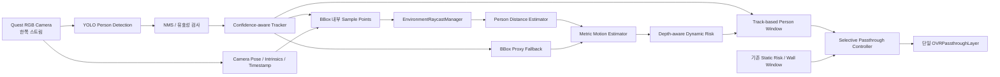

# Quest 3 Depth 기반 동적 위험·인물 Passthrough 개선 제작문서

문서 버전: 1.0  
작성 기준일: 2026-07-28  
대상 프로젝트: `unity-client/`  
문서 상태: 구현 전 설계 확정안  
기준 SDK: Meta XR SDK 203.0.0  

연관 문서:

- [정적·동적 위험도 재분리 제작문서](STATIC_DYNAMIC_RISK_SEPARATION_SPEC.md)
- [Quest 3 사람 검출·사용자 상태·UI 안정화 제작문서](QUEST3_DETECTION_STABILITY_UI_FIX_SPEC.md)
- [Quest 3 사람 검출·사용자 상태·UI 안정화 구현 결과](QUEST3_DETECTION_STABILITY_UI_FIX_IMPLEMENTATION.md)
- [동적 객체 인식·위험도 Unity 구현 및 검증 문서](DYNAMIC_RISK_UNITY_IMPLEMENTATION.md)

## 1. 문서 목적

현재 앱은 Quest 3 RGB 카메라에서 사람 bbox를 검출하고, bbox 면적 변화로
상대 거리와 접근 여부를 추정한 뒤 동적 위험도와 인물 Passthrough Window를
제어한다.

실기기 시험에서는 다음 추가 개선점이 확인됐다.

1. 실제 사람이 움직일 때 같은 사람을 계속 1명으로 유지하지 못하고
   `0 ↔ 1`로 흔들리는 경우가 있다.
2. 동적 Passthrough Window가 사람에 비해 넓고, 사람을 부드럽게 따라가기보다
   검출 bbox를 즉시 따라가는 느낌이 난다.
3. 가까운 사람이 더 위험해야 하지만 현재는 bbox 면적을 `Far/Mid/Near`로
   구분하는 간접 추정이므로 실제 거리와 위험도의 관계가 명확하지 않다.
4. Quest 3에는 여러 카메라와 Depth API가 있는데도 bbox 면적만 거리 대용값으로
   사용하는 것은 최종 구조로 적합하지 않다.

이 문서는 위 문제를 해결하기 위해 다음 변경을 설계한다.

- 사람 bbox는 인물의 화면 위치와 Passthrough 영역을 정하는 용도로 유지한다.
- 실제 거리, 접근속도, TTC는 Quest Depth API를 우선 사용한다.
- 카메라 두 대를 직접 스테레오 매칭하는 구현은 하지 않는다.
- 기존 사람 오검출 억제는 유지하면서, 확정된 사람의 일시적 저신뢰 검출은
  계속 같은 트랙으로 연결한다.
- 인물 Passthrough는 작고 안정된 Window가 동일 인물을 따라가도록 변경한다.
- 정적 위험과 동적 위험의 독립 계산·정책·ON/OFF 구조는 유지한다.

## 2. 이번 변경의 핵심 결정

### 2.1 결정 요약

| 항목 | 결정 |
|---|---|
| 사람 인식 카메라 | 현재처럼 좌·우 RGB 중 한쪽만 사용 |
| 두 번째 RGB 카메라 | 이번 단계에서는 사용하지 않음 |
| 직접 Stereo Depth | 구현하지 않음 |
| 실제 거리 | Meta Depth API 기반 Environment Raycast 사용 |
| BBox 역할 | 사람 위치, 추적, Passthrough ROI |
| BBox 면적 역할 | Depth 불가 시 fallback과 진단값 |
| 접근속도 | 거리의 시간 변화량을 우선 사용 |
| TTC | `거리 / 접근속도`의 metric TTC를 우선 사용 |
| 사람 트랙 | 신규 트랙과 기존 확정 트랙의 confidence 기준을 분리 |
| Passthrough 크기 | bbox보다 작은 집중 Window와 최대 크기 제한 |
| Passthrough 이동 | Track ID별 위치·크기 보간과 Lost fade-out |
| 정적 위험 | 기존 벽 방향 위험 계산과 Window 유지 |
| 후방 벽 | 이번 구현에서 제외 |
| 기능 버튼 | Static/Dynamic Passthrough 독립 ON/OFF 유지 |

### 2.2 여러 카메라를 모두 사용하지 않는 이유

Quest 3 Passthrough Camera API에서는 전면 좌·우 RGB 카메라를 사용할 수 있다.
그러나 카메라가 여러 개라는 사실만으로 사람까지의 거리가 자동으로 제공되는
것은 아니다.

좌·우 RGB 영상으로 직접 거리를 계산하려면 다음 처리가 추가로 필요하다.

- 두 영상의 정확한 시간 동기화
- 좌·우 카메라 intrinsics와 extrinsics 관리
- 영상 rectification
- disparity 또는 stereo matching
- 가려짐과 무늬가 적은 옷에 대한 예외 처리
- 사람 검출 결과의 좌·우 대응
- 추가 카메라 스트림의 GPU·메모리 비용 검증

이 작업은 연구적으로 가능하지만 현재 목표에는 과하다. Meta SDK가 이미
실시간 Environment Depth와 Raycast를 제공하므로 다음 구성을 사용한다.

```text
한쪽 RGB 카메라
→ 사람 검출·추적
→ bbox 내부의 여러 ray 생성
→ Environment Raycast
→ 사람 거리 산출
```

두 번째 RGB 카메라는 다음 경우에만 후속 검토한다.

- 한쪽 카메라의 사각지대 때문에 실제 검출률이 부족함
- Passthrough Window 좌우 시차 보정이 Depth 결합 후에도 부족함
- 연구 범위에 직접 stereo 비교 실험이 포함됨

## 3. 현재 기준선

### 3.1 유지할 구현

다음 구현은 이미 검증됐으므로 유지한다.

- YOLO 출력 계약: `CenterXYWH + ModelPixels`
- confidence 필터와 NMS
- `Tentative → Confirmed → Lost → Removed` 트랙 수명주기
- 일반 확정 `3/5 frame`
- 고신뢰 빠른 확정 `2 frame`
- HMD 움직임 EMA와 상태 히스테리시스
- 단일 HUD와 5 Hz 갱신
- 정적·동적 위험 정책 분리
- 정적·동적 Passthrough 기능 버튼
- 하나의 `OVRPassthroughLayer`에서 정적·동적 Window 합성
- 정적 벽 방향 Window
- 동적 사람 bbox Window

### 3.2 현재 bbox 기반 거리 추정

현재 `RelativeLocationEstimator`는 bbox 면적을 다음처럼 구분한다.

```text
bbox area < 0.03  → Far
bbox area < 0.06  → Mid
그 이상          → Near
```

`DynamicRiskEstimator`는 각각 다음 proximity factor를 사용한다.

```text
Far  = 0.15
Mid  = 0.55
Near = 1.00
```

이 방식은 계산이 매우 싸고 Depth가 없어도 동작한다. 그러나 사람의 자세,
화면 잘림, 팔 움직임, 검출 bbox 흔들림에 따라 동일 거리에서도 면적이 달라진다.
따라서 프로토타입 fallback으로는 유효하지만 실제 거리의 최종 기준으로는
사용하지 않는다.

### 3.3 현재 인물 Passthrough 기준

현재 주요 값은 다음과 같다.

```text
cameraViewport          = (0.05, 0.18, 0.90, 0.72)
personPaddingRatio      = 0.12
personEdgeFeather       = 0.12
minimumPersonWindowRisk = 0.50
maximumPersonWindows    = 3
```

Window는 현재 프레임의 bbox를 바로 사용한다. 문서에 정의됐던 Track ID별
위치·크기 보간과 Lost fade-out은 실제 렌더링 코드에 아직 적용되지 않았다.
큰 bbox에 padding까지 더해지므로 가까운 사람에서는 Window가 지나치게 커질 수
있다.

## 4. 목표 아키텍처



원칙은 다음과 같다.

1. 검출과 Depth는 서로 독립적으로 실패할 수 있다.
2. 사람으로 확정된 트랙만 Depth와 동적 위험 평가를 수행한다.
3. 위험도는 metric distance를 우선 사용한다.
4. Depth가 잠시 끊기면 마지막 값 유지 후 bbox proxy로 전환한다.
5. Passthrough Window는 위험도 계산과 별도로 Track ID를 기준으로 안정화한다.
6. 정적 위험은 동적 Depth 구현을 참조하지 않는다.

## 5. 데이터 계약

### 5.1 거리 출처

```csharp
public enum PersonDistanceSource
{
    Unavailable,
    EnvironmentDepth,
    BoundingBoxProxy
}
```

### 5.2 사람 거리 측정값

```csharp
public sealed class PersonDistanceMeasurement
{
    public int TrackId;
    public double CameraTimestampSeconds;
    public double DepthTimestampSeconds;
    public PersonDistanceSource Source;
    public bool Available;
    public float RawDistanceMeters;
    public float FilteredDistanceMeters;
    public float Confidence;
    public int RequestedSampleCount;
    public int ValidSampleCount;
    public float SourceAgeSeconds;
    public string FailureReason;
}
```

규칙:

- `Available = false`일 때 거리값을 0 m로 해석하지 않는다.
- `EnvironmentDepth`와 `BoundingBoxProxy`는 같은 정확도로 취급하지 않는다.
- bbox proxy 결과에는 metric 정확도가 있는 것처럼 기록하지 않는다.
- 모든 값은 해당 검출 프레임의 `TrackId`와 timestamp에 연결한다.

### 5.3 검출 프레임 메타데이터

```csharp
public sealed class PersonDetectionFrameMetadata
{
    public double TimestampSeconds;
    public PassthroughCameraAccess.CameraPositionType CameraPosition;
    public Pose CameraPoseAtCapture;
    public Vector2Int CameraResolution;
    public bool FlipVertical;
}
```

YOLO 추론이 끝난 현재 HMD pose가 아니라, 영상을 획득한 시점의 카메라 pose를
사용해야 한다. 추론 지연 중 사용자가 머리를 돌려도 ray 방향이 원본 영상과
일치해야 하기 때문이다.

### 5.4 동적 평가 확장

`RelativeLocationEstimate`, `MotionEstimate`, `DynamicRiskAssessment`에 다음 값을
추가한다.

```text
DistanceSource
RawDistanceMeters
FilteredDistanceMeters
DistanceConfidence
ClosingSpeedMetersPerSecond
MetricTtcSeconds
HasMetricTtc
```

기존 필드는 바로 제거하지 않는다.

```text
BoundingBoxArea
ScaleRatePerSecond
TtcSecondsApprox
```

위 값은 fallback, 이전 결과 비교, 회귀 진단을 위해 한 단계 동안 유지한다.

## 6. Environment Depth 거리 측정

### 6.1 사용할 API

현재 프로젝트 SDK에서 확인된 API는 다음과 같다.

```text
Meta.XR.PassthroughCameraAccess
  - CameraPosition
  - GetCameraPose()
  - ViewportPointToRay()

Meta.XR.EnvironmentRaycastManager
  - IsSupported
  - Raycast(Ray, out EnvironmentRaycastHit, float maxDistance)

Meta.XR.EnvironmentRaycastHit
  - point
  - normal
  - normalConfidence
  - status
```

첫 구현은 원본 Depth texture 전체를 CPU로 읽지 않고
`EnvironmentRaycastManager`를 이용한다. 필요한 bbox 내부 지점에만 ray를
발사하므로 구현과 성능 검증 범위를 줄일 수 있다.

`DepthTextureAccess`는 다음 상황에서만 2차 대안으로 사용한다.

- Environment Raycast 호출 비용이 실기기 목표를 초과함
- 여러 사람에 대한 ray 수가 많아 batch sampling이 필요함
- 거리뿐 아니라 사람 영역의 3D point cloud가 필요함

### 6.2 BBox 내부 sample

bbox 정중앙 한 점만 사용하지 않는다. 중앙이 팔 사이, 다리 사이 또는 사람 뒤의
배경을 가리킬 수 있기 때문이다.

초기 sample은 bbox 내부의 몸통 중심부 7개 지점을 사용한다.

```text
(0.50, 0.30)
(0.35, 0.42)
(0.50, 0.42)
(0.65, 0.42)
(0.40, 0.60)
(0.50, 0.60)
(0.60, 0.60)
```

좌표는 bbox 내부 정규화 좌표다. bbox 가장자리 15%는 배경 혼입 가능성이 높아
sample하지 않는다.

처리 순서:

1. 검출 프레임의 bbox와 `CameraPoseAtCapture`를 가져온다.
2. `flipVertical`을 한 곳에서만 적용한다.
3. 각 sample을 camera viewport 좌표로 변환한다.
4. `PassthroughCameraAccess.ViewportPointToRay()`로 world ray를 만든다.
5. 최대 6 m로 Environment Raycast를 수행한다.
6. 유효 hit 거리만 수집한다.

### 6.3 유효 거리 판정

다음 조건을 모두 만족하는 hit만 사용한다.

```text
status = Hit
0.20 m <= distance <= 6.00 m
NaN 또는 Infinity가 아님
camera/depth timestamp 차이가 허용 범위 이내
```

Meta Depth API의 약 0.20 m보다 가까운 영역은 신뢰도가 떨어지므로
`0.20 m 이하`를 정확한 metric 값으로 사용하지 않는다. 이 경우에는
`very-near` 안전 상태로 clamp하고 진단 로그에 원본 상태를 남긴다.

### 6.4 배경 hit 제거

단순 평균은 사람 뒤 벽의 깊이에 끌려갈 수 있다. 다음 robust 집계 방식을
사용한다.

1. 유효 거리를 오름차순 정렬한다.
2. 거리 차이 0.35 m 이내의 sample을 같은 cluster로 묶는다.
3. sample이 3개 이상인 가장 가까운 cluster를 선택한다.
4. 선택 cluster의 median을 raw person distance로 사용한다.

유효 sample이 3개 미만이면 해당 프레임의 Depth는 불가로 판단한다.

### 6.5 시간 필터

Track ID별로 다음 필터를 적용한다.

```text
최근 raw distance median window = 5 samples
distance EMA time constant       = 0.25 s
single-frame jump threshold      = 1.50 m
jump confirmation               = 2 consecutive samples
metric hold on dropout           = 0.50 s
```

한 프레임에서 거리가 크게 바뀌면 즉시 반영하지 않고 다음 sample에서 같은
방향의 변화가 확인될 때 반영한다. 단, 매우 가까운 값이 반복되거나 TTC가
급격히 짧아지는 상황은 위험 축소 방향보다 빠르게 반영한다.

### 6.6 Depth fallback

우선순위:

```text
1. 신선한 Environment Depth
2. 0.50초 이내 마지막 metric distance
3. bbox area proxy
4. Unavailable
```

Depth에서 bbox proxy로 바뀌는 순간 위험도가 갑자기 낮아지지 않도록 마지막
metric 위험에서 0.30초 동안 완만하게 전환한다. 로그와 HUD에는 반드시 현재
거리 출처를 표시한다.

## 7. 사람 추적 안정화

### 7.1 문제 원인

현재 confidence 0.55 미만의 검출은 tracker에 전달되지 않는다. 사람이 빠르게
움직이거나 일부 가려지면 confidence가 잠깐 낮아져 기존 트랙이 Lost가 되고,
다시 보였을 때 다른 Track ID로 생성될 수 있다.

threshold를 전체적으로 낮추면 손이나 배경 오검출이 다시 사람으로 확정될
가능성이 커진다. 따라서 신규 사람과 이미 확정된 사람에 같은 confidence
기준을 사용하지 않는다.

### 7.2 두 단계 confidence

초기 권장값:

```text
newTrackConfidence       = 0.55
confirmedMatchConfidence = 0.35
fastConfirmConfidence    = 0.85
```

규칙:

- 0.55 이상 검출만 새 Tentative 트랙을 만들 수 있다.
- 0.35~0.55 검출은 새 트랙을 만들 수 없다.
- 0.35~0.55 검출은 위치가 맞는 기존 Confirmed/Lost 트랙만 연장할 수 있다.
- 손을 한 프레임 사람으로 잘못 본 저신뢰 검출은 새 사람으로 확정되지 않는다.

### 7.3 Track association

기존 IoU와 center distance를 유지하되, 같은 사람의 빠른 이동을 고려해 다음
순서로 확장한다.

1. 이전 두 관측으로 bbox 중심 속도를 계산한다.
2. 현재 timestamp의 예상 bbox 중심을 구한다.
3. 예상 bbox와 새 검출의 IoU, 중심 거리, 크기 비율을 비교한다.
4. Confirmed/Lost 트랙을 Tentative 트랙보다 먼저 매칭한다.
5. 한 detection을 둘 이상의 track에 배정하지 않는다.

초기 gate:

```text
minimum IoU                       = 0.15
maximum predicted center distance = 0.22 viewport
maximum size ratio                = 2.50
```

단순히 gate를 넓히는 대신 예측 위치와 크기 비율을 함께 사용해 다른 사람으로의
ID 전환을 줄인다.

### 7.4 Lost 트랙 유지

```text
tracking lost hold       = 0.75 s
person count display hold = 0.75 s
mask hold                = 0.60 s
mask fade-out            = 0.30 s
```

Lost 상태에서는 마지막 assessment를 즉시 제거하지 않는다.

- 사람 수는 유지시간 동안 1명으로 유지한다.
- Passthrough Window는 마지막 위치에서 유지 후 fade-out한다.
- metric distance는 새 값으로 갱신하지 않고 source age를 증가시킨다.
- 위험도는 즉시 0으로 만들지 않고 보수적으로 감쇠한다.
- 동일 트랙이 다시 잡히면 fade-out을 취소하고 같은 ID로 이어간다.

## 8. Metric 기반 접근속도와 TTC

### 8.1 접근속도

거리 필터 결과를 이용한다.

```text
closingSpeed = -(filteredDistanceNow - filteredDistancePrevious) / dt
```

정의:

```text
closingSpeed > 0 → 사람과 착용자 사이가 가까워짐
closingSpeed ≈ 0 → 거리 유지
closingSpeed < 0 → 멀어짐
```

단일 프레임 차분 대신 최근 0.6초 거리 sample의 robust slope를 사용한다.

초기 상태 기준:

```text
Approaching: closingSpeed >=  0.15 m/s
Receding:    closingSpeed <= -0.15 m/s
Steady:      그 사이
```

0.05 m/s의 해제 히스테리시스를 적용해 상태가 빠르게 왕복하지 않게 한다.

### 8.2 Metric TTC

```text
if closingSpeed > 0.10 m/s:
    TTC = filteredDistance / closingSpeed
else:
    TTC = unavailable
```

TTC는 0~15초로 제한한다. 거리 source가 bbox proxy인 경우에는 기존
`1 / bbox scale growth rate`를 `TTC proxy`로 유지하되 metric TTC와 구분한다.

### 8.3 BBox motion의 역할

기존 bbox scale rate는 제거하지 않고 다음 용도로 유지한다.

- Depth가 일시적으로 불가한 상황의 접근 방향 fallback
- metric distance와 bbox 변화가 서로 크게 충돌할 때 센서 이상 진단
- 이전 구현과 위험도 결과 비교

metric 거리와 bbox 변화가 반대 방향으로 0.5초 이상 유지되면
`distanceDisagreement` 진단 이벤트를 기록한다.

## 9. Depth-aware 동적 위험도

### 9.1 기존 가중치 유지

한 번에 거리 source와 가중치를 모두 바꾸면 회귀 원인을 구분하기 어렵다.
따라서 첫 구현은 기존 가중치를 유지하고 각 factor의 입력만 metric 값으로
교체한다.

```text
Rdynamic =
    0.30 × Rproximity
  + 0.30 × Rapproach
  + 0.15 × RTTC
  + 0.10 × RcollisionPath
  + 0.05 × RobjectType
  + 0.10 × RproximityApproach
```

검출 confidence와 motion reliability를 기존 방식대로 적용하되, Depth
confidence가 낮으면 metric factor를 무조건 0으로 만들지 않고 fallback으로
전환한다.

### 9.2 연속 거리 위험

초기 Quest 시험값:

| 실제 거리 | `Rproximity` |
|---:|---:|
| `<= 0.60 m` | `1.00` |
| `0.60~1.50 m` | `1.00 → 0.55` 선형 보간 |
| `1.50~3.00 m` | `0.55 → 0.15` 선형 보간 |
| `>= 3.00 m` | `0.15` |

이 값은 최종 연구 임계값이 아니라 실기기 시험용 초기값이다. 중요한 조건은
다음과 같다.

```text
동일한 접근속도와 신뢰도에서
거리가 가까워질수록 Rdynamic이 감소하면 안 된다.
```

따라서 가까운 사람이 더 큰 위험도를 갖는다.

### 9.3 접근 위험

```text
Rapproach = clamp01(closingSpeed / 1.20 m/s)
```

멀어지는 객체에는 기존처럼 감소 계수를 적용한다. 단, 0.60 m 이내의 사람은
멀어지는 중이라도 proximity 위험을 즉시 크게 낮추지 않는다.

### 9.4 TTC 위험

기존 기준을 유지한다.

```text
TTC <= 2 s  → 1.00
TTC >= 15 s → 0.00
그 사이     → 선형 보간
```

### 9.5 위험 단계와 Passthrough 정책

객체별 단계:

```text
Safe    < 0.25
Caution < 0.50
Warning < 0.75
Danger  >= 0.75
```

동적 Passthrough 정책:

```text
ON  : maximum Rdynamic >= 0.60
OFF : maximum Rdynamic <  0.45
minimum hold = 0.75 s
```

기존 정적·동적 독립 정책을 유지하며 전체 `Rtotal`로 다시 합치지 않는다.

## 10. 작고 안정적인 인물 Passthrough

### 10.1 표현 원칙

동적 Passthrough는 다음처럼 보여야 한다.

```text
작은 부드러운 창이
같은 사람을 따라가며
일시적인 미검출에도 바로 사라지지 않는다.
```

Window 크기로 위험도를 과도하게 표현하지 않는다. 위험도는 Window 테두리,
opacity, HUD 단계로 표현하고 Window 크기는 사람이 어디에 있는지 보여주는 데
집중한다.

### 10.2 집중 Window

bbox 전체에 큰 padding을 더하는 대신 사람 중심부를 보여주는 집중 rect를
사용한다.

초기 권장값:

```text
width  = clamp(bbox.width  × 0.82 + 0.01, 0.10, 0.32)
height = clamp(bbox.height × 0.78 + 0.01, 0.16, 0.48)
risk scale = lerp(0.90, 1.05, Rdynamic)
edge feather = 0.08
```

의미:

- 먼 사람은 알아볼 수 있는 최소 크기를 확보한다.
- 가까운 사람의 bbox가 화면 대부분을 차지해도 Window는 최대 크기를 넘지 않는다.
- Danger에서도 최대 5% 정도만 확장해 Window가 갑자기 커지는 현상을 막는다.
- Window는 사람 실루엣이 아니라 사람 중심 영역을 보여주는 soft ROI다.

위 값은 Quest 시야에서 확인한 뒤 조정한다. 첫 시험에서는 총 reveal 면적이
화면의 45%를 넘지 않게 제한한다. 이번 단계에서는 동적 위험만으로 전체 화면
Passthrough를 켜지 않는다.

### 10.3 Track ID별 Window 상태

```csharp
public sealed class PersonWindowState
{
    public int TrackId;
    public Rect CurrentRect;
    public Rect TargetRect;
    public float CurrentOpacity;
    public double LastObservedTimestamp;
    public bool FadingOut;
}
```

Window slot 번호가 아니라 `TrackId`를 key로 사용한다. 위험 순위가 바뀌어도
같은 사람이 다른 slot로 순간 이동하지 않게 한다.

### 10.4 위치·크기 보간

초기값:

```text
position smoothing time constant = 0.15 s
size smoothing time constant     = 0.25 s
new track fade-in                = 0.20 s
lost hold                        = 0.60 s
lost fade-out                    = 0.30 s
```

위치가 크게 변할 때도 한 프레임에 바로 점프하지 않는다. 다만 보간이 너무
느려 실제 사람 뒤에 Window가 남지 않도록 최대 추적 지연을 0.20초 이내로
제한한다.

### 10.5 다중 인물

- 최대 3개 Window는 유지한다.
- 우선순위는 `Danger → Warning → Risk → 화면 중심` 순이다.
- 기존 Track ID의 Window를 새 Track보다 우선 유지한다.
- 총 면적 제한을 넘으면 낮은 위험 Window부터 축소하거나 숨긴다.
- 여러 사람 때문에 전체 화면 Passthrough로 자동 전환하지 않는다.

## 11. 정적 위험과의 관계

Depth 결합은 동적 사람 위험에만 적용한다.

정적 파트는 다음을 그대로 유지한다.

- Room Scene의 벽 정보
- HMD와 벽 사이의 거리
- 벽 접근속도, 가속도, TTC
- 사용자 움직임 상태
- 접근 중인 벽 방향의 Passthrough Window
- Static Passthrough ON/OFF 버튼

동적 파트는 다음만 소유한다.

- RGB 사람 검출
- 사람 추적
- 사람 Depth 거리
- 사람 접근속도와 TTC
- 사람 위험도
- 사람 중심 Passthrough Window
- Dynamic Passthrough ON/OFF 버튼

두 파트는 위험값을 합산하지 않는다. 렌더링 단계에서 두 Window의 합집합만
하나의 `OVRPassthroughLayer`에 적용한다.

착용자가 뒤로 이동하다 후방 벽과 충돌하는 기능은 이번 구현에서 제외한다.
후방 화살표, 진동, 공간 음향, 전체 화면 안전 Passthrough도 추가하지 않는다.

## 12. UI 변경

### 12.1 유지할 UI

- 기존 단일 HUD
- Static/Dynamic Passthrough ON/OFF 버튼
- bbox 개발자 라벨
- 5 Hz HUD 갱신
- 기존 사용자 움직임 상태 필터

### 12.2 HUD 표시

화면에는 가장 위험한 사람 한 명의 요약만 추가한다.

```text
People: 1 | Track: 3 | Depth: 1.24 m [DEPTH]
Closing: 0.42 m/s | TTC: 2.95 s
Rdynamic: 0.73 Warning | Dynamic PT: ON | Window: 1
```

Depth가 없으면 다음처럼 표시한다.

```text
Depth: -- [BBOX FALLBACK]
```

sample 수, source age, raw distance 등 상세 정보는 상시 HUD에 넣지 않는다.
상단 글씨가 다시 겹치지 않도록 개발자 상세값은 로그 또는 선택형 Debug HUD에만
표시한다.

## 13. 로그 설계

동적 assessment JSONL에 다음 필드를 추가한다.

```json
{
  "trackId": 3,
  "cameraPosition": "Left",
  "cameraTimestampSeconds": 123.40,
  "depthTimestampSeconds": 123.43,
  "distanceSource": "EnvironmentDepth",
  "distanceAvailable": true,
  "rawDistanceMeters": 1.18,
  "filteredDistanceMeters": 1.24,
  "distanceConfidence": 0.82,
  "requestedDepthSamples": 7,
  "validDepthSamples": 5,
  "closingSpeedMetersPerSecond": 0.42,
  "metricTtcSeconds": 2.95,
  "bboxArea": 0.084,
  "bboxScaleRatePerSecond": 0.10,
  "rdynamic": 0.73,
  "riskLevel": "Warning",
  "windowVisible": true,
  "windowRect": [0.40, 0.32, 0.22, 0.38],
  "windowOpacity": 1.0
}
```

추가 이벤트:

```text
depthReadyChanged
distanceSourceChanged
distanceSampleRejected
distanceJumpSuppressed
distanceDisagreement
trackRecovered
trackIdSwitched
personWindowFadeStarted
personWindowRemoved
```

원본 카메라 영상과 Depth texture는 기본 로그로 저장하지 않는다.

## 14. 파일별 구현 계획

### 14.1 신규 파일

| 파일 | 역할 |
|---|---|
| `Core/PersonDistanceModels.cs` | 거리 source와 측정값 계약 |
| `Core/PersonDistanceFilter.cs` | cluster median, jump reject, EMA |
| `Core/MetricMotionEstimator.cs` | 거리 기반 접근속도와 TTC |
| `Core/PersonWindowTracker.cs` | Track ID별 Window 보간·fade |
| `Quest/QuestPersonDepthProvider.cs` | Camera ray와 Environment Raycast 연결 |
| `Tests/EditMode/PersonDistanceFilterTests.cs` | 순수 거리 계산 테스트 |
| `Tests/EditMode/MetricMotionEstimatorTests.cs` | 접근속도·TTC 테스트 |
| `Tests/EditMode/PersonWindowTrackerTests.cs` | Window 안정화 테스트 |

### 14.2 수정 파일

| 파일 | 변경 |
|---|---|
| `DynamicRiskModels.cs` | 거리·metric motion 필드 추가 |
| `PersonDetectionPostProcessor.cs` | high/low confidence 후보 분리 출력 |
| `SimpleObjectTracker.cs` | 기존 트랙 저신뢰 매칭, 예상 위치 association |
| `DynamicRiskPipeline.cs` | Depth 측정값을 track별 평가에 연결 |
| `RelativeLocationEstimator.cs` | Depth 우선 DistanceBand, bbox fallback |
| `HistoryMotionEstimator.cs` | bbox motion을 fallback으로 축소 |
| `DynamicRiskEstimator.cs` | 연속 metric proximity·closing·TTC 적용 |
| `QuestPersonDetectionRunner.cs` | capture pose와 timestamp 보존 |
| `DynamicRiskController.cs` | Depth provider 연결과 source freshness 관리 |
| `SelectivePassthroughController.cs` | 집중 Window, Track ID 상태, 보간·fade |
| `DynamicPassthroughPolicyController.cs` | Lost assessment의 보수적 감쇠 처리 |
| `IndependentPassthroughHud.cs` | 거리 source와 primary person 요약 |
| `DynamicRiskSessionLogger.cs` | 거리와 Window 필드 추가 |
| `AdaptivePassthroughSceneBuilder.cs` | Depth/Raycast 컴포넌트와 참조 설치 |
| `SampleScene.unity` | 새 컴포넌트와 초기값 반영 |
| `QuestIntegrationAssetTests.cs` | Scene 연결과 단일 인스턴스 검증 |

### 14.3 Scene 구성

```text
Adaptive Passthrough System
├─ PassthroughCameraAccess
├─ EnvironmentDepthManager
├─ EnvironmentRaycastManager
├─ QuestPersonDetectionRunner
├─ QuestPersonDepthProvider
├─ DynamicRiskController
├─ DynamicPassthroughPolicyController
├─ StaticPassthroughPolicyController
├─ SelectivePassthroughController
├─ IndependentPassthroughHud
└─ PassthroughFeatureTogglePanel
```

`EnvironmentDepthManager`와 `EnvironmentRaycastManager`는 Scene에 각각 하나만
존재하도록 검사한다.

## 15. 구현 순서

### 단계 1. 현재 기준선 보존

- 현재 EditMode 테스트 실행
- 현재 APK의 사람 0명, 사람 1명, Static/Dynamic 버튼 결과 기록
- 기존 위험도와 Window 설정값을 로그에 남김

### 단계 2. 추적 연결 완화

- high/low confidence 후보 분리
- low confidence는 기존 Confirmed/Lost 트랙에만 매칭
- predicted center association 적용
- Lost assessment 유지와 recovery 구현

이 단계에서 Depth나 위험도 계산은 바꾸지 않는다. 먼저 `0 ↔ 1`과 Track ID
전환을 줄였는지 확인한다.

### 단계 3. Environment Depth 연결

- Scene에 Depth/Raycast manager 추가
- 카메라 pose와 timestamp 보존
- bbox 7점 raycast
- robust cluster와 거리 filter 구현
- HUD와 로그에 거리만 표시

이 단계에서는 아직 위험도와 Passthrough를 Depth로 제어하지 않는다.

### 단계 4. Metric 위험도 병렬 계산

- 기존 bbox 위험도와 새 metric 위험도를 동시에 계산
- 실제 제어는 기존 위험도로 유지
- 로그에서 두 결과를 비교
- 거리 단조성, 접근속도, TTC를 실기기에서 검증

### 단계 5. 동적 정책 전환

- metric Depth 사용 가능 시 새 위험도 적용
- Depth 불가 시 bbox fallback
- 동적 Passthrough ON/OFF가 새 위험도를 사용
- 정적 정책에는 변경이 없는지 검증

### 단계 6. 인물 Window 안정화

- 집중 rect와 최대 크기 제한
- Track ID별 위치·크기 보간
- fade-in, Lost hold, fade-out
- 다중 인물 면적 제한

### 단계 7. 빌드와 Quest 시험

- 전체 EditMode 테스트
- Android Development Build
- Quest 3 설치와 자동 실행
- 실기기 시나리오 Q1~Q8 수행
- 최종 Release APK 생성

## 16. 자동 테스트

### 16.1 거리 filter

- 7개 sample 중 사람 거리 5개, 배경 2개이면 사람 cluster 선택
- 유효 sample 2개이면 Depth unavailable
- 0.2 m 미만 값 처리
- 6 m 초과 값 제거
- NaN, Infinity 제거
- 단일 1.5 m jump 억제
- 같은 방향 2회 jump 반영
- 0.5초 dropout hold 후 bbox fallback

### 16.2 추적

- confidence 0.40 검출은 새 트랙을 만들지 않음
- confidence 0.40 검출이 기존 Confirmed 트랙을 연장
- 손 1프레임 검출은 Confirmed가 되지 않음
- 빠른 좌우 이동에서도 동일 Track ID 유지
- Lost 0.5초 후 재검출 시 동일 ID 복구
- 서로 교차하는 두 사람의 ID 전환 최소화

### 16.3 위험도

- 동일 속도에서 거리가 짧을수록 위험도가 같거나 증가
- 동일 거리에서 접근속도가 빠를수록 위험도 증가
- 멀어지는 사람의 접근 위험 감소
- metric TTC가 proxy TTC보다 우선
- Depth fallback 전환에서 위험도 급락 없음
- 모든 factor와 최종 위험도가 `0~1`

### 16.4 Passthrough Window

- 최대 width 0.32, height 0.48 제한
- Track ID가 같으면 slot이 바뀌지 않음
- 위치 smoothing이 frame rate와 무관
- 한 프레임 dropout에 Window가 사라지지 않음
- Lost hold와 fade-out 시간 확인
- Dynamic OFF일 때 사람 Window 0개
- Static OFF는 사람 Window에 영향 없음
- 총 reveal 면적 45% 제한

### 16.5 Scene 통합

- `PassthroughCameraAccess` 한 개
- `EnvironmentDepthManager` 한 개
- `EnvironmentRaycastManager` 한 개
- `OVRPassthroughLayer` 한 개
- Static/Dynamic 정책 각각 한 개
- Static/Dynamic 버튼 각각 한 개
- 단일 HUD 유지

## 17. Quest 3 실기기 시험

### Q1. 빈 공간과 손

```text
조건: 사람 없는 공간에서 손 흔들기 60초
기대:
- Confirmed People = 0
- 동적 Window = 0
- 저신뢰 후보가 새 트랙을 만들지 않음
```

### Q2. 한 사람 좌우 이동

```text
조건: 약 1.5 m에서 한 사람이 좌우로 60초 이동
기대:
- 표시 사람 수가 대부분 1
- 동일 Track ID 유지
- Window가 순간 이동하지 않고 사람을 따라감
- 0.3초 이내 미검출에 Window가 꺼지지 않음
```

정량 목표:

```text
People = 1 유지율 >= 95%
불필요한 Track ID 변경 <= 분당 1회
```

### Q3. 거리 단계

```text
조건: 사람을 3.0 m, 1.5 m, 0.75 m에 정지
기대:
- 측정 거리가 순서대로 감소
- Rproximity와 Rdynamic이 순서대로 증가
- 거리 source가 EnvironmentDepth로 표시
```

초기 거리 목표:

```text
0.5~3.0 m 구간에서
median absolute error <= max(0.25 m, 실제 거리의 15%)
```

이 값은 기기 시험 후 현실적인 범위로 조정한다.

### Q4. 접근·정지·후퇴

```text
조건: 한 사람이 접근 → 정지 → 후퇴
기대:
- Approaching → Steady → Receding 순서
- 접근 시 closing speed 양수
- 정지 시 TTC unavailable
- 접근 중 거리가 가까워질수록 위험도 증가
```

### Q5. 일시 가림

```text
조건: 사람이 몸 일부를 0.3~0.6초 가림
기대:
- 같은 Track ID 유지 또는 복구
- Window hold 후 자연스럽게 이어짐
- People 0/1의 빠른 반복이 없음
```

### Q6. Dynamic 버튼

```text
Static OFF / Dynamic ON:
- 사람 위험도와 사람 Window만 확인

Static ON / Dynamic OFF:
- 사람 거리와 위험도는 계산되지만 사람 Window는 0
```

### Q7. Static·Dynamic 동시 위험

```text
조건: 시야 안 벽에 접근하면서 사람이 앞에 있음
기대:
- 정적 벽 Window와 동적 사람 Window가 함께 표시
- 한 source의 OFF가 다른 source를 끄지 않음
- OVRPassthroughLayer는 하나
```

### Q8. 장시간 성능

```text
조건: 30분 실행, 최대 3명
확인:
- 72 FPS 목표 유지
- 추론·Depth·Window 처리 P95
- GC spike
- raycast 실패율
- 로그 누락
- Track state 누수
```

## 18. 성능 기준

Meta Quest 앱의 최소 72 FPS를 유지하는 것이 우선이다.

초기 제한:

```text
RGB stream                 = 1개
YOLO inference             = 10 Hz
Depth/raycast update       = 10 Hz
ray per confirmed person   = 7개
maximum evaluated people   = 3명
maximum raycast rate       = 210 calls/s
HUD                        = 5 Hz
dynamic JSONL              = 최대 10 Hz
```

목표:

| 항목 | 목표 |
|---|---:|
| Depth + 거리 계산 평균 | 1.0 ms 이하 |
| Depth + 거리 계산 P95 | 2.0 ms 이하 |
| Window 갱신 평균 | 0.3 ms 이하 |
| 프레임당 추가 GC | 0 B 목표 |
| 앱 프레임률 | 72 FPS 이상 |

목표를 넘으면 순서대로 다음을 적용한다.

1. sample을 7개에서 5개로 축소
2. Depth 갱신을 10 Hz에서 7.5 Hz로 축소
3. 최대 Depth 평가 인원을 3명에서 2명으로 축소
4. `DepthTextureAccess` 기반 batch sampling 검토

두 번째 RGB 카메라 추가는 성능 최적화 수단이 아니다.

## 19. 오류와 fallback

| 상황 | 동작 |
|---|---|
| Camera 권한 없음 | 동적 파트 unavailable, 정적 파트 유지 |
| Depth 미지원 | bbox proxy 사용 |
| Depth 준비 전 | bbox proxy 사용, HUD에 `DEPTH WARMING` |
| Raycast 유효 sample 부족 | 마지막 metric 값 0.5초 유지 |
| Depth 0.5초 이상 중단 | bbox proxy로 전환 |
| 검출 frame stale | Lost hold 후 동적 위험 감쇠 |
| 사람 없음 | 동적 위험 0, 동적 Window 없음 |
| Shader 문제 | Window 비활성화, 위험 계산·로그 유지 |
| Static Room 미설정 | 정적 unavailable, 동적 파트 유지 |

Depth 실패를 거리 0 m 또는 안전 0점으로 바꾸지 않는다.

## 20. 빌드·배포

구현 완료 후 다음 순서로 진행한다.

1. Unity 전체 EditMode 테스트
2. `TeamVR > Adaptive Passthrough > Build Quest 3 APK`
3. APK 확인:

```text
unity-client/Builds/Android/AdaptivePassthrough.apk
```

4. 연결 기기 확인:

```powershell
adb devices -l
```

5. 설치와 실행:

```powershell
powershell.exe -NoProfile -ExecutionPolicy Bypass `
  -File .\Tools\Install-Quest3.ps1 `
  -Serial <QUEST_SERIAL> `
  -Launch
```

6. Q1~Q8 수행
7. 로그 회수와 분석
8. 검증값을 Scene 기본값과 문서에 반영
9. 최종 Release APK 재빌드

앱은 Quest의 알 수 없는 출처/개발자 앱 목록에서 나중에도 직접 실행할 수 있게
동일 package ID를 유지한다.

## 21. 완료 기준

- [ ] 한쪽 RGB 카메라만으로 사람 검출이 동작한다.
- [ ] `EnvironmentRaycastManager`가 Scene에 한 개 연결된다.
- [ ] 확정된 사람 bbox에서 metric distance를 얻는다.
- [ ] Depth 거리와 bbox proxy가 명확히 구분된다.
- [ ] 가까운 사람일수록 proximity 위험이 감소하지 않는다.
- [ ] metric closing speed와 TTC가 위험도에 사용된다.
- [ ] 저신뢰 검출은 새 트랙을 만들지 않으면서 기존 사람을 이어준다.
- [ ] Q1 손 흔들기에서 Confirmed People 0을 유지한다.
- [ ] Q2 한 사람 이동에서 People 1 유지율 95% 이상이다.
- [ ] 한 프레임 미검출로 사람 Window가 사라지지 않는다.
- [ ] Window가 Track ID별로 사람을 부드럽게 따라간다.
- [ ] 인물 Window가 최대 width·height를 넘지 않는다.
- [ ] Static/Dynamic ON/OFF가 서로 독립적으로 동작한다.
- [ ] 후방 벽 기능이 실수로 포함되지 않는다.
- [ ] 정적 위험 계산 결과가 변경 전과 일치한다.
- [ ] 전체 EditMode 테스트가 통과한다.
- [ ] Quest Q1~Q8 시험 결과가 기록된다.
- [ ] 30분 실행에서 크래시와 지속적 메모리 증가가 없다.
- [ ] 최종 APK를 Quest에 설치하고 앱 목록에서 재실행할 수 있다.

## 22. 이번 구현 제외 범위

- 좌·우 RGB 직접 stereo matching
- 두 카메라에서 YOLO를 각각 실행
- 사람 segmentation ONNX 모델
- 사람 실루엣 단위 Passthrough
- 후방 벽 충돌 경고
- 후방 화살표, 진동, 공간 음향
- 동적 위험에 의한 전체 화면 Passthrough
- 개인화 ONNX 모델 학습과 배포
- `Rintent` 구현

개인화는 거리·추적·Passthrough 로그가 안정된 뒤 PC에서 분석하고, 이후
threshold 또는 weight를 Quest에 적용하는 별도 단계로 진행한다.

## 23. 참고 자료

- [Meta Passthrough Camera API Overview](https://developers.meta.com/horizon/documentation/unity/unity-pca-overview/)
- [Meta Depth API Overview](https://developers.meta.com/horizon/documentation/unity/unity-depthapi-overview/)
- [Meta Passthrough Windows](https://developers.meta.com/horizon/documentation/unity/unity-customize-passthrough-passthrough-windows/)

Meta 공식 문서와 프로젝트에 설치된 SDK 203.0.0의
`PassthroughCameraAccess`, `EnvironmentDepthManager`,
`EnvironmentRaycastManager`, `DepthTextureAccess` API를 기준으로 작성했다.
SDK 또는 Horizon OS 업데이트 후에는 지원 여부와 Raycast 동작을 다시
검증한다.

## 24. 구현 반영 결과 (2026-07-28)

본 문서 기준의 Unity 구현은 다음 상태로 반영했다.

| 영역 | 반영 내용 | 상태 |
|---|---|---|
| 사람 검출 | 확정 임계값 0.55, 기존 트랙 유지용 저신뢰 임계값 0.35 분리 | 완료 |
| 사람 추적 | 예측 중심점·IoU·크기비 매칭, Lost 0.75초 유지 | 완료 |
| 거리 측정 | bbox 내부 7개 torso sample을 `EnvironmentRaycastManager`로 측정 | 완료 |
| 거리 안정화 | 가장 가까운 일관 cluster, median·EMA, 1-frame jump 억제 | 완료 |
| fallback | Depth 유효값 0.5초 유지 후 bbox proxy로 명시적 전환 | 완료 |
| 동적 운동 | Track별 metric 거리 회귀로 closing speed와 TTC 계산 | 완료 |
| 동적 위험 | metric 거리·접근 속도·TTC 우선, bbox 기반 기존 계산 fallback | 완료 |
| Window | Track ID별 위치·크기 smoothing, Lost hold·fade, 최대 0.32×0.48 | 완료 |
| UI | Confirmed People와 선택 Track의 Depth·Closing·TTC 표시 | 완료 |
| 로그 | 거리 출처·원시/필터 거리·confidence·TTC·Window 상태 기록 | 완료 |
| Scene | Depth Manager, Raycast Manager, Depth Provider 연결 | 완료 |
| 자동 테스트 | Unity EditMode 53개 통과 | 완료 |
| Android 빌드 | Development APK 생성, 빌드 오류 0 | 완료 |
| Quest 실기 | Q1~Q8 및 30분 안정성 시험 | 실기 검증 필요 |

구현 파일의 핵심 책임은 다음과 같다.

```text
QuestPersonDetectionRunner
  -> SimpleObjectTracker
  -> QuestPersonDepthProvider
       -> PersonDistanceFilter
  -> MetricMotionEstimator
  -> DynamicRiskEstimator
  -> SelectivePassthroughController
       -> PersonWindowTracker
```

Unity Editor 자동 테스트에서 확인한 항목:

- 손 또는 저신뢰 검출이 새 사람 Track을 만들지 않는다.
- 저신뢰 검출은 이미 확정된 Track만 이어줄 수 있다.
- 순간적인 큰 Depth 점프는 한 번 억제되고 반복 시에만 수용된다.
- 가까운 metric 거리가 먼 거리보다 높은 위험도를 만든다.
- 접근 중인 사람의 closing speed와 TTC가 계산된다.
- 한 프레임 미검출 후에도 Window가 즉시 사라지지 않는다.
- Static/Dynamic 토글과 계산 경로가 서로 독립적이다.
- 후방 벽 충돌 기능은 포함하지 않았다.

실기 시험에서는 HUD와 JSONL 로그에서 다음 값을 함께 확인한다.

```text
Track
Depth source = EnvironmentDepth | BoundingBoxProxy
Raw/Filtered distance
Closing speed
Metric TTC
Observed/Lost
Window rect/opacity
```

생성한 APK:

```text
unity-client/Builds/Android/AdaptivePassthrough.apk
크기: 160.66 MiB
SHA-256: 1ED8E6ADA74ED9F96B6D297B5B7C8CBAE4B3FD330A596D32A68E0C0C6D0905D6
```
