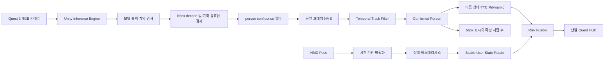

# Quest 3 사람 검출·사용자 상태·UI 안정화 제작문서

문서 버전: 1.0  
작성 기준일: 2026-07-28  
대상 프로젝트: `unity-client/`  
대상 기기: Meta Quest 3  
문서 상태: 구현 완료, Quest 3 사용자 시나리오 검증 진행 중

## 1. 문서 목적

이 문서는 Quest 3 실기기 시험에서 확인된 다음 세 가지 문제를 수정하기 위한 구현 기준과 검증 절차를 정의한다.

1. 사람이 없는 상황에서 손을 흔들었을 때 사람 수가 9~10명까지 증가하는 문제
2. 화면 상단의 상태 문구와 bbox 디버그 문구가 겹치는 문제
3. 사용자의 현재 움직임 상태가 지나치게 빠르게 전환되는 문제

이번 수정의 최종 목적은 단순히 화면 표시를 안정시키는 것이 아니다. 잘못된 사람 검출과 불안정한 사용자 상태가 `Rdynamic`, `Rstate`, `Rtotal`에 전달되지 않도록 하여 동적 위험도 산출의 신뢰성을 확보하는 것이 목적이다.

## 2. 중간보고서와의 관계

이 문서는 `2026중간보고서_08_TeamVR_몰입형_XR을_위한_상황_인식_기반_Adaptive_Passthrough_Framework.pdf`의 다음 설계를 유지한다.

- 동적 객체 입력은 COCO class 0인 `person` 전신 bbox를 사용한다.
- 화면 좌/중/우, bbox 면적 기반 거리 구간, 접근·정지·후퇴 상태를 계산한다.
- 접근 판정은 최근 1.5초 bbox 크기 이력을 사용한다.
- 접근 상태 계산은 최소 4회, 250ms 이상의 관측 이후 시작한다.
- 동적 위험도는 보고서의 규칙 기반 `Rdynamic` 수식을 유지한다.
- 사용자 상태 위험도는 HMD 속도, 가속도, 각속도로 `Static`, `Dynamic`, `Agitated`를 구분한다.
- 전체 위험도 구조는 `Rstatic`, `Rstate`, `Rdynamic`, `Rintent`의 결합을 유지한다.
- 원본 카메라 영상은 저장하지 않고 메타데이터와 위험도 결과만 기록한다.

이번 수정에서 변경하는 것은 위 위험도 정의가 아니라 위험도 계산 전에 들어가는 입력의 품질과 UI 표현 방식이다.

## 3. 현재 문제와 판단 근거

### 3.1 사람 수 과다 검출

현재 `QuestPersonDetectionRunner`는 다음 순서로 동작한다.

```text
모델 출력
-> person class 및 confidence 필터
-> 좌표를 0~1로 clamp
-> NMS
-> SimpleObjectTracker
-> 검출 bbox 개수를 사람 수로 표시
```

현재 설정은 confidence `0.35`, NMS IoU `0.45`, 추론 주기 `10Hz`이다. 검출된 bbox에는 첫 프레임부터 Track ID가 부여되며, 여러 프레임에서 반복해서 관측된 실제 객체인지 확인하는 단계가 없다.

2026-07-28 Quest 로그에서는 동일한 시각에 거의 같은 위치와 크기를 가진 사람 bbox 5개가 별도 Track ID 28~32로 기록되었다. confidence는 약 `0.44~0.59`, bbox 높이는 화면 전체에 가까웠다. 같은 사람 후보가 NMS 이후에도 여러 개 남았거나, 원본 tensor의 구조·좌표 단위가 잘못 해석되었을 가능성이 있다.

손 하나가 사람으로 한 번 오검출되는 것은 모델 성능 문제일 수 있다. 그러나 손 하나가 9~10명의 사람으로 집계되는 것은 다음 구현 문제를 함께 의심해야 한다.

- 출력 tensor shape 또는 bbox layout 해석 오류
- pixel 좌표와 normalized 좌표 혼용
- corner 형식과 center 형식 혼용
- 유효성 검사 전에 수행되는 `Clamp01`
- 동일 프레임 중복 bbox에 대한 NMS 실패
- 검출 즉시 사람 수에 포함되는 미확정 트랙

### 3.2 사용자 상태의 빠른 전환

현재 `QuestRiskExperimentLogger`는 매 Unity 프레임에 다음 값을 계산한다.

```text
HMD velocity     = position difference / deltaTime
HMD acceleration = velocity difference / deltaTime
HMD angular rate = rotation difference / deltaTime
```

계산된 원시값을 평활화하지 않고 즉시 임계값과 비교한다. 상태 유지 시간과 진입·해제 임계값 분리도 없다. 위치 추적 노이즈, 자연스러운 머리 떨림, 프레임 시간 변동은 특히 2차 차분인 가속도에서 크게 증폭될 수 있다.

현재 손 속도는 UI 계산에 포함되지만 `Static`, `Dynamic`, `Agitated` 판정에는 직접 사용되지 않는다. 따라서 손을 흔든 것만으로 상태가 바뀌었다면 손 자체가 아니라 동시에 발생한 HMD 움직임 또는 추적 노이즈를 확인해야 한다.

### 3.3 상단 텍스트 겹침

현재 `SampleScene`에는 서로 독립적인 두 UI가 동시에 존재한다.

- `QuestRiskExperimentLogger`가 갱신하는 World Space Canvas의 두 개 Text
- `DynamicRiskDebugOverlay.OnGUI()`가 그리는 전체 화면 패널, 상단 요약, bbox 라벨

두 UI 모두 상단 영역을 사용하며, 잘못 검출된 bbox가 많을수록 여러 라벨이 같은 위치에 생성된다. 고정 크기의 legacy `Text`에 긴 문자열을 매 프레임 넣고 있어 글자 잘림과 열 간 침범도 발생할 수 있다.

## 4. 수정 후 목표 구조



핵심 원칙은 다음과 같다.

- 원본 bbox와 정규화 bbox를 분리한다.
- 잘못된 좌표를 clamp로 숨기지 않는다.
- 같은 프레임의 중복 bbox와 여러 프레임의 미확정 검출을 별도로 처리한다.
- 위험도에는 확정된 사람 트랙만 전달한다.
- 사용자 상태는 원시 프레임값이 아니라 평활화된 값과 상태 머신으로 결정한다.
- Quest 화면에는 하나의 HUD만 기본 표시한다.

## 5. 상세 구현 요구사항

### 5.1 단계 A: 모델 출력 계약 확정

첫 번째 구현은 threshold 조정이 아니라 모델 출력 계약 확인이어야 한다.

앱 시작 시 한 번 다음 정보를 기록한다.

- 모델 입력 tensor 이름과 shape
- 세 출력 tensor의 이름, 데이터형, shape, length
- bbox 출력 순서
- bbox 형식: `cx, cy, w, h` 또는 `x1, y1, x2, y2`
- bbox 단위: 모델 입력 pixel 또는 `0~1`
- class ID와 score가 bbox의 어느 차원과 대응하는지
- 카메라 Texture 크기와 모델 입력 크기
- letterbox 또는 단순 resize 사용 여부

런타임 최초 10회 추론에는 confidence 상위 10개 후보의 다음 값을 진단 로그로 남긴다.

```text
rawIndex
rawBox[4]
classId
confidence
decodedCornersBeforeClip
decodedNormalizedBox
rejectionReason
```

출력 계약이 확정되기 전에는 좌표 범위를 보고 형식을 자동 추측하지 않는다. 모델별 decoder 설정을 명시적으로 고정한다.

### 5.2 단계 B: bbox decoder 분리

`QuestPersonDetectionRunner`에서 bbox 해석 코드를 분리하여 순수 C# 후처리 클래스로 만든다.

권장 파일:

```text
Assets/Scripts/AdaptivePassthrough/Core/PersonDetectionPostProcessor.cs
Assets/Scripts/AdaptivePassthrough/Core/PersonDetectionPostProcessorSettings.cs
```

처리 순서는 반드시 다음과 같아야 한다.

1. 원본 네 좌표가 `NaN` 또는 무한대인지 검사
2. 모델 계약에 따라 corner 좌표로 변환
3. `right > left`, `bottom > top` 검사
4. 모델 입력 pixel 기준이면 입력 너비·높이로 정규화
5. 영상 영역과 교차하는지 검사
6. 원본 box와 영상 내부로 잘린 visible box의 비율 검사
7. 마지막에만 화면 영역으로 clip
8. 너비·높이·면적이 0보다 큰지 재검사
9. person class와 confidence 검사
10. NMS 수행

`Clamp01`은 잘못된 좌표를 유효한 좌표처럼 만드는 데 사용하면 안 된다. 예를 들어 `x1=-500`, `x2=10`인 잘못된 bbox를 먼저 clamp하면 화면 왼쪽의 정상 bbox처럼 보일 수 있다.

초기 유효성 기준은 과도한 사람 형태 필터를 사용하지 않는다. 멀리 있는 사람이나 화면 일부만 보이는 사람을 제거할 수 있기 때문이다.

- 모든 좌표는 finite 값이어야 한다.
- corner 순서가 유효해야 한다.
- bbox가 영상과 실제로 교차해야 한다.
- clip 이후 width, height, area가 양수여야 한다.
- 영상 전체보다 비정상적으로 큰 raw box는 진단 로그와 함께 거부한다.

### 5.3 단계 C: 동일 프레임 NMS 보장

NMS는 confidence 내림차순으로 수행하고 person class 안에서만 비교한다.

초기값:

| 항목 | 초기값 | 비고 |
|---|---:|---|
| 최소 confidence | 0.55 | 0.45~0.70 범위에서 실기기 조정 |
| NMS IoU | 0.45 | 기존 보고서·구현과 연속성 유지 |
| NMS 전 최대 후보 | 50 | 상위 confidence만 유지 |
| 최종 최대 사람 후보 | 10 | 안전장치이며 오류를 숨기는 용도로 사용하지 않음 |

NMS 결과는 다음 조건을 만족해야 한다.

- 최종 목록의 임의 두 bbox 간 IoU가 설정값 이상이면 안 된다.
- 같은 위치의 bbox가 confidence만 다르게 여러 개 남으면 안 된다.
- NMS 전후 개수는 모두 로그에 남아야 한다.
- 최종 개수를 10으로 자르는 것만으로 사람 수 문제를 해결한 것으로 판단하지 않는다.

confidence를 `0.35`에서 `0.55`로 올리는 것은 초기 오검출 완화값이다. decoder와 NMS가 검증되지 않은 상태에서 threshold만 올리는 것은 완료 조건이 아니다.

### 5.4 단계 D: 확정 트랙 기반 사람 수

`SimpleObjectTracker`에 트랙 생명주기를 추가한다.

```text
Tentative -> Confirmed -> Lost -> Removed
```

각 트랙은 다음 상태를 가진다.

```csharp
TrackId
Lifecycle
TotalHits
ConsecutiveHits
MissedFrames
FirstSeenAt
LastSeenAt
AverageConfidence
LatestDetection
```

초기 확정 규칙:

- 일반 확정: 최근 5개 추론 중 3회 이상 매칭
- 빠른 확정: confidence `0.85` 이상이며 2회 연속 매칭
- 확정 해제: 마지막 매칭 후 0.5초 동안 검출 없음
- 사람 수: `Confirmed` 상태이며 현재 유효한 트랙 수

10Hz 추론 기준 일반 확정에는 약 0.3~0.5초가 걸린다. 이 지연은 손이나 순간적인 물체 오검출이 즉시 위험도로 전달되는 것을 막기 위한 것이다.

`Rdynamic`에는 원칙적으로 확정 트랙만 전달한다. 단, 향후 안전 반응 속도가 부족하다고 측정되면 높은 confidence의 tentative 트랙을 별도 낮은 가중치로 사용하는 방안을 실험할 수 있다. 첫 수정에는 포함하지 않는다.

중간보고서의 접근 상태 계산 조건도 트랙 확정 이후 적용한다.

- 최근 1.5초 bbox scale 이력
- 최소 4개 관측
- 최소 250ms 관측
- 이력이 부족하면 `Unknown`

### 5.5 단계 E: 사용자 상태 평활화

순수 C# 상태 처리 클래스를 추가한다.

권장 파일:

```text
Assets/Scripts/AdaptivePassthrough/Core/UserMotionStateFilter.cs
```

처리 절차:

1. HMD pose를 매 프레임 샘플링
2. 지나치게 작거나 큰 `deltaTime` 샘플 거부
3. 속도 벡터를 계산하고 시간 기반 EMA 적용
4. 평활화된 속도에서 가속도 계산
5. 가속도와 각속도에도 EMA 적용
6. 평활화된 값으로 후보 상태 계산
7. 후보 상태가 일정 시간 지속될 때만 최종 상태 변경

초기 평활화값:

| 항목 | 초기값 |
|---|---:|
| 속도 EMA time constant | 0.35초 |
| 가속도 EMA time constant | 0.45초 |
| 각속도 EMA time constant | 0.35초 |
| 상태 UI 갱신 주기 | 5Hz |

EMA는 프레임 수 기반 고정 계수가 아니라 실제 `dt`를 사용한다.

```text
alpha = 1 - exp(-dt / tau)
filtered = lerp(previous, current, alpha)
```

### 5.6 단계 F: 상태 히스테리시스

중간보고서의 중심 임계값은 유지하되 상태 진입과 해제에 서로 다른 조건을 사용한다. 다음 수치는 실기기 로그 수집을 위한 초기값이며 최종 연구값이 아니다.

#### Static 진입

다음 조건이 모두 0.75초 이상 유지될 때 `Static`으로 전환한다.

```text
head speed < 0.04 m/s
head acceleration < 0.25 m/s²
head angular speed < 0.25 rad/s
```

#### Static 해제

다음 중 하나가 0.25초 이상 유지될 때 `Dynamic` 후보가 된다.

```text
head speed > 0.08 m/s
head acceleration > 0.50 m/s²
head angular speed > 0.60 rad/s
```

#### Agitated 진입

중간보고서 기준 중 하나가 0.25초 이상 유지될 때 `Agitated`로 전환한다.

```text
head speed > 1.0 m/s
head acceleration > 5.0 m/s²
head angular speed > 2.5 rad/s
```

#### Agitated 해제

다음 조건이 모두 0.75초 이상 유지될 때 `Dynamic`으로 전환한다.

```text
head speed < 0.75 m/s
head acceleration < 3.5 m/s²
head angular speed < 1.8 rad/s
```

상태가 바뀌지 않더라도 원시값과 평활화값은 로그에 기록한다. 이를 통해 임계값이 잘못된 것인지 추적 노이즈가 큰 것인지 구분한다.

### 5.7 단계 G: Quest HUD 통합

Quest 기기에서 기본으로 보이는 UI는 하나의 World Space Canvas로 통합한다.

권장 구조:

```text
CenterEyeAnchor
└── QuestRiskHudCanvas
    ├── StatusHeader
    ├── DetectionPanel
    │   ├── ConfirmedPeopleText
    │   └── DynamicRiskText
    ├── UserStatePanel
    │   ├── StableStateText
    │   └── StateRiskText
    ├── TotalRiskPanel
    └── BBoxLayer
```

UI 구현 기준:

- legacy `UnityEngine.UI.Text` 대신 TextMeshPro 사용
- 헤드 기준 전방 약 2m에 배치
- 상태 HUD는 5Hz로 갱신
- 카메라·권한·Room Scene 상태는 한 줄로 표시
- 사람 수는 raw bbox 개수가 아니라 confirmed track 수로 표시
- 기본 화면에는 최대 위험 객체 1개의 요약만 표시
- 상세 bbox 정보는 개발자 모드에서만 표시
- bbox 라벨은 한 줄로 제한: `ID / conf / Rdynamic`
- bbox 라벨이 겹치면 위·아래로 이동하거나 낮은 우선순위 라벨을 숨김
- 화면 밖으로 나간 라벨은 viewport 안으로 제한

`DynamicRiskDebugOverlay` 처리:

- Quest 기본 빌드에서는 `visible = false`
- Unity Editor 또는 Development Build에서만 토글 가능
- 전체 화면 검은 패널과 상단 요약은 기본 비활성화
- World Space HUD와 동시에 동일 정보를 출력하지 않음

최종 HUD 예시:

```text
Camera: READY | Room: READY
People: 1 | Rdynamic: 0.42
User: Dynamic | Rstate: 0.50
Rtotal: 0.46 | Caution | Passthrough: OFF
```

## 6. 파일별 수정 계획

| 파일 | 변경 내용 |
|---|---|
| `QuestPersonDetectionRunner.cs` | 추론 실행만 담당하고 decoder·NMS를 별도 클래스로 위임 |
| `PersonDetectionPostProcessor.cs` | 신규. 출력 계약 기반 decode, 유효성 검사, confidence, NMS |
| `PersonDetectionPostProcessorSettings.cs` | 신규. 모델 형식과 threshold 설정 |
| `SimpleObjectTracker.cs` | tentative/confirmed/lost 상태와 hit/miss 이력 추가 |
| `DynamicRiskPipeline.cs` | 확정 트랙만 motion·risk 계산으로 전달 |
| `UserMotionStateFilter.cs` | 신규. HMD 값 EMA와 상태 히스테리시스 |
| `QuestRiskExperimentLogger.cs` | 원시 상태 판정 제거, 안정화된 상태와 confirmed count 사용 |
| `QuestRiskHud.cs` | 신규. 통합 HUD와 제한된 갱신 주기 |
| `DynamicRiskDebugOverlay.cs` | 개발자 토글 전용으로 축소, 기본 비활성화 |
| `SampleScene.unity` | HUD 참조 연결, 중복 Text·Overlay 정리, 초기값 적용 |
| `DynamicRiskPipelineTests.cs` | NMS·트랙 확정·중복 억제 테스트 추가 |
| `UserMotionStateFilterTests.cs` | 신규. 노이즈·상태 유지·히스테리시스 테스트 |
| `QuestIntegrationAssetTests.cs` | Scene의 HUD 단일화와 설정값 검사 |

기존 파일에 다른 작업자의 변경이 존재하므로 구현 시 전체 교체보다 필요한 구간만 수정한다.

## 7. 진단 로그 설계

원본 카메라 이미지는 저장하지 않는다. 다음 메타데이터만 JSONL에 추가한다.

```json
{
  "timestamp": 0.0,
  "modelInput": [1, 3, 640, 640],
  "boxOutputShape": [],
  "classOutputShape": [],
  "scoreOutputShape": [],
  "rawCandidateCount": 0,
  "personCandidateCount": 0,
  "invalidBoxCount": 0,
  "afterNmsCount": 0,
  "tentativeTrackCount": 0,
  "confirmedTrackCount": 0,
  "maxConfidence": 0.0,
  "hmdRawSpeed": 0.0,
  "hmdFilteredSpeed": 0.0,
  "hmdRawAcceleration": 0.0,
  "hmdFilteredAcceleration": 0.0,
  "hmdRawAngularSpeed": 0.0,
  "hmdFilteredAngularSpeed": 0.0,
  "candidateUserState": "Static",
  "stableUserState": "Static",
  "stateTransitionReason": ""
}
```

로그는 매 추론의 요약을 저장하되 상위 raw bbox 상세값은 최초 10회와 이상 감지 시에만 기록한다.

이상 감지 조건:

- NMS 이후 bbox가 5개 초과
- 같은 프레임 bbox 쌍의 IoU가 NMS 기준 이상
- raw 좌표가 예상 단위를 크게 벗어남
- confirmed count가 1초 안에 3 이상 증가
- 사용자 상태가 2초 안에 2회 이상 전환

## 8. 자동 테스트 계획

### 8.1 bbox decoder

- center pixel 형식을 normalized corner로 정확히 변환
- corner pixel 형식을 정확히 변환
- normalized 형식에 pixel 나누기를 중복 적용하지 않음
- `NaN`, infinity, 역전된 corner를 거부
- 영상 밖 bbox를 유효성 검사 후 한 번만 clip
- 잘못된 대형 bbox를 clamp로 정상화하지 않음
- Y축 반전이 설정된 경우 한 번만 적용

### 8.2 NMS

- 동일한 bbox 5개 입력 시 가장 높은 confidence 1개만 출력
- 부분적으로 겹친 서로 다른 두 사람은 유지
- 입력 순서가 달라도 결과가 동일
- NMS 결과 모든 쌍의 IoU가 임계값 미만

### 8.3 트랙 확정

- 1프레임 오검출은 사람 수 0
- 5프레임 중 3회 매칭 후 사람 수 1
- confidence 0.85 이상 2회 연속 매칭 후 빠른 확정
- 동일 사람 중복 bbox가 여러 Track ID로 증가하지 않음
- 0.5초 미검출 후 confirmed count에서 제거
- 두 사람이 교차하지 않는 일반 상황에서 각각 하나의 ID 유지

### 8.4 사용자 상태

- 정지 상태에 작은 위치·회전 노이즈를 넣어도 `Static` 유지
- 1프레임 속도 spike로 `Agitated` 전환하지 않음
- 정상 이동이 0.25초 이상 지속되면 `Dynamic`
- 빠른 이동·회전이 0.25초 이상 지속되면 `Agitated`
- 임계값 근처 진동 입력에서 상태가 반복 전환되지 않음
- 프레임률 72Hz와 90Hz에서 유사한 전환 시점을 보임

### 8.5 UI

- Scene에 기본 활성화된 상태 요약 UI가 하나만 존재
- confirmed 사람 수를 표시
- HUD 갱신 주기가 매 프레임이 아님
- 디버그 Overlay가 기본 비활성화

## 9. Quest 3 실기기 시험 시나리오

각 시험은 화면 녹화와 JSONL 로그를 함께 확보한다.

### 시나리오 Q1: 빈 공간

- 실제 사람 없음
- 60초 동안 정면, 좌측, 우측을 천천히 바라봄
- 기대 결과: confirmed people 0

### 시나리오 Q2: 손 흔들기

- 실제 사람 없음
- 카메라 가까이에서 손과 팔을 60초 동안 여러 속도로 움직임
- 기대 결과: confirmed people 0
- raw tentative 오검출이 발생하면 confidence와 지속시간을 기록
- 사람 수 9~10명 또는 다중 Track ID 생성은 허용하지 않음

### 시나리오 Q3: 한 사람

- 한 사람이 중앙에서 30초 정지
- 좌우 이동, 접근, 후퇴를 각각 수행
- warm-up 이후 confirmed people 1이 전체 샘플의 95% 이상
- 동일 사람에 대해 동시에 2개 이상의 confirmed track이 없어야 함
- 접근·정지·후퇴 상태가 행동과 일치하는지 확인

### 시나리오 Q4: 두 사람

- 두 사람이 겹치지 않은 상태와 부분적으로 겹치는 상태를 반복
- confirmed people이 실제 인원과 일치
- 한 사람의 중복 bbox를 두 사람으로 계산하지 않음

### 시나리오 Q5: 사용자 정지

- 사용자가 30초 동안 서서 자연스럽게 호흡하고 미세하게 머리를 움직임
- 초기 안정화 1초 이후 `Static` 유지
- 순간적인 tracking spike로 `Agitated`가 되지 않음

### 시나리오 Q6: 사용자 이동

- 천천히 걷기, 빠르게 머리 돌리기, 급격히 움직이기를 구분해서 수행
- 각 상태가 최소 유지시간 이후 전환
- UI 상태가 0.75초보다 짧게 깜빡이지 않음

### 시나리오 Q7: UI 가독성

- 정면·좌우 시선에서 상태 HUD 확인
- bbox 0개, 1개, 2개 상황 확인
- 상단 상태 문구, bbox 라벨, 위험도 문구가 겹치지 않음
- 텍스트가 잘리거나 화면 밖으로 나가지 않음

## 10. 완료 판정 기준

다음 조건을 모두 만족해야 수정 완료로 판단한다.

- [ ] 모델 출력 shape와 bbox 형식이 코드와 문서에 명시되어 있음
- [ ] bbox를 유효성 검사하기 전에 `Clamp01`하지 않음
- [ ] 동일 프레임 중복 bbox가 NMS 테스트에서 제거됨
- [ ] 사람 수가 raw bbox가 아니라 confirmed track 수를 사용함
- [ ] 손 흔들기 60초 시험에서 confirmed people이 0임
- [ ] 한 사람 시험에서 중복 confirmed track이 발생하지 않음
- [ ] 동적 위험도가 confirmed track을 기반으로 계산됨
- [ ] HMD 원시값에 EMA가 적용됨
- [ ] 사용자 상태에 진입 지연과 해제 히스테리시스가 적용됨
- [ ] 정지 30초 시험에서 상태가 반복 전환되지 않음
- [ ] 기본 Quest HUD가 하나만 활성화됨
- [ ] 상단 텍스트와 bbox 라벨이 겹치지 않음
- [ ] 원본 영상 없이 필요한 진단 메타데이터가 JSONL에 기록됨
- [ ] 기존 동적 위험도 수식과 전체 위험도 결합이 유지됨
- [ ] Unity EditMode 전체 테스트 통과
- [ ] Quest 3에서 30분 연속 실행 시 crash와 지속적인 메모리 증가가 없음

## 11. 구현 순서와 중간 산출물

### 작업 1: 검출 출력 진단

산출물:

- 출력 tensor 계약 로그
- raw bbox와 변환 bbox 비교 로그
- 손 흔들기 재현 로그

중단 조건:

- 모델 출력 형식이 확정되지 않으면 후속 threshold 조정을 진행하지 않는다.

### 작업 2: decoder와 NMS 교체

산출물:

- 순수 C# 후처리 모듈
- decoder·NMS EditMode 테스트
- 같은 프레임 중복 제거 결과

### 작업 3: confirmed track 도입

산출물:

- 트랙 생명주기
- confirmed count
- 확정 트랙 기반 `Rdynamic`

### 작업 4: 사용자 상태 안정화

산출물:

- 원시값·평활화값 비교 로그
- 히스테리시스 상태 머신
- 노이즈 입력 자동 테스트

### 작업 5: HUD 통합

산출물:

- 단일 World Space HUD
- 개발자 Overlay 토글
- 겹침 없는 bbox 라벨

### 작업 6: Quest 통합 시험

산출물:

- Q1~Q7 체크리스트
- 화면 녹화
- JSONL 시험 로그
- 최종 임계값 표

## 12. 문제 분리 기준

수정 후에도 손이 사람으로 검출되면 다음 기준으로 원인을 분리한다.

| 관찰 결과 | 판단 |
|---|---|
| 같은 프레임에 거의 같은 bbox가 여러 개 남음 | decoder 또는 NMS 문제 |
| bbox 한 개가 매 프레임 다른 Track ID로 바뀜 | tracker 매칭 문제 |
| 손 bbox 하나가 높은 confidence로 지속됨 | 모델 자체 오검출 또는 데이터 편향 |
| raw 좌표가 모델 입력 범위를 크게 벗어남 | 출력 layout·단위 해석 문제 |
| raw는 정상이지만 화면 bbox 위치가 다름 | 카메라 resize, letterbox, Y축 또는 UI 좌표 변환 문제 |
| 사람 수는 안정적이나 `Rdynamic`만 튐 | motion history 또는 risk 입력 문제 |

모델 자체 오검출로 확인된 경우에만 다음 순서로 조정한다.

1. 실기기 로그를 이용한 confidence threshold 조정
2. 화면 가장자리·비정상 visible ratio 필터 검토
3. Quest 환경의 손·팔 음성 예제가 아닌 부정 이미지 데이터 수집
4. 필요 시 모델 교체 또는 fine-tuning

threshold를 높여 증상을 숨기기 전에 decoder, NMS, tracker가 정확하다는 것을 자동 테스트와 로그로 먼저 증명해야 한다.

## 13. 연구 해석상 주의사항

- bbox 면적 기반 거리는 실제 미터 단위 거리가 아니라 proxy이다.
- TTC 역시 실제 물리적 충돌 시간으로 단정하지 않는다.
- confirmed track 도입으로 약 0.3~0.5초의 검출 지연이 생긴다.
- 사용자 상태 평활화는 센서 노이즈를 줄이지만 급격한 상태 변화 반응을 늦출 수 있다.
- 본 문서의 threshold와 유지시간은 초기 실험값이며 Quest 로그를 기반으로 최종 조정해야 한다.
- 위험도 시각화는 연구용 의사결정 지원 정보이며 안전을 보장하는 기능으로 표현하지 않는다.
