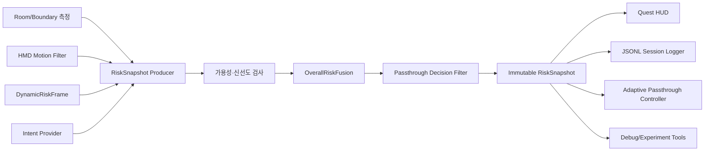

# 단일 RiskSnapshot 기반 위험도 통합 제작문서

> 상태 안내: 이 문서는 현재 통합 구현의 설계와 이력을 설명한다. 다음 구현에서는
> 정적·동적 위험을 독립 정책으로 재분리하며, 변경 기준은
> [정적·동적 위험도 재분리 제작문서](STATIC_DYNAMIC_RISK_SEPARATION_SPEC.md)를
> 따른다.

문서 버전: 1.1  
작성 기준일: 2026-07-28  
대상 프로젝트: `unity-client/`  
기준 문서: 중간보고서, `DYNAMIC_RISK_UNITY_IMPLEMENTATION.md`  
문서 상태: 코드 구현 및 자동 테스트 완료, Quest 3 실기기 검증 대기  

## 1. 문서 목적

현재 Unity 앱은 정적 경계 위험, 사용자 움직임 상태, 동적 객체 위험,
최종 위험도와 Passthrough 결정을 여러 컴포넌트의 개별 속성으로 관리한다.
HUD, 로그, Passthrough 제어기가 각 속성을 서로 다른 시점에 읽으면 한 화면이나
한 로그 레코드 안에 서로 다른 프레임의 값이 섞일 수 있다.

이번 구현의 목적은 다음 정보를 하나의 불변 `RiskSnapshot`으로 묶어 같은 시점의
판정 결과로 발행하는 것이다.

- `Rstatic`: 정적 경계 충돌 위험
- `Rstate`: 사용자 움직임 상태 위험
- `Rdynamic`: 확정된 동적 객체 위험
- `Rintent`: 사용자 상호작용 의도 위험
- `Rtotal`: 가용한 위험 요소의 통합 위험도
- 전체 위험 단계
- Passthrough 활성화 결정
- 각 입력의 가용 여부와 데이터 시각
- 확정된 사람 수와 대표 동적 객체 정보

이번 단계에서는 기존 위험도 수식 자체를 변경하지 않는다. 하나의 위험 상태를
생성하고 전달하는 데이터 계약과 실행 순서를 통합하는 것이 핵심이다.

## 2. 기준과 전제

### 2.1 중간보고서 기준

중간보고서의 전체 위험도 정의를 유지한다.

```text
Rtotal =
    wstatic  * Rstatic
  + wstate   * Rstate
  + wdynamic * Rdynamic
  + wintent  * Rintent

sum(weights) = 1
```

초기 가중치는 현재 Unity 구현과 같은 값을 사용한다.

| 위험 요소 | 초기 가중치 |
|---|---:|
| `Rstatic` | 0.40 |
| `Rstate` | 0.20 |
| `Rdynamic` | 0.40 |
| `Rintent` | 0.00 |

정적 위험도는 거리, TTC, 접근 가속도, 사각지대 위험의 가중 결합을 유지한다.

```text
Rstatic =
    (0.30 * Rd
   + 0.30 * RTTC
   + 0.25 * Ra
   + 0.15 * Rblind)
   / availableStaticWeightSum
```

사용자 상태 위험은 현재 기준을 유지한다.

| 사용자 상태 | `Rstate` |
|---|---:|
| `Static` | 0.0 |
| `Dynamic` | 0.5 |
| `Agitated` | 1.0 |

동적 객체 위험도는 현재 규칙 기반 `DynamicRiskEstimator`의 결과를 사용한다.
사람 수와 `Rdynamic`에는 확정된 트랙만 반영한다.

### 2.2 현재 테스트 결과에 대한 전제

2026-07-28 Quest 3 손 흔들기 시험에서 최대 확정 인원은 1명이었고, 기존의
9~10명 폭증은 재현되지 않았다. 사용자가 현재 결과를 만족 가능한 기준으로
판정했으므로 이번 `RiskSnapshot` 구현에는 추가 bbox threshold 조정을 포함하지
않는다.

검출 성능 조정이 다시 필요해지면 `RiskSnapshot` 외부의 검출기와 트래커를
조정한다. 스냅샷 계약은 그 결과를 전달할 뿐 검출 정책을 소유하지 않는다.

## 3. 현재 구조의 문제

현재 최종 위험 상태는 다음 위치에 분산되어 있다.

| 정보 | 현재 소유 위치 |
|---|---|
| 동적 객체별 위험 | `DynamicRiskFrame` |
| 최대 `Rdynamic` | `DynamicRiskController.LatestMaximumRisk` |
| `Rstatic` | `QuestRiskExperimentLogger.LastStaticRisk` |
| `Rstate` | `QuestRiskExperimentLogger.LastStateRisk` |
| 사용자 상태 | `QuestRiskExperimentLogger.CurrentUserState` |
| `Rtotal` | `QuestRiskExperimentLogger.LastTotalRisk` |
| Passthrough 결정 | `QuestRiskExperimentLogger.LastPassthroughDecision` |
| HUD | 위 속성을 개별 조회 |
| 동적 위험 로그 | `DynamicRiskFrame`만 별도 기록 |

이 구조에는 다음 문제가 있다.

1. `DynamicRiskFrame`이 갱신된 직후 `Rtotal`이 아직 이전 값일 수 있다.
2. HUD가 여러 속성을 순서대로 읽는 동안 값이 변경될 수 있다.
3. 정적 Scene 데이터가 없을 때와 실제 `Rstatic = 0`을 구분하기 어렵다.
4. 현재 사용하지 않는 `Rintent = 0`과 실제 의도 위험 0을 구분할 수 없다.
5. HUD, JSONL 로그, Passthrough 제어가 동일 판정을 사용했는지 추적하기 어렵다.
6. `QuestRiskExperimentLogger`가 측정, 위험 계산, UI 문자열 생성, 판정을 함께
   수행하여 책임이 과도하게 집중되어 있다.

## 4. 목표 구조



핵심 원칙:

- 최종 위험 상태를 작성하는 컴포넌트는 하나만 둔다.
- 스냅샷은 생성 후 변경할 수 없다.
- 모든 소비자는 같은 `Sequence`의 스냅샷을 사용한다.
- 위험값 0과 입력 사용 불가 상태를 분리한다.
- 오래된 동적 검출을 현재 위험으로 재사용하지 않는다.
- HUD와 로그는 위험도를 다시 계산하지 않는다.
- Passthrough 제어기는 `Rtotal`을 다시 판정하지 않고 스냅샷 결정을 사용한다.

## 5. RiskSnapshot 데이터 계약

### 5.1 최상위 모델

권장 파일:

```text
Assets/Scripts/AdaptivePassthrough/Core/RiskSnapshotModels.cs
```

권장 형태:

```csharp
public sealed class RiskSnapshot
{
    public readonly int SchemaVersion;
    public readonly long Sequence;
    public readonly double TimestampSeconds;

    public readonly RiskSourceState Sources;
    public readonly StaticRiskSnapshot Static;
    public readonly UserStateRiskSnapshot UserState;
    public readonly DynamicRiskSnapshot Dynamic;
    public readonly IntentRiskSnapshot Intent;
    public readonly OverallRiskResult Overall;
    public readonly OverallRiskLevel OverallLevel;
    public readonly PassthroughDecisionSnapshot Passthrough;
}
```

`RiskSnapshot`에는 `GameObject`, `Transform`, `MonoBehaviour`, `Texture`와 같은
Unity 객체 참조를 넣지 않는다. Core 계층에서 자동 테스트 가능한 순수 데이터로
유지한다.

### 5.2 공통 식별 필드

| 필드 | 의미 |
|---|---|
| `SchemaVersion` | 로그 및 외부 연동 데이터 계약 버전 |
| `Sequence` | 앱 실행 중 단조 증가하는 스냅샷 번호 |
| `TimestampSeconds` | `Time.realtimeSinceStartupAsDouble` 기준 생성 시각 |

초기 `SchemaVersion`은 `1`로 한다. `Sequence`는 1부터 시작하며 앱 실행 중
감소하거나 재사용하지 않는다.

### 5.3 입력 소스 상태

```csharp
public sealed class RiskSourceState
{
    public readonly bool CameraReady;
    public readonly bool RoomSceneReady;
    public readonly bool MotionReady;
    public readonly bool DynamicReady;
    public readonly bool IntentReady;
    public readonly double DynamicSourceTimestampSeconds;
    public readonly float DynamicSourceAgeSeconds;
}
```

가용 여부는 위험값과 분리한다.

- `RoomSceneReady = false`, `Rstatic = 0`은 "안전"이 아니라 "측정 불가"다.
- `DynamicReady = true`, `Rdynamic = 0`은 최근 검출 결과에 동적 위험이 없다는
  의미다.
- `IntentReady = false`, `Rintent = 0`은 아직 의도 추정기가 연결되지 않았다는
  의미다.

### 5.4 정적 위험 스냅샷

```csharp
public sealed class StaticRiskSnapshot
{
    public readonly bool Available;
    public readonly float ClosestDistanceMeters;
    public readonly float TimeToCollisionSeconds;
    public readonly bool HasTimeToCollision;
    public readonly float TowardBoundarySpeed;
    public readonly float TowardBoundaryAcceleration;
    public readonly float DistanceRisk;
    public readonly float TtcRisk;
    public readonly float AccelerationRisk;
    public readonly float BlindSpotRisk;
    public readonly float Risk;
}
```

Room Scene이나 유효한 경계 면이 없으면 `Available = false`로 생성한다.
`float.MaxValue`, `Infinity`, `NaN`은 스냅샷에 직접 넣지 않고 `HasTimeToCollision`
필드로 유효성을 표현한다.

### 5.5 사용자 상태 위험 스냅샷

```csharp
public sealed class UserStateRiskSnapshot
{
    public readonly bool Available;
    public readonly UserMotionState StableState;
    public readonly float FilteredSpeed;
    public readonly float FilteredAcceleration;
    public readonly float FilteredAngularSpeed;
    public readonly float Risk;
}
```

`UserMotionStateFilter`의 안정화된 값을 사용한다. HUD나 다른 소비자가 속도값을
다시 임계값과 비교하여 상태를 계산하지 않는다.

### 5.6 동적 위험 스냅샷

```csharp
public sealed class DynamicRiskSnapshot
{
    public readonly bool Available;
    public readonly double SourceTimestampSeconds;
    public readonly float SourceAgeSeconds;
    public readonly int ConfirmedPersonCount;
    public readonly float MaximumRisk;
    public readonly DynamicRiskLevel MaximumLevel;
    public readonly int PrimaryTrackId;
    public readonly float PrimaryConfidence;
    public readonly DynamicMotionState PrimaryMotionState;
}
```

`PrimaryTrackId`는 가장 높은 동적 위험도를 가진 확정 트랙이다. 확정된 사람이
없으면 `PrimaryTrackId = 0`으로 한다.

스냅샷마다 동적 객체 목록 전체를 복제하지 않는다. 기존 `DynamicRiskFrame`은
상세 디버그와 객체별 로그에 계속 사용할 수 있지만, 최종 위험 소비자는
`DynamicRiskSnapshot` 요약을 사용한다.

### 5.7 의도 위험 스냅샷

```csharp
public sealed class IntentRiskSnapshot
{
    public readonly bool Available;
    public readonly float Risk;
    public readonly float Confidence;
}
```

현재 MVP에서는 다음 값으로 생성한다.

```text
Available = false
Risk = 0
Confidence = 0
```

향후 손과 사람의 상호작용 의도 모델이 추가되어도 최상위 스냅샷 계약은
변경하지 않는다.

### 5.8 전체 위험과 위험 단계

기존 `OverallRiskResult`를 재사용하되 위험 단계는 동적 객체 단계와 구분한다.

```csharp
public enum OverallRiskLevel
{
    Safe,
    Caution,
    Warning,
    Danger
}
```

초기 전체 위험 단계는 현재 Quest HUD 기준을 유지한다.

| `Rtotal` 범위 | 전체 위험 단계 |
|---|---|
| `< 0.30` | `Safe` |
| `< 0.60` | `Caution` |
| `< 0.80` | `Warning` |
| `>= 0.80` | `Danger` |

동적 객체별 `DynamicRiskLevel` 기준인 0.25, 0.50, 0.75와 혼용하지 않는다.

### 5.9 Passthrough 결정 스냅샷

```csharp
public sealed class PassthroughDecisionSnapshot
{
    public readonly bool Enabled;
    public readonly PassthroughDecisionReason Reason;
    public readonly float OnThreshold;
    public readonly float OffThreshold;
    public readonly float HeldSeconds;
}
```

최초 구현은 기존 `0.60` 단일 임계값 동작을 보존하는 호환 모드로 시작한다.
단일 스냅샷 전환이 검증된 뒤 다음 히스테리시스를 선택적으로 활성화한다.

```text
OFF -> ON: Rtotal >= 0.60
ON  -> OFF: Rtotal < 0.50
최소 유지 시간: 0.50초
```

호환 모드와 히스테리시스 모드는 설정으로 분리한다. 데이터 계약 변경 없이
결정 필터만 교체할 수 있어야 한다.

## 6. 위험값 가용성 정책

### 6.1 가중치 재정규화

사용할 수 없는 위험 요소는 단순히 0점으로 포함하지 않고 분모에서도 제외한다.

```text
Rtotal =
    sum(weight[i] * risk[i] for available inputs)
    / sum(weight[i] for available inputs)
```

예를 들어 Room Scene을 사용할 수 없고 `Rintent`가 아직 구현되지 않았다면:

```text
Rtotal =
    (0.20 * Rstate + 0.40 * Rdynamic)
    / (0.20 + 0.40)
```

이는 현재 `QuestRiskExperimentLogger`의 no-room 분기 동작과 일치한다.

가용한 입력의 가중치 합이 0이면 다음과 같이 처리한다.

```text
Overall.Available = false
Rtotal = 0
OverallLevel = Safe
Passthrough.Enabled = false
Reason = NoRiskInputs
```

`OverallRiskResult`에 `Available`을 추가하거나 `RiskSnapshot`의 별도 필드로
전체 위험 가용성을 표현한다.

### 6.2 동적 데이터 신선도

동적 객체 검출은 HMD 프레임보다 느리게 갱신된다. 최신 `DynamicRiskFrame`을
무기한 재사용하지 않도록 source age를 검사한다.

초기값:

```text
dynamicStaleAfterSeconds = 0.50
```

| 조건 | 처리 |
|---|---|
| 카메라 준비 전 | `Dynamic.Available = false` |
| 최신 frame 없음 | `Dynamic.Available = false` |
| source age <= 0.50초 | 최신 동적 위험 사용 |
| source age > 0.50초 | stale 처리, 가중치에서 제외 |

트래커의 0.5초 Lost 유지 시간과 동적 source stale 시간을 동일한 설정으로
묶지 않는다. 두 값의 의미는 다르며 각각 조정 가능해야 한다.

### 6.3 숫자 유효성

스냅샷 생성 직전에 모든 수치를 검사한다.

- `NaN`과 무한대 거부
- 모든 위험도 `0~1`로 clamp
- 음수 거리와 음수 source age 거부
- 확정 인원수 음수 거부
- 존재하지 않는 대표 트랙의 ID는 0

유효성 오류는 조용히 정상값으로 위장하지 않고 진단 카운터와 경고 로그로
남긴다.

## 7. 생산자 설계

권장 파일:

```text
Assets/Scripts/AdaptivePassthrough/Core/RiskSnapshotBuilder.cs
Assets/Scripts/AdaptivePassthrough/Unity/QuestRiskSnapshotController.cs
Assets/Scripts/AdaptivePassthrough/Core/PassthroughDecisionFilter.cs
```

### 7.1 RiskSnapshotBuilder

순수 C# 구현으로 다음 입력을 받는다.

```text
timestamp
source readiness
static risk measurement
UserMotionSnapshot
DynamicRiskFrame
intent measurement
weights and thresholds
previous passthrough decision
```

출력은 완성된 `RiskSnapshot` 하나다. Unity API를 호출하지 않으며 EditMode
테스트에서 직접 검증한다.

### 7.2 QuestRiskSnapshotController

Unity 실행 순서와 데이터 연결을 담당한다.

```csharp
public sealed class QuestRiskSnapshotController : MonoBehaviour
{
    public RiskSnapshot Latest { get; private set; }
    public event Action<RiskSnapshot> SnapshotPublished;
}
```

책임:

1. HMD와 Room Scene 측정값 수집
2. 안정화된 `UserMotionSnapshot` 수집
3. 최신 `DynamicRiskFrame` 수집
4. 입력별 가용성과 source age 계산
5. `RiskSnapshotBuilder` 호출
6. `Latest`를 한 번 교체
7. 동일 인스턴스를 모든 구독자에게 발행

HUD 문자열 생성, JSON 직렬화, 실제 Passthrough API 호출은 담당하지 않는다.

### 7.3 발행 주기

초기 권장값:

```text
snapshotRateHz = 20 Hz
HUD refreshRateHz = 5 Hz
snapshotLogRateHz = 10 Hz
dynamicInferenceRateHz = 현재 설정 유지
```

20 Hz는 최대 50ms의 판정 지연을 가지며 HMD 프레임마다 객체를 할당하는 것을
피한다. 실제 Quest Profiler에서 GC와 CPU 시간을 측정한 뒤 조정한다.

새 `DynamicRiskFrame`이 도착하면 다음 Unity Update에서 반영한다. 이벤트
콜백 안에서 즉시 최종 위험을 다시 계산하지 않아 생산 순서를 하나로 유지한다.

### 7.4 발행 원자성

다음 순서를 반드시 지킨다.

```text
모든 입력 읽기
-> 임시 지역 변수로 모든 위험 계산
-> RiskSnapshot 생성 완료
-> Latest 교체
-> SnapshotPublished 호출
```

부분 계산 중에는 `Latest`를 변경하지 않는다. 이벤트 발생 후에는 스냅샷 내부
값을 변경하지 않는다.

## 8. 소비자 설계

### 8.1 Quest HUD

`QuestRiskHud`는 다음 속성을 개별 조회하지 않는다.

```text
QuestRiskExperimentLogger.LastStateRisk
QuestRiskExperimentLogger.LastTotalRisk
QuestRiskExperimentLogger.LastPassthroughDecision
DynamicRiskController.LatestFrame
```

대신 `QuestRiskSnapshotController.Latest` 하나만 읽는다.

HUD 예시:

```text
Camera: READY | Room: UNAVAILABLE | Seq: 1842
People: 0 | Rdynamic: 0.00 | Age: 0.08s
User: Static | Rstate: 0.00
Rtotal: 0.00 | Safe | Passthrough: OFF
```

HUD Canvas 배치와 렌더링 문제는 별도 UI 수정 작업이다. `RiskSnapshot`은
표시할 데이터의 일관성만 보장한다.

### 8.2 세션 로그

권장 파일:

```text
Assets/Scripts/AdaptivePassthrough/Unity/RiskSnapshotSessionLogger.cs
```

모든 최종 위험 로그에 `schemaVersion`과 `sequence`를 포함한다.

```json
{
  "recordType": "riskSnapshot",
  "schemaVersion": 1,
  "sequence": 1842,
  "timestampSeconds": 93.25,
  "cameraReady": true,
  "roomSceneReady": false,
  "dynamicReady": true,
  "dynamicSourceAgeSeconds": 0.08,
  "confirmedPersonCount": 0,
  "userState": "Static",
  "rstaticAvailable": false,
  "rstatic": 0.0,
  "rstate": 0.0,
  "rdynamic": 0.0,
  "rintentAvailable": false,
  "rintent": 0.0,
  "rtotal": 0.0,
  "overallLevel": "Safe",
  "passthroughEnabled": false
}
```

기존 객체별 assessment 로그는 유지할 수 있다. 다만 각 assessment에도 해당
최종 위험 스냅샷의 `sequence`를 연결할 수 있어야 한다.

### 8.3 Adaptive Passthrough 제어

Passthrough 제어기는 다음 입력만 사용한다.

```text
snapshot.Passthrough.Enabled
snapshot.Passthrough.Reason
snapshot.Sequence
```

제어기가 자체 임계값으로 `Rtotal`을 다시 판단하면 안 된다. 적용 성공 여부와
실제 적용한 `Sequence`를 로그로 남긴다.

### 8.4 실험·디버그 도구

디버그 오버레이, 원격 Dashboard, 향후 Backend 전송도 같은 스냅샷을 사용한다.
이를 통해 화면, 로그, 실제 제어가 같은 `Sequence`였는지 사후 검증할 수 있다.

## 9. QuestRiskExperimentLogger 분리 계획

현재 `QuestRiskExperimentLogger`는 다음 책임을 함께 가진다.

- Scene permission과 Room Scene 로딩
- 정적 경계 면 수집
- HMD와 손 속도 계산
- 사용자 상태 계산
- 정적 위험 계산
- 전체 위험 결합
- Passthrough 결정
- UI 문자열 생성

한 번에 전체 파일을 교체하지 않고 다음 순서로 분리한다.

### 단계 1: 측정값 공개

- Room Scene 상태와 가장 가까운 경계 측정을 구조체로 반환
- 안정화된 `UserMotionSnapshot`을 제공
- 기존 UI와 위험 계산은 유지

### 단계 2: 병렬 RiskSnapshot 생성

- `QuestRiskSnapshotController` 추가
- 기존 `Last*Risk` 값과 새 스냅샷 값을 동시에 계산
- 두 결과의 차이를 진단 로그로 기록
- 이 단계에서는 HUD와 Passthrough 제어를 변경하지 않음

### 단계 3: 소비자 전환

1. JSONL 최종 위험 로그
2. Quest HUD
3. 디버그 오버레이
4. Adaptive Passthrough 제어

각 소비자를 하나씩 전환하고 자동 테스트와 Quest smoke test를 수행한다.

### 단계 4: 중복 제거

다음 공개 속성과 중복 최종 위험 계산을 제거한다.

```text
LastStaticRisk
LastStateRisk
LastDynamicRisk
LastTotalRisk
LastPassthroughDecision
```

호환이 필요한 동안에는 `[Obsolete]` 읽기 전용 어댑터로
`RiskSnapshotController.Latest` 값을 반환하게 할 수 있다.

## 10. 파일별 구현 계획

| 파일 | 변경 내용 |
|---|---|
| `RiskSnapshotModels.cs` | 신규. 불변 스냅샷과 하위 모델 정의 |
| `RiskSnapshotBuilder.cs` | 신규. 가용성, 신선도, 전체 위험 계산 |
| `PassthroughDecisionFilter.cs` | 신규. 호환 임계값과 선택적 히스테리시스 |
| `QuestRiskSnapshotController.cs` | 신규. Unity 입력 수집과 단일 발행 |
| `OverallRiskFusion.cs` | 가용 입력 기반 재정규화 API 추가 |
| `QuestRiskExperimentLogger.cs` | 측정 제공자 역할로 축소 |
| `QuestRiskHud.cs` | `Latest RiskSnapshot`만 사용 |
| `DynamicRiskSessionLogger.cs` | sequence 연결 또는 객체별 로그로 역할 축소 |
| `RiskSnapshotSessionLogger.cs` | 신규. 최종 위험 스냅샷 JSONL 기록 |
| `SampleScene.unity` | 생산자와 소비자 참조 연결 |
| `RiskSnapshotBuilderTests.cs` | 신규. 순수 계산 테스트 |
| `RiskSnapshotIntegrationTests.cs` | 신규. Scene 참조와 단일 소비 경로 검증 |

## 11. 자동 테스트 계획

### 11.1 데이터 계약

- 생성 후 필드가 변경되지 않음
- `SchemaVersion = 1`
- `Sequence`가 단조 증가
- 모든 위험도가 `0~1`
- `NaN`과 무한대가 최종 스냅샷에 없음

### 11.2 위험 결합

- 모든 입력 가용 시 기존 가중치 계산과 일치
- Room Scene 미가용 시 `Rstatic` 가중치 제외
- intent 미구현 시 `Rintent` 가중치 제외
- 모든 입력 미가용 시 전체 위험 미가용 처리
- 0 가중치가 분모 오류를 만들지 않음
- 동일 입력에서 기존 계산과 오차 `1e-5` 이하

### 11.3 동적 데이터 신선도

- 0.50초 이하 frame 사용
- 0.50초 초과 frame 제외
- source age가 음수가 되지 않음
- stale frame의 사람 수와 위험이 현재 판정에 남지 않음
- 트래커 Lost 유지와 source stale 설정이 독립적으로 동작

### 11.4 원자성

- 한 번의 발행에서 HUD, logger, controller가 같은 `Sequence` 수신
- 이벤트 발생 전 `Latest`가 완성된 스냅샷으로 교체됨
- 발행 중 입력이 갱신되어도 현재 스냅샷 값이 바뀌지 않음
- 소비자가 위험도를 다시 계산하지 않음

### 11.5 Passthrough 결정

- 호환 모드에서 기존 0.60 임계값과 동일
- 히스테리시스 모드 ON/OFF 경계 검증
- 한 프레임 spike로 결정이 반복 전환되지 않음
- 최소 유지 시간 검증
- no-risk-input 상태에서 안전한 기본 결정

### 11.6 Scene 통합

- `QuestRiskSnapshotController`가 정확히 1개 존재
- HUD와 logger가 같은 producer를 참조
- 기존 `Last*Risk` 직접 참조가 남아 있지 않음
- Scene 데이터가 없어도 동적 위험 시험이 계속 동작

## 12. Quest 3 실기기 시험

### Q1: 데이터 동기화

- 60초간 앱 실행
- HUD, JSONL, Passthrough 적용 로그의 `Sequence` 비교
- 기대 결과: 같은 시점의 세 소비자가 동일한 sequence 사용

### Q2: Room Scene 없음

- Room Scene을 사용할 수 없는 상태에서 실행
- 기대 결과:
  - `RoomSceneReady = false`
  - `Static.Available = false`
  - `Rstate`, `Rdynamic` 가중치만 재정규화
  - 앱과 로그가 중단되지 않음

### Q3: 동적 frame 중단

- 카메라 권한 또는 검출 입력을 일시적으로 중단
- 기대 결과:
  - 0.50초 이후 `Dynamic.Available = false`
  - 오래된 사람 수와 `Rdynamic`이 남지 않음
  - 다른 가용 위험 입력으로 `Rtotal` 계산 유지

### Q4: 위험도 단계 전환

- 정지, 이동, 빠른 회전을 순서대로 수행
- 실제 사람 접근과 후퇴를 수행
- 기대 결과:
  - 각 스냅샷 내부의 상태와 `Rstate`가 일치
  - 대표 동적 객체와 `Rdynamic`이 일치
  - `Rtotal`, 위험 단계, Passthrough 결정이 동일 sequence에서 일치

### Q5: 장시간 안정성

- 30분 연속 실행
- 확인 항목:
  - sequence 역전이나 중복 없음
  - `NaN`, 무한대 없음
  - 로그 누락률
  - GC spike와 프레임 드롭
  - stale source 처리 횟수

## 13. 진단 로그

다음 상황은 경고 또는 카운터로 기록한다.

- `RiskSnapshot` 입력에 `NaN` 또는 무한대
- sequence 중복 또는 역전
- 동적 frame stale 전환
- 전체 위험 입력이 모두 미가용
- HUD가 오래된 sequence를 반복 사용
- Passthrough 적용 sequence와 최신 sequence 차이가 설정값 초과
- 기존 계산과 병렬 스냅샷 계산의 오차가 `1e-5` 초과

원본 카메라 영상은 저장하지 않는다. 스냅샷에는 위험도와 진단 메타데이터만
기록한다.

## 14. 성능 기준

Quest 3 초기 목표:

| 항목 | 목표 |
|---|---:|
| 스냅샷 생성 평균 시간 | 0.20ms 이하 |
| 스냅샷 생성 P95 | 0.50ms 이하 |
| 추가 GC allocation | 초당 10KB 이하 목표 |
| 발행 주기 | 20 Hz |
| HUD 갱신 | 5 Hz |
| 최종 위험 로그 | 10 Hz 이하 |

문자열은 HUD와 logger에서만 생성한다. Core 스냅샷은 문자열 배열이나 전체 bbox
목록을 매번 복사하지 않는다.

## 15. 완료 조건

다음 조건을 모두 만족해야 구현 완료로 판단한다.

- [x] 최종 위험을 발행하는 producer가 Scene에 1개만 존재
- [x] `RiskSnapshot`이 생성 후 변경되지 않음
- [x] 모든 스냅샷에 schema version, sequence, timestamp가 있음
- [x] 위험값 0과 입력 미가용 상태가 구분됨
- [x] Room Scene 미가용 시 가중치가 재정규화됨
- [x] stale 동적 frame이 최종 위험에서 제외됨
- [x] HUD가 하나의 `RiskSnapshot`만 사용
- [x] 최종 JSONL 로그가 하나의 `RiskSnapshot`만 사용
- [ ] Passthrough 제어가 스냅샷 결정을 그대로 사용
- [ ] HUD, 로그, 실제 제어의 sequence가 일치
- [x] 기존과 동일한 입력에서 `Rtotal` 오차가 `1e-5` 이하
- [x] 전체 EditMode 테스트 통과
- [ ] Quest 3 Q1~Q5 시험 통과
- [ ] 30분 실행 중 지속적인 메모리 증가나 치명적 예외 없음

## 16. 구현 제외 범위

다음 항목은 이번 제작문서의 구현 범위에 포함하지 않는다.

- 사람 검출 모델 교체 또는 추가 threshold 조정
- ByteTrack, SORT와 같은 트래커 교체
- 깊이 기반 실제 거리 추정
- `Rintent` 추정 모델 구현
- 개인화 모델 학습과 가중치 자동 갱신
- Quest HUD Canvas가 보이지 않는 렌더링 문제 수정
- Passthrough 시각화 방식 자체의 변경

위 기능은 `RiskSnapshot`을 입력 또는 출력 계약으로 사용하여 별도 작업으로
진행한다.
