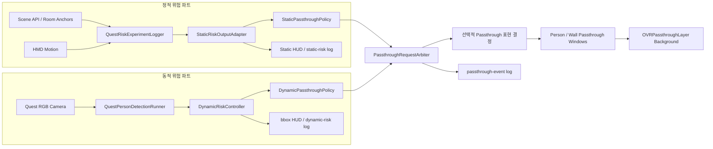

# 정적·동적 위험도 재분리 제작문서

문서 버전: 1.2  
작성 기준일: 2026-07-28  
대상 프로젝트: `unity-client/`  
구현 기준 브랜치: `codex/quest3-risk-snapshot-integration`  
통합 직전 정적 기준점: `bb8ca3e`  
현재 통합 기준점: `fc246be`  
문서 상태: 구현 전 설계 확정안

## 1. 문서 목적

현재 Unity 앱은 정적 경계 위험, 사용자 움직임 상태, 동적 객체 위험을 하나의
`RiskSnapshot`과 하나의 `Rtotal`로 통합한다. 그러나 실제 Passthrough를 적용하고
로그 기반 개인화를 진행하려면 정적 위험과 동적 위험의 발생 원인, 표시 방식,
사용자 반응을 각각 추적할 수 있어야 한다.

이번 작업의 목적은 다음과 같다.

1. 정적 위험과 동적 위험의 계산·판정·UI·로그 책임을 다시 분리한다.
2. 정적 파트는 통합 직전 구현의 책임과 동작을 최대한 유지한다.
3. 동적 파트는 현재 Quest 3 사람 검출, 추적, bbox 안정화 및 위험도 구현을
   독립적으로 유지한다.
4. 두 파트가 실제 Passthrough 장치를 동시에 요구할 때만 얇은 조정 계층에서
   충돌을 해결한다.
5. 이후 정적·동적 로그 기반 개인화 정책을 서로 독립적으로 적용할 수 있게 한다.
6. 동적 위험은 해당 인물 영역을, 정적 위험은 접근 중인 벽 방향을 실제
   Passthrough Window로 표시한다.

이 문서에서 말하는 “재분리”는 Git 과거 버전으로 파일 전체를 되돌린다는 뜻이
아니다. **통합 전의 책임 경계를 복원하되, 통합 이후 검증된 안정화 수정은
보존한다**는 뜻이다.

## 2. 배경과 현재 상태

### 2.1 통합 전 정적 구현

통합 직전 `main`의 `QuestRiskExperimentLogger`는 다음 기능을 한 컴포넌트에서
수행했다.

- Quest Scene API로 `WallFace`, `InvisibleWallFace` 수집
- HMD 및 컨트롤러 움직임 계산
- 가장 가까운 벽까지 거리, 접근 속도, 접근 가속도, TTC 계산
- `Rd`, `RTTC`, `Ra`, `Rblind` 계산
- 정적 충돌 위험 `Rcollision` 계산
- 사용자 움직임 상태와 `Rstate` 계산
- 정적 파트 기준 `Rtotal`과 Passthrough 필요 여부 계산
- 정적 실험 UI 표시

동적 위험과 의도 위험은 당시 다음처럼 자리만 예약되어 있었다.

```text
Rdynamic = 0
Rintent  = 0
```

통합 전 정적 파트의 총위험도는 다음 설정을 기본값으로 사용했다.

```text
RstaticDecision = 0.60 × Rstatic + 0.40 × Rstate
```

여기서 기존 코드의 `Rcollision`은 현재 용어의 `Rstatic`과 같은 의미로 취급한다.

### 2.2 현재 동적 구현

동적 파트는 다음 흐름으로 독립 실행이 가능한 상태다.

```text
Quest RGB 카메라
→ YOLO 사람 bbox
→ 검출 후처리
→ ID 추적
→ 크기·중심 이력
→ 접근/정지/이탈 및 TTC proxy
→ 상대 위치
→ Rdynamic
→ bbox HUD 및 dynamic-risk JSONL
```

동적 파트의 핵심 진입점은 `DynamicRiskController`이고 최종 출력은
`DynamicRiskFrame`이다. `DynamicRiskFrame`은 객체별 평가와 최대 동적 위험도를
이미 소유하므로 정적 파트가 없어도 실행할 수 있다.

### 2.3 현재 통합 구조

현재는 `QuestRiskSnapshotController`가 다음 입력을 읽는다.

- `QuestRiskExperimentLogger.CurrentStaticMeasurement`
- `QuestRiskExperimentLogger.CurrentMotionSnapshot`
- `DynamicRiskController.LatestFrame`
- Quest 카메라 준비 상태

그리고 `RiskSnapshotBuilder`가 다음 통합값과 단일 결정을 만든다.

```text
Rtotal =
    0.40 × Rstatic
  + 0.20 × Rstate
  + 0.40 × Rdynamic
  + 0.00 × Rintent
```

입력을 사용할 수 없으면 해당 가중치를 제외하고 나머지 가중치를 재정규화한다.
이 구조는 한 시점의 전체 상태를 기록하는 데는 유용하지만 다음 문제가 있다.

1. 정적 위험과 동적 위험이 서로 다른 임계값과 표시 방식을 가질 수 없다.
2. 사용자가 어떤 원인의 Passthrough를 취소했는지 구분하기 어렵다.
3. Room Scene을 사용할 수 없는 상황과 동적 객체가 없는 상황이 한 결정에 섞인다.
4. 정적 파트가 동적 컨트롤러와 통합 컨트롤러를 직접 참조한다.
5. 한쪽 파트의 수정이 통합 스냅샷, HUD, 로그 테스트까지 연쇄적으로 영향을 준다.
6. 개인화 모델이 정적·동적 선호를 독립적으로 학습하기 어렵다.

## 3. 이번 재분리의 결정 사항

### 3.1 결정 요약

| 항목 | 결정 |
|---|---|
| 위험 계산 | 정적과 동적을 독립 계산한다. |
| 위험 판정 | 정적·동적 정책이 각자 ON/OFF 요청을 만든다. |
| 통합 `Rtotal` | 실제 Passthrough 제어에 사용하지 않는다. |
| 사용자 상태 | 통합 전과 같이 정적 파트의 보조 입력으로 유지한다. |
| 실제 Passthrough | 두 정책이 직접 장치를 제어하지 않고 조정 계층에 요청한다. |
| UI | 정적 HUD와 동적 bbox/HUD를 분리한다. |
| 로그 | `static-risk`, `dynamic-risk`, `passthrough-event`로 분리한다. |
| 개인화 | 정적·동적 프로필과 임계값을 독립적으로 적용한다. |
| 긴급 안전 | 어느 한쪽이라도 긴급이면 개인화를 무시하고 표시한다. |
| 실제 렌더링 | 배경 Passthrough 한 개와 화면 alpha 기반 Passthrough Window를 사용한다. |

### 3.2 유지할 통합 이후 개선 사항

책임은 분리하지만 다음 구현은 되돌리지 않는다.

- 사람 bbox 검출 후처리 및 중복 억제
- ID 추적과 Lost 유지시간
- 접근/정지/이탈 판정
- 동적 위험도 계산식과 상세 JSONL
- 사용자 움직임 상태의 필터링, 히스테리시스 및 최소 유지시간
- Quest 카메라 권한 처리
- 모델과 Quest 카메라 연결
- 현재 앱의 설치·빌드 도구
- 숫자 유효성 검사와 입력 availability 개념

특히 `QuestRiskExperimentLogger.cs`를 `bb8ca3e` 버전으로 통째로 체크아웃하지
않는다. 그렇게 하면 사용자 상태가 빠르게 바뀌던 문제를 해결한 필터도 함께
사라진다.

### 3.3 이번 단계에서 하지 않는 일

- 개인화 모델 학습
- Quest 내부 ONNX 개인화 추론
- `Rintent` 구현
- 정적 위험 계산식 자체의 튜닝
- 동적 위험 계산식 자체의 튜닝
- 정적 파트 전체 리팩터링
- 착용자의 후진 및 현재 시야 밖 후방 벽 충돌 대응
- 후방 방향 cue, 진동, 공간 음향 및 후방 위험 기반 전체 Passthrough

이번 단계는 각 위험원이 독립적으로 계산되고 독립적인 요청을 만들며, 그 요청이
실제 선택적 Passthrough 표현으로 이어지는 데까지를 완료 범위로 한다.
정적 벽 방향이 현재 카메라 FOV 밖이면 이번 구현에서는 정적 window를 표시하지
않는다. 후방 벽 대응은 별도 안전 기능으로 분리해 후속 단계에서 설계·검증한다.

## 4. 목표 아키텍처



핵심은 `PassthroughRequestArbiter`가 위험도를 다시 합산하지 않는다는 점이다.
이 컴포넌트는 이미 내려진 두 요청의 충돌만 해결한다.

## 5. 파트별 책임

### 5.1 정적 파트

정적 파트는 방 경계와 사용자 자기 움직임으로 인한 충돌 위험을 담당한다.

입력:

- Room Scene의 벽 앵커
- HMD 위치와 회전
- 좌우 컨트롤러 위치

출력:

- 정적 입력 사용 가능 여부
- `Rstatic`
- `Rstate`
- 거리, TTC, 접근 속도·가속도, 사각지대 위험
- 안정화된 사용자 상태
- 정적 Passthrough 요청

정적 파트는 다음 항목을 참조하지 않는다.

- `DynamicRiskController`
- `DynamicRiskFrame`
- 사람 수와 bbox
- Quest 카메라 준비 상태
- 동적 Passthrough 결정

Room Scene이 없으면 정적 출력만 `Unavailable`이 된다. 동적 파트의 실행과 UI에는
영향을 주지 않는다.

### 5.2 동적 파트

동적 파트는 Quest 카메라 영상에 나타난 사람의 접근 위험을 담당한다.

입력:

- Quest Passthrough Camera 영상
- YOLO 사람 검출 결과

출력:

- 동적 입력 사용 가능 여부
- 확인된 사람 수
- 객체별 bbox와 track ID
- 접근/정지/이탈 상태
- TTC proxy와 상대 위치
- `Rdynamic` 및 동적 위험 등급
- 동적 Passthrough 요청

동적 파트는 다음 항목을 참조하지 않는다.

- Room Scene 준비 상태
- 벽 앵커와 정적 거리
- `Rstatic`
- 정적 Passthrough 결정

동적 파트는 Space Setup을 하지 않아도 카메라 권한과 모델 준비가 완료되면
실행되어야 한다.

### 5.3 공통 조정 계층

실제 Quest에는 하나의 사용자가 보는 최종 화면이 있으므로 두 파트가 동시에
Passthrough 장치를 직접 켜고 끄면 안 된다. 다음과 같은 공통 요청 계약만
공유한다.

```csharp
public enum RiskSource
{
    Static,
    Dynamic
}

public sealed class PassthroughRequest
{
    public long Sequence;
    public double TimestampSeconds;
    public RiskSource Source;
    public bool Available;
    public bool Enabled;
    public float Risk;
    public string Level;
    public string Reason;
    public float OnThreshold;
    public float OffThreshold;
    public float HeldSeconds;
    public bool EmergencyOverride;
}
```

이 계약에는 상대 파트의 위험값이나 통합 위험값을 넣지 않는다.

## 6. 데이터 계약

### 6.1 정적 출력 계약

정적 원본 코드를 크게 수정하지 않기 위해 새 `StaticRiskOutputAdapter`가
`QuestRiskExperimentLogger`의 읽기 전용 출력을 가져와 다음 프레임을 발행한다.

```csharp
public sealed class StaticRiskFrame
{
    public long Sequence;
    public double TimestampSeconds;
    public bool Available;
    public StaticRiskMeasurement Measurement;
    public StaticHazardDirection HazardDirection;
    public UserMotionSnapshot Motion;
    public float StaticRisk;
    public float StateRisk;
    public float DecisionRisk;
    public StaticRiskLevel Level;
}
```

정적 결정용 점수의 초기값은 통합 전 동작을 따른다.

```text
DecisionRisk =
    (0.60 × Rstatic + 0.40 × Rstate)
    / availableWeightSum
```

정적 Scene 입력을 사용할 수 없으면 다음처럼 처리한다.

```text
Available = false
DecisionRisk = 0
Static passthrough request = unavailable/off
```

`Rstate`만으로 정적 Passthrough를 켜지 않는다. 정적 경계가 없을 때 움직임이
크다는 이유만으로 정적 경고를 내면 의미가 불명확하기 때문이다.

### 6.2 동적 출력 계약

기존 `DynamicRiskFrame`을 그대로 사용한다. 별도의 통합 스냅샷으로 복사하지
않는다.

동적 policy 입력은 다음 필드만 요구한다.

- `TimestampSeconds`
- `ConfirmedPersonCount`
- `MaximumRisk`
- `MaximumLevel`
- 최대 위험 객체의 `TrackId`
- 동적 source age

카메라가 준비되지 않았거나 최신 프레임이 stale이면 동적 요청은
`Unavailable/Off`가 된다.

### 6.3 Sequence 규칙

정적과 동적 sequence는 서로 독립적이다.

```text
staticSequence  = 정적 프레임 발행 순서
dynamicSequence = 동적 추론 프레임 발행 순서
requestSequence = 공통 조정 계층에 들어온 요청 순서
```

정적 sequence와 동적 sequence가 같을 필요는 없다. 로그 결합이 필요할 때는
sequence가 아니라 `TimestampSeconds`와 UTC 시간을 사용한다.

## 7. 독립 Passthrough 정책

### 7.1 정적 정책

초기 기본값:

```text
ON  : Static DecisionRisk >= 0.60
OFF : Static DecisionRisk <  0.50
최소 유지시간: 0.50초
긴급 기준: Rstatic >= 0.80
```

정적 위험은 벽이나 경계가 지속되는 특성이 있으므로 전체 Passthrough 또는 넓은
방향 표시 정책에 연결한다.

### 7.2 동적 정책

초기 기본값:

```text
ON  : Rdynamic >= 0.60
OFF : Rdynamic <  0.45
최소 유지시간: 0.75초
긴급 기준: Rdynamic >= 0.80 또는 DynamicRiskLevel.Danger
```

동적 위험은 사람 bbox와 방향을 알고 있으므로 이후 bbox 주변의 제한적
Passthrough 또는 방향 강조 표현에 연결한다.

동적 위험도의 자체 등급 경계인 `0.25`, `0.50`, `0.75`는 진단용으로 유지한다.
Passthrough ON/OFF 임계값은 표현 정책 값이므로 별도 설정으로 관리한다.

### 7.3 조정 규칙

| 정적 요청 | 동적 요청 | 최종 상태 | 원인 |
|---|---|---|---|
| OFF | OFF | OFF | `None` |
| ON | OFF | ON | `Static` |
| OFF | ON | ON | `Dynamic` |
| ON | ON | ON | `StaticAndDynamic` |
| Emergency | 임의 | ON | `StaticEmergency` |
| 임의 | Emergency | ON | `DynamicEmergency` |

OFF로 전환할 때는 **모든 활성 요청이 OFF**여야 한다. 한 파트가 ON인 동안 다른
파트가 OFF를 발행해도 최종 Passthrough를 끄지 않는다.

조정 계층은 다음 행위를 하지 않는다.

- `Rstatic`과 `Rdynamic`의 가중합
- 새로운 `Rtotal` 계산
- 상대 파트의 threshold 변경
- 사용자 상태 재분류
- 객체 위험도 재계산

## 8. 선택적 Passthrough 실제 구현

### 8.1 기술 방식 결정

현재 프로젝트는 다음 패키지를 사용한다.

```text
Meta XR Core SDK 203.0.0
Meta MR Utility Kit 203.0.0
Universal Render Pipeline 17.4.0
```

과거에는 `OVRPassthroughLayer.projectionSurfaceType = UserDefined`와
`AddSurfaceGeometry()`를 이용해 특정 메시에만 Passthrough를 투영할 수 있었다.
하지만 이 API는 Meta XR SDK v83부터 deprecated되었고 새 개발에는 권장되지
않는다. 현재 설치된 SDK의 `OVRPassthroughLayer.cs`에도 같은 폐기 경고가 있다.

따라서 새 구현에서는 **Passthrough Windows** 방식을 사용한다.

```text
한 개의 reconstructed/background OVRPassthroughLayer를 전체 화면 뒤에 유지
→ Unity 가상 장면을 정상 렌더링
→ 가장 마지막 렌더 단계에서 위험 영역의 framebuffer alpha를 낮춤
→ alpha가 낮아진 영역을 통해 배경 Passthrough가 보임
```

화면 alpha의 의미는 다음과 같다.

```text
alpha = 1.0 → 가상 장면 유지
alpha = 0.0 → Passthrough 완전 노출
0 < alpha < 1 → 가상 장면과 Passthrough 혼합
```

정적용과 동적용으로 `OVRPassthroughLayer`를 두 개 만들지 않는다. 프로젝트에
포함된 SDK 코드도 `OVRPassthroughLayer` 인스턴스는 하나만 존재해야 한다고
검사한다. 정적·동적 분리는 **위험 계산과 mask 생성 단계**에서 유지하고, 최종
렌더러가 두 mask의 합집합을 한 번만 framebuffer에 적용한다.

### 8.2 기본 렌더링 계층

렌더 순서는 다음과 같다.

```text
1. XR Compositor의 배경 Passthrough
2. Unity 가상 장면
3. Passthrough Window alpha mask
4. 위험 방향 화살표, 테두리, 텍스트
5. 개발용 bbox와 진단 HUD
```

위험 화살표와 경고 테두리는 Passthrough Window보다 나중에 그린다. 그래야
Passthrough가 켜져도 위험 원인 표시가 사라지지 않는다.

권장 Scene 구성:

```text
OVRCameraRig
├─ OVRManager
│  └─ Insight Passthrough Enabled
├─ OVRPassthroughLayer
│  ├─ Background/Reconstructed
│  ├─ Opacity = 1
│  └─ 한 Scene에 한 개만 존재
└─ Passthrough Presentation
   ├─ PassthroughPresentationController
   ├─ DynamicPersonMaskProvider
   ├─ StaticWallMaskProvider
   ├─ RearWallSafetyResolver
   └─ PassthroughWindowRenderer
```

### 8.3 Passthrough Window shader

Meta의 Passthrough Windows 방식에 맞춰 최종 framebuffer의 RGB와 alpha를
source alpha만큼 곱하는 shader를 사용한다.

핵심 blend 설정:

```shaderlab
BlendOp Add
Blend Zero SrcAlpha
ZWrite Off
ZTest Always
Cull Off
```

fragment 출력:

```hlsl
float reveal = max(dynamicRevealMask, staticRevealMask);
float virtualAlpha = 1.0 - saturate(reveal);
return float4(0, 0, 0, virtualAlpha);
```

이 pass는 모든 불투명·투명 가상 콘텐츠 뒤에서 실행되어야 한다. 권장 방식은
URP `ScriptableRendererFeature`의 `AfterRendering` 시점에 한 번 실행하는 것이다.
초기 프로토타입에서 render queue `5000`의 화면 채움 mesh로 검증할 수 있지만,
최종 구현은 렌더 순서가 명시적인 Renderer Feature를 기준으로 한다.

XR Single Pass Instanced 렌더링을 고려해 shader에 Unity stereo instance/eye
매크로를 포함한다. 왼쪽 눈과 오른쪽 눈 framebuffer 모두에 같은 의미의 mask가
적용되어야 한다.

한 프레임에 mask GameObject를 여러 개 그리면 겹치는 영역에서 alpha가 반복
곱해질 수 있다. 따라서 정적·동적 mask를 shader 안에서 먼저 `max()`로 합성하고
전체 화면 pass는 한 번만 실행한다.

### 8.4 공통 표현 상태 계약

조정 계층의 단순 ON/OFF 결과를 렌더링 가능한 상태로 확장한다.

```csharp
public enum PassthroughPresentationMode
{
    None,
    PersonWindow,
    WallWindow,
    CombinedWindows,
    RearWallWarning,
    GlobalEmergency
}

public sealed class PassthroughPresentationState
{
    public long Sequence;
    public double TimestampSeconds;
    public PassthroughPresentationMode Mode;
    public IReadOnlyList<PersonWindowMask> PersonMasks;
    public WallWindowMask WallMask;
    public RearWallCue RearCue;
    public bool StaticRequestActive;
    public bool DynamicRequestActive;
    public bool RearWallHazard;
    public bool GlobalEmergency;
    public string Reason;
}
```

`PassthroughRequestArbiter`는 위험을 합산하지 않지만 활성 source와 긴급 여부를
정리해 `PassthroughPresentationController`에 전달한다. 실제 mask 위치와 크기는
각 source의 mask provider가 계산한다.

### 8.5 동적 위험: 인물 영역 Passthrough

#### 8.5.1 표현 목표

확인된 사람 가운데 위험 정책이 활성화된 인물의 bbox 영역을 Passthrough
Window로 연다.

```text
확인된 person track
→ 안정화된 bbox
→ camera viewport에서 XR viewport로 재투영
→ padding과 feathering 적용
→ rounded rectangle 또는 ellipse reveal mask
```

현재 검출 결과는 bbox이므로 “사람 실루엣만 정확히” 보여줄 수는 없다. 첫
구현은 인물과 그 주변 배경을 포함하는 부드러운 사각형 또는 타원 영역이다.
사람 segmentation 모델을 추가하기 전까지 이를 사람 silhouette라고 기록하거나
평가하지 않는다.

#### 8.5.2 bbox 좌표 변환

YOLO bbox는 Passthrough Camera 영상의 정규화 좌표다. 이 좌표를 그대로 HMD
화면 좌표로 사용하면 카메라 위치, 시야각, 영상 반전 및 추론 지연 때문에
Passthrough Window가 사람과 어긋날 수 있다.

동적 검출 프레임에는 다음 메타데이터를 함께 보존한다.

```text
cameraPosition = Left | Right
cameraResolution
cameraTimestamp
cameraPoseAtCapture
cameraIntrinsics
flipVertical
```

MRUK `PassthroughCameraAccess`가 제공하는 다음 기능을 사용한다.

```text
Intrinsics
GetCameraPose()
ViewportPointToRay()
WorldToViewportPoint()
```

권장 변환 순서:

1. 추론에 사용한 프레임 시점의 camera pose를 저장한다.
2. bbox 네 모서리와 중심점을 `ViewportPointToRay()`로 world ray로 바꾼다.
3. ray 방향을 현재 center-eye camera viewport로 다시 투영한다.
4. 좌우 눈에 적용할 최종 정규화 rect를 계산한다.
5. 화면 밖 좌표는 clamp하되 완전히 FOV 밖인 객체는 방향 cue로 전환한다.

실제 metric depth가 없으므로 초기 버전은 ray 방향 기반 재투영을 사용한다.
가까운 사람은 좌·우 카메라와 center eye 간 parallax 때문에 오차가 커질 수 있다.
따라서 Quest 실험에서 bbox padding을 충분히 두고 좌·우/상·하 offset 보정값을
측정한다.

#### 8.5.3 인물 mask 설정

초기 권장값:

```text
bboxPaddingRatio = 0.12
minimumPaddingViewport = 0.015
edgeFeatherViewport = 0.025
maskPositionSmoothingSeconds = 0.12
maskSizeSmoothingSeconds = 0.18
lostMaskHoldSeconds = 0.50
maximumPersonMasks = 3
```

mask 선택 우선순위:

1. `Danger`
2. `Warning`
3. 위험도 점수
4. 화면 중심에 가까운 객체

동시에 사람이 많아도 가장 위험한 세 명까지만 별도 mask를 만든다. 네 명
이상에서 전체 mask 면적이 화면의 55%를 넘으면 여러 작은 창보다
`GlobalEmergency` 또는 하나의 합쳐진 넓은 창이 더 안정적이다.

위험도에 따른 표현:

| 동적 상태 | 표현 |
|---|---|
| Safe | 인물 Passthrough 없음 |
| Caution | 낮은 opacity의 작은 feathered window 또는 bbox cue만 표시 |
| Warning | bbox + padding 영역 Passthrough |
| Danger | 더 넓은 window, 강한 테두리, 최소 유지시간 적용 |

#### 8.5.4 동적 mask 시간 안정화

검출은 약 10 Hz로 갱신되고 HMD 렌더링은 72 Hz 이상이므로 bbox 위치를 새
검출값으로 즉시 점프시키지 않는다.

- 검출 사이에는 이전 rect에서 새 rect로 보간한다.
- 동일 `TrackId`에 대해서만 보간한다.
- 새 track은 짧게 fade-in한다.
- Lost 상태에서는 0.5초 동안 마지막 위치를 유지하며 fade-out한다.
- 위험 등급이 낮아져도 policy의 OFF threshold와 최소 유지시간을 통과한 뒤
  mask를 닫는다.

### 8.6 정적 위험: 접근 중인 벽 방향 Passthrough

#### 8.6.1 필요한 정적 출력 확장

현재 `StaticRiskMeasurement`에는 거리와 위험 성분은 있지만 화면에서 어느
방향을 열어야 하는지 결정할 충분한 정보가 없다. 정적 계산식은 바꾸지 않고
다음 읽기 전용 정보를 출력 계약에 추가한다.

```csharp
public sealed class StaticHazardDirection
{
    public int WallIndex;
    public Vector3 ClosestPointWorld;
    public Vector3 DirectionToWallWorld;
    public Vector3 WallNormalWorld;
    public float HeadRelativeYawDegrees;
    public float HeadRelativePitchDegrees;
    public bool InsideCurrentView;
    public bool RearRelative;
    public float BackwardSpeed;
}
```

가능하면 Room Scene anchor의 plane boundary 또는 너비·높이도 함께 보존한다.
그 정보가 없으면 초기 구현은 가장 가까운 벽 방향을 중심으로 한 screen-space
sector를 사용한다.

#### 8.6.2 벽 방향 계산

```text
directionToWallWorld = closestPointOnWall - hmdPosition
directionHeadLocal   = inverse(hmdRotation) × directionToWallWorld
yaw   = atan2(directionHeadLocal.x, directionHeadLocal.z)
pitch = atan2(directionHeadLocal.y,
              sqrt(x² + z²))
```

벽 방향이 현재 FOV 안이면 viewport 중심점을 구하고 그 방향에 Passthrough
Window를 만든다. FOV 바깥이면 화면 가장자리의 방향 화살표와 주변부 gradient를
표시한다.

벽의 정확한 화면 polygon을 만들 수 있을 때는 다음 순서를 사용한다.

1. Room Scene의 wall plane 경계점을 world 좌표로 변환한다.
2. center-eye camera로 각 점을 viewport에 투영한다.
3. 화면과 교차하는 polygon을 clip한다.
4. 사용자의 진행 방향과 가까운 부분을 mask로 선택한다.
5. feathering과 위험도 기반 확장을 적용한다.

#### 8.6.3 정적 mask 표현

초기 표현은 “벽 전체를 정확히 복원”하는 것이 아니라 **접근 중인 벽 방향의
현실을 넓게 보여주는 것**을 목표로 한다.

| 정적 상태 | 표현 |
|---|---|
| Safe | 벽 방향 Passthrough 없음 |
| Caution | 해당 방향 가장자리에 좁은 gradient |
| Warning | 해당 방향 화면 폭의 약 25~35%를 window로 표시 |
| Danger | 해당 방향을 크게 확장하거나 전체 Passthrough로 승격 |

초기 권장값:

```text
wallCautionHalfWidth = 0.12 viewport
wallWarningHalfWidth = 0.22 viewport
wallDangerHalfWidth = 0.35 viewport
wallEdgeFeather = 0.05 viewport
wallMaskSmoothingSeconds = 0.20
wallBehindViewAngle = 65 degrees
```

벽이 사용자 뒤쪽에 있으면 현재 전방 카메라 화면으로 뒤의 벽을 직접 보여줄 수
없다. **이번 구현은 이 경우 정적 Passthrough Window를 숨기고 추가 경고를
발생시키지 않는다.** 아래 항목은 후속 구현 후보이며 현재 범위에는 포함하지
않는다.

- 위험 방향을 가리키는 화면 가장자리 화살표
- “뒤/좌측/우측 벽 접근” 텍스트 또는 아이콘
- controller 진동 또는 공간 음향 경고
- Danger에서는 전체 Passthrough로 승격하여 사용자가 고개를 돌리는 즉시
  주변 전체를 확인할 수 있게 함

### 8.7 정적·동적 mask 합성

두 mask는 위험도 가중합 없이 화면 영역의 합집합으로 합친다.

```text
dynamicReveal = max(all active person masks)
staticReveal  = active wall-direction mask
finalReveal   = max(dynamicReveal, staticReveal)
virtualAlpha  = 1 - finalReveal
```

표현 결과:

| 정적 mask | 동적 mask | 화면 |
|---|---|---|
| 없음 | 없음 | 가상 장면 |
| 있음 | 없음 | 벽 방향만 Passthrough |
| 없음 | 있음 | 인물 영역만 Passthrough |
| 있음 | 있음 | 두 영역의 합집합 |
| 긴급 | 임의 | 전체 Passthrough |

mask가 겹치더라도 한 source가 다른 source를 지우지 않는다.

### 8.8 착용자가 뒤로 이동해 후방 벽에 접근하는 경우 — 후속 범위

> 구현 상태: 보류. 아래 내용은 현재 코드의 동작이 아니라 다음 단계의 설계
> 참고안이다. 현재 구현은 벽 방향이 FOV 밖이면 정적 window를 비활성화한다.

#### 8.8.1 상황 정의

여기서 “뒤쪽 위험”은 카메라에 검출된 사람 뒤에 벽이 있는 경우가 아니다.
**Quest 착용자가 뒤로 이동하다가 현재 시야 밖의 후방 벽에 충돌할 위험**을
뜻한다.

이 상황은 동적 사람 검출과 관계없이 정적 위험 파트가 담당한다.

```text
착용자 HMD 이동
→ 가장 가까운 벽 방향으로 속도 성분 발생
→ 해당 벽이 현재 시야 뒤쪽 또는 FOV 밖
→ RearWallHazard
```

동적 인물이 전방에 동시에 존재하면 인물 Passthrough Window는 그대로 유지하고,
후방 벽 경고를 별도의 정적 표현으로 함께 제공한다.

#### 8.8.2 감지 기준

기존 정적 계산에는 벽 방향 접근 속도가 이미 있다.

```text
directionToWall = normalize(closestPointOnWall - hmdPosition)
towardWallSpeed = max(0, dot(hmdVelocity, directionToWall))
```

후방 위험 분류에 다음 값을 추가한다.

```text
headRelativeYaw = signed yaw from head forward to directionToWall
wallInsideView = projected wall direction is inside current viewport
rearRelative = abs(headRelativeYaw) >= rearWallAngleThreshold
backwardSpeed = max(0, dot(hmdVelocity, -headForward))
```

초기 권장값:

```text
rearWallAngleThreshold = 100 degrees
minimumTowardWallSpeed = 0.10 m/s
minimumBackwardSpeed = 0.08 m/s
rearWarningDistance = 1.0 m
rearDangerDistance = 0.5 m
rearWarningTtc = 2.0 s
rearDangerTtc = 0.8 s
```

최종 후방 위험 조건:

```text
RearWallHazard =
    static source available
    AND towardWallSpeed >= minimumTowardWallSpeed
    AND wall is outside current view
    AND (
        rearRelative
        OR backwardSpeed >= minimumBackwardSpeed
    )
```

안전 판정에서는 `towardWallSpeed`를 가장 중요한 값으로 사용한다. 착용자가
고개만 옆으로 돌리면 head forward와 실제 몸 방향이 달라질 수 있기 때문이다.
`backwardSpeed`와 `rearRelative`는 경고의 방향과 종류를 선택하는 보조 정보로
사용하며, 둘이 순간적으로 false가 되었다는 이유만으로 벽 접근 위험을
해제하지 않는다.

#### 8.8.3 Passthrough의 시야 한계

Quest 3의 Passthrough RGB 카메라는 헤드셋 전방을 향한다. 후방 벽이 현재
시야에 없다면 그 벽을 Passthrough Window로 직접 보여줄 수 없다.

전체 Passthrough를 켜도 사용자가 고개를 돌리기 전에는 뒤쪽 벽 자체가 보이지
않는다. 따라서 후방 벽 위험에서는 Passthrough만으로 경고를 해결하려 하지
않고 다음 신호를 함께 사용한다.

- 화면 아래쪽 또는 후방 방향의 큰 화살표
- “뒤쪽 벽 0.6m”처럼 거리 또는 TTC를 포함한 경고
- 좌우 방향을 구분하는 화면 가장자리 arc
- 양쪽 컨트롤러 진동
- 뒤쪽 방향에서 들리는 공간 음향 경고
- Danger에서 전체 Passthrough로 승격

전체 Passthrough 승격은 뒤쪽 벽을 즉시 보여주기 위한 것이 아니라, 착용자가
멈추거나 고개를 돌렸을 때 주변 현실 전체를 바로 확인할 수 있게 하는 보조
안전 조치다.

#### 8.8.4 시야 안·밖 전환

후방 위험이 발생한 상태에서 사용자가 고개를 벽 쪽으로 돌리면 다음처럼 표현을
전환한다.

```text
wall outside FOV
→ RearWallWarning + 방향 cue + 진동

사용자가 벽 방향으로 회전
→ wall enters FOV
→ 벽 방향 Passthrough Window 표시

벽 접근이 계속되고 Danger
→ GlobalEmergency
```

FOV 경계에서 표현이 빠르게 바뀌지 않도록 별도 히스테리시스를 사용한다.

```text
enterViewMargin = 5 degrees
exitViewMargin = 10 degrees
minimumRearCueHoldSeconds = 0.75
```

#### 8.8.5 위험도별 처리

| 조건 | 처리 |
|---|---|
| 후방 벽 Caution | 작은 후방 방향 arc, 낮은 강도의 진동 |
| 후방 벽 Warning | 큰 후방 화살표, 거리/TTC, 반복 진동 |
| 후방 벽 Danger | 전체 Passthrough + 큰 후방 경고 + 강한 반복 진동 |
| 벽이 시야 안으로 들어옴 | 해당 벽 방향 Passthrough Window로 전환 |
| 전방 동적 위험도 함께 활성 | 인물 window와 후방 경고를 동시에 유지 |
| 전방 동적 Danger + 후방 정적 Danger | 전체 Passthrough와 두 원인 모두 표시 |

전체 Passthrough에서도 원인을 합산하지 않고 다음처럼 기록한다.

```text
mode = GlobalEmergency
reason = RearWallDanger
staticRisk = ...
closestWallDistanceMeters = ...
rearWallYawDegrees = ...
towardWallSpeed = ...
ttcSeconds = ...
dynamicRequestActive = true | false
```

#### 8.8.6 후속 구현 시 검토할 초기 정책

후방 안전 기능을 다시 범위에 포함할 때 다음 정책을 검토한다.

```text
일반 동적 위험
→ 해당 인물 bbox Passthrough

정적 벽 위험이 현재 시야 안
→ 해당 벽 방향 Passthrough

착용자가 뒤로 이동하고 벽이 시야 밖
→ 이번 구현에서는 window 없음
→ 후속 구현에서 방향 cue + 거리/TTC + 진동 검토
```

현재 범위에서는 보이지 않는 후방 벽을 Passthrough로 볼 수 있는 것처럼
오해시키지 않도록, 해당 방향을 렌더링 대상에서 제외한다.

### 8.9 새 렌더링 컴포넌트

권장 파일:

```text
Assets/Scripts/AdaptivePassthrough/Presentation/
├─ PassthroughPresentationModels.cs
├─ PassthroughPresentationController.cs
├─ DynamicPersonMaskProvider.cs
├─ StaticWallMaskProvider.cs
└─ PassthroughWindowRenderer.cs

Assets/Scripts/AdaptivePassthrough/Rendering/
└─ PassthroughWindowRendererFeature.cs

Assets/Shaders/AdaptivePassthrough/
└─ PassthroughWindow.shader
```

책임:

| 컴포넌트 | 책임 |
|---|---|
| `DynamicPersonMaskProvider` | 위험 track의 bbox를 안정화된 viewport mask로 변환 |
| `StaticWallMaskProvider` | 정적 위험 방향/벽 polygon을 viewport mask로 변환 |
| `PassthroughPresentationController` | 두 독립 요청과 mask를 표현 상태로 구성 |
| `PassthroughWindowRenderer` | material parameter와 mask buffer 갱신 |
| `PassthroughWindowRendererFeature` | URP 최종 시점에서 alpha pass 실행 |

위 컴포넌트는 `Rstatic` 또는 `Rdynamic`을 재계산하지 않는다.

### 8.10 성능 기준

Quest 앱은 최소 72 Hz 렌더링을 기준으로 한다.

- 전체 화면 alpha pass는 프레임당 한 번만 실행한다.
- mask 개수는 기본 최대 3명 + 벽 1개로 제한한다.
- mask parameter는 고정 크기 buffer 또는 material vector array로 전달한다.
- 매 프레임 `new List`, 문자열 생성 및 mesh 재생성을 하지 않는다.
- 동적 추론은 기존 주기를 유지하고 mask만 렌더 프레임 사이에서 보간한다.
- 실제 Quest에서 CPU/GPU frame time, dropped frame 및 발열을 기록한다.
- 선택적 Passthrough 적용 전후 GPU frame time 차이를 측정한다.

성능 기준:

```text
목표 refresh rate 유지
Passthrough window pass GPU 증가량 <= 1.0 ms 권장
지속적인 GC.Alloc = 0 bytes/frame
mask 갱신으로 인한 눈에 띄는 hitch 없음
```

### 8.11 Passthrough 렌더링 로그

`passthrough-event`에 다음 필드를 추가한다.

```text
presentationMode
personMaskCount
activeTrackIds
wallIndex
wallYawDegrees
wallInsideView
rearWallHazard
backwardSpeed
towardWallSpeed
rearTtcSeconds
rearCueMode
globalEmergency
finalRevealCoverage
renderPath
staticProfileVersion
dynamicProfileVersion
```

사용자 취소 이벤트에는 취소 당시 표시 모드와 source를 보존한다. 그래야 이후
개인화가 인물 창, 벽 창, 전체 Passthrough에 대한 반응을 구분할 수 있다.

### 8.12 Passthrough 구현 단계

#### P1. 전체 화면 Passthrough 검증

1. `OVRManager`에서 Passthrough를 활성화한다.
2. Scene에 background `OVRPassthroughLayer` 한 개를 둔다.
3. shader에 `reveal = 1`을 넣어 전체 화면 Passthrough를 확인한다.
4. `reveal = 0`으로 가상 장면 복귀를 확인한다.
5. 0~1 값을 바꾸어 혼합이 동작하는지 확인한다.

#### P2. 고정 Passthrough Window 검증

1. 화면 중앙에 고정된 원 또는 사각형 mask를 표시한다.
2. feathering과 opacity를 확인한다.
3. 양쪽 눈에서 위치·크기·깊이 불편이 없는지 확인한다.
4. UI가 Passthrough Window 위에 보이는지 확인한다.

#### P3. 동적 인물 mask 연결

1. `TrackId`별 bbox를 mask로 변환한다.
2. 카메라 intrinsics/pose 기반 좌표 보정을 적용한다.
3. padding, smoothing, Lost fade-out을 적용한다.
4. 사람 접근·정지·이탈 시 window 변화를 검증한다.

#### P4. 정적 벽 방향 mask 연결

1. closest wall 방향을 정적 출력에 추가한다.
2. FOV 안/밖 판정을 구현한다.
3. screen-space sector부터 연결한다.
4. Room Scene wall plane polygon 방식으로 확장한다.

#### P5. 후방 벽 접근 처리

1. wall yaw, FOV 포함 여부와 HMD 후진 속도를 계산한다.
2. `RearWallWarning` 표현을 연결한다.
3. 거리와 TTC를 포함한 방향 화살표를 연결한다.
4. Warning/Danger 단계별 진동 cue를 연결한다.
5. Danger일 때 전체 Passthrough 승격을 연결한다.

#### P6. 실제 위험 정책과 개인화 연결

1. 정적·동적 policy ON/OFF가 mask 표시를 제어한다.
2. 기본 threshold와 최소 유지시간을 적용한다.
3. 이후 `personalization-profile.json` 값을 독립적으로 연결한다.
4. 긴급 override가 개인화보다 우선하는지 검증한다.

### 8.13 Passthrough 전용 테스트

EditMode:

- person bbox padding과 viewport clamp 계산
- 정적 yaw의 viewport/화면 가장자리 방향 계산
- 정적·동적 mask의 `max` 합성
- 후방 벽 yaw와 FOV 포함 여부 계산
- HMD 후진 및 벽 방향 접근 판정
- 위험도별 presentation mode 전환
- 후방 벽 Danger의 `GlobalEmergency` 승격
- Lost track mask 유지 및 fade-out
- 최대 인물 mask 개수 제한

Quest:

- 중앙 고정 window가 좌우 눈에서 안정적으로 보임
- 실제 사람과 bbox Passthrough Window의 정렬 오차 측정
- 좌/우/상/하 및 Near/Mid/Far에서 정렬 오차 기록
- 벽 왼쪽/오른쪽/정면 접근 시 올바른 방향에 window 표시
- 벽이 FOV 밖일 때 방향 cue 표시
- 후진 중 벽이 FOV 밖일 때 후방 경고 확인
- 고개를 벽 방향으로 돌렸을 때 벽 Passthrough Window 전환 확인
- 후방 벽 Danger에서 전체 Passthrough 전환 확인
- 72 Hz 유지와 frame time 측정

초기 정렬 허용 오차는 bbox 폭·높이의 15% 이내를 목표로 한다. 오차가 이를
넘으면 padding을 무작정 키우기 전에 camera pose 시점, 영상 flip, intrinsics와
center-eye 재투영을 먼저 점검한다.

## 9. 코드 변경 계획

### 9.1 유지할 파일

동적 파트의 다음 파일은 계산 동작을 변경하지 않는다.

```text
Assets/Scripts/AdaptivePassthrough/Core/DynamicRiskModels.cs
Assets/Scripts/AdaptivePassthrough/Core/DynamicRiskPipeline.cs
Assets/Scripts/AdaptivePassthrough/Core/DynamicRiskEstimator.cs
Assets/Scripts/AdaptivePassthrough/Core/HistoryMotionEstimator.cs
Assets/Scripts/AdaptivePassthrough/Core/RelativeLocationEstimator.cs
Assets/Scripts/AdaptivePassthrough/Core/SimpleObjectTracker.cs
Assets/Scripts/AdaptivePassthrough/Core/PersonDetectionPostProcessor.cs
Assets/Scripts/AdaptivePassthrough/Quest/QuestPersonDetectionRunner.cs
Assets/Scripts/AdaptivePassthrough/Unity/DynamicRiskController.cs
Assets/Scripts/AdaptivePassthrough/Unity/DynamicRiskDebugOverlay.cs
Assets/Scripts/AdaptivePassthrough/Unity/DynamicRiskSessionLogger.cs
```

사용자 상태 안정화도 유지한다.

```text
Assets/Scripts/AdaptivePassthrough/Core/UserMotionStateFilter.cs
```

### 9.2 정적 파일의 최소 수정

`Assets/Scripts/QuestRiskExperimentLogger.cs`에서는 다음 통합 의존성만 제거한다.

- `DynamicRiskController` 직렬화 필드
- `QuestRiskSnapshotController` 참조
- `LastDynamicRisk`
- `LastTotalRisk`
- 통합 Passthrough 호환 property
- 동적 사람 수와 `Rdynamic` UI 문자열
- “Final risk: see compact snapshot HUD” 안내

다음 항목은 유지한다.

- Scene API와 벽 수집 코드
- 정적 위험 계산식과 Inspector 파라미터
- HMD/손 feature 계산
- `UserMotionStateFilter`
- `CurrentStaticMeasurement`
- `CurrentMotionSnapshot`
- `CurrentUserState`
- 정적 실험 UI

정적 계산식과 threshold를 임의로 바꾸지 않는다. 정적 계산 로직 변경이 필요하면
분리 작업과 다른 커밋 또는 PR에서 정적 파트 담당자 검토를 받는다.

### 9.3 새로 추가할 파일

권장 경로:

```text
Assets/Scripts/AdaptivePassthrough/Static/StaticRiskModels.cs
Assets/Scripts/AdaptivePassthrough/Static/StaticRiskOutputAdapter.cs
Assets/Scripts/AdaptivePassthrough/Static/StaticPassthroughPolicy.cs
Assets/Scripts/AdaptivePassthrough/Dynamic/DynamicPassthroughPolicy.cs
Assets/Scripts/AdaptivePassthrough/Passthrough/PassthroughRequestModels.cs
Assets/Scripts/AdaptivePassthrough/Passthrough/PassthroughRequestArbiter.cs
Assets/Scripts/AdaptivePassthrough/Logging/StaticRiskSessionLogger.cs
Assets/Scripts/AdaptivePassthrough/Logging/PassthroughEventLogger.cs
Assets/Scripts/AdaptivePassthrough/Unity/StaticRiskDebugHud.cs
Assets/Scripts/AdaptivePassthrough/Presentation/PassthroughPresentationModels.cs
Assets/Scripts/AdaptivePassthrough/Presentation/PassthroughPresentationController.cs
Assets/Scripts/AdaptivePassthrough/Presentation/DynamicPersonMaskProvider.cs
Assets/Scripts/AdaptivePassthrough/Presentation/StaticWallMaskProvider.cs
Assets/Scripts/AdaptivePassthrough/Presentation/RearWallSafetyResolver.cs
Assets/Scripts/AdaptivePassthrough/Presentation/PassthroughWindowRenderer.cs
Assets/Scripts/AdaptivePassthrough/Rendering/PassthroughWindowRendererFeature.cs
Assets/Shaders/AdaptivePassthrough/PassthroughWindow.shader
```

폴더명 `Dynamic`은 기존 `Core`, `Quest`, `Unity` 구조를 크게 이동하지 않기 위해
정책 파일에만 사용한다. 기존 동적 파일을 이번 작업에서 대규모 이동하지 않는다.

### 9.4 통합 파일 처리

다음 파일은 런타임 제어 경로에서 제거한다.

```text
Assets/Scripts/QuestRiskSnapshotController.cs
Assets/Scripts/QuestRiskHud.cs
Assets/Scripts/RiskSnapshotSessionLogger.cs
Assets/Scripts/AdaptivePassthrough/Core/RiskSnapshotBuilder.cs
Assets/Scripts/AdaptivePassthrough/Core/OverallRiskFusion.cs
```

안전한 마이그레이션을 위해 한 번에 삭제하지 않고 다음 순서를 따른다.

1. Scene에서 통합 컴포넌트를 비활성화한다.
2. 새 정적·동적 정책과 로그를 연결한다.
3. EditMode와 Quest 테스트를 통과한다.
4. 통합 로그가 더 이상 필요하지 않은지 확인한다.
5. 그 후 사용되지 않는 통합 파일과 테스트를 삭제한다.

`RiskSnapshotModels.cs`와 `PassthroughDecisionFilter.cs`는 정적·동적 정책이 일부
타입 또는 필터를 재사용하는지 확인한 후 처리한다. 재사용하더라도 이름이
통합 개념을 강제하지 않도록 공통 계약 파일로 옮기는 것을 권장한다.

## 10. Scene 구성

`SampleScene`은 다음처럼 나눈다.

```text
Adaptive Passthrough Root
├─ Static Risk System
│  ├─ QuestRiskExperimentLogger
│  ├─ StaticRiskOutputAdapter
│  ├─ StaticPassthroughPolicy
│  ├─ StaticRiskSessionLogger
│  └─ StaticRiskDebugHud
├─ Dynamic Risk System
│  ├─ QuestCameraPermissionCoordinator
│  ├─ PassthroughCameraAccess
│  ├─ QuestPersonDetectionRunner
│  ├─ DynamicRiskController
│  ├─ DynamicPassthroughPolicy
│  ├─ DynamicRiskSessionLogger
│  └─ DynamicRiskDebugOverlay
└─ Passthrough Coordination
   ├─ OVRPassthroughLayer
   ├─ PassthroughRequestArbiter
   ├─ PassthroughPresentationController
   ├─ DynamicPersonMaskProvider
   ├─ StaticWallMaskProvider
   ├─ RearWallSafetyResolver
   ├─ PassthroughWindowRenderer
   └─ PassthroughEventLogger
```

참조 규칙:

- `Static Risk System` 안에서는 Dynamic 컴포넌트를 참조하지 않는다.
- `Dynamic Risk System` 안에서는 Static 컴포넌트를 참조하지 않는다.
- 두 파트는 `PassthroughRequestArbiter`를 직접 수정하지 않고 요청만 보낸다.
- `OVRPassthroughLayer`는 Scene에 한 개만 둔다.
- Passthrough Window 렌더러만 정적·동적 mask를 최종 합성한다.
- 개발용 HUD는 겹치지 않도록 정적 요약은 좌측 상단, 동적 요약은 우측 상단,
  bbox는 영상 좌표에 표시한다.
- 통합 `QuestRiskHudPanel`은 제거하거나 기본 비활성화한다.

## 11. 로그 설계

### 11.1 정적 로그

파일:

```text
RiskLogs/static-risk-YYYYMMDD-HHMMSS.jsonl
```

필수 필드:

```text
recordType
utc
schemaVersion
staticSequence
timestampSeconds
roomSceneReady
userMotionReady
userState
filteredHeadSpeed
filteredHeadAcceleration
filteredHeadAngularSpeed
closestDistanceMeters
hasTtc
ttcSeconds
towardBoundarySpeed
towardBoundaryAcceleration
wallIndex
wallYawDegrees
wallInsideView
rearRelative
backwardSpeed
rearWallHazard
rd
rttc
ra
rblind
rstatic
rstate
decisionRisk
requestEnabled
requestReason
```

### 11.2 동적 로그

기존 `dynamic-risk-*.jsonl`을 유지한다. 객체별 다음 정보도 유지한다.

- track ID
- bbox
- confidence
- 방향 및 거리 구간
- 접근/정지/이탈 상태
- TTC proxy
- 동적 위험도와 등급

정책 연결 후 다음 필드를 추가한다.

```text
requestEnabled
requestReason
onThreshold
offThreshold
emergencyOverride
```

### 11.3 공통 Passthrough 이벤트 로그

파일:

```text
RiskLogs/passthrough-event-YYYYMMDD-HHMMSS.jsonl
```

이 로그는 위험도 계산을 합치기 위한 것이 아니라 실제 표시 상태와 사용자 반응을
추적하기 위한 로그다.

필수 이벤트:

- `request-on`
- `request-off`
- `applied-on`
- `applied-off`
- `manual-dismiss`
- `manual-reopen`

각 이벤트에는 반드시 `source = static | dynamic | both`를 기록한다. 이후 PC
개인화 분석은 이 필드로 정적·동적 취소율과 표시 시간을 각각 계산한다.

### 11.4 기존 통합 로그 호환

`risk-snapshot-*.jsonl`은 분리 전 실험 자료로 보존한다. 새 구현은 기존 파일을
덮어쓰거나 같은 prefix로 저장하지 않는다.

분리 이후의 분석 도구는 다음 두 입력 모드를 구분해야 한다.

```text
schemaVersion 1 + recordType riskSnapshot = 기존 통합 로그
분리형 static-risk/dynamic-risk/passthrough-event = 새 로그
```

기존 로그를 새 로그처럼 해석하지 않는다.

## 12. 구현 순서

### 단계 1. 통합 의존성 제거 준비

1. 현재 Scene과 Inspector 직렬화 참조를 기록한다.
2. 정적·동적 기존 테스트를 먼저 실행해 기준 결과를 저장한다.
3. `QuestRiskExperimentLogger`에서 동적/통합 참조 지점을 목록화한다.
4. 통합 파일은 아직 삭제하지 않는다.

완료 조건:

- 현재 테스트 결과가 기준선으로 남아 있다.
- 정적 수정 범위가 통합 의존성 제거로 제한되어 있다.

### 단계 2. 정적 출력과 정책 분리

1. `StaticRiskFrame`을 추가한다.
2. `StaticRiskOutputAdapter`가 정적 읽기 전용 값을 발행하게 한다.
3. 통합 전 가중치 `0.60/0.40`으로 정적 결정 점수를 복구한다.
4. 정적 전용 히스테리시스 정책을 추가한다.
5. 정적 HUD와 정적 로그를 연결한다.

완료 조건:

- 카메라가 없어도 정적 파트가 실행된다.
- Room Scene이 있으면 기존과 같은 정적 계산값을 얻는다.
- 동적 파트 참조가 정적 GameObject와 코드에서 사라진다.

### 단계 3. 동적 정책 분리

1. 기존 `DynamicRiskFrame`을 직접 소비하는 정책을 추가한다.
2. 동적 source stale 처리를 정책 입력 availability에 반영한다.
3. 동적 HUD와 상세 로그를 유지한다.
4. Room Scene 없이 동적 파트만 실행하는 테스트를 추가한다.

완료 조건:

- Space Setup이 없어도 사람 bbox와 `Rdynamic`이 표시된다.
- 정적 GameObject가 없어도 동적 파트에 예외가 발생하지 않는다.
- 동적 ON/OFF가 정적 위험값에 영향받지 않는다.

### 단계 4. 요청 조정 계층 연결

1. 정적·동적 `PassthroughRequest`를 받는다.
2. OR 규칙과 긴급 우선 규칙을 적용한다.
3. 최종 원인을 `Static`, `Dynamic`, `StaticAndDynamic`으로 유지한다.
4. `PassthroughPresentationState`를 발행한다.

완료 조건:

- 한 요청이 ON이면 다른 요청이 OFF여도 최종 상태가 유지된다.
- 두 요청이 모두 OFF일 때만 최종 상태가 OFF가 된다.
- 조정 계층에 위험도 가중합 코드가 없다.

### 단계 5. 선택적 Passthrough 렌더링 연결

1. background `OVRPassthroughLayer` 한 개를 연결한다.
2. URP 최종 alpha pass와 고정 Passthrough Window를 검증한다.
3. 동적 bbox를 인물 mask로 연결한다.
4. 정적 벽 방향을 wall mask로 연결한다.
5. 시야 밖 후방 벽 접근에 `RearWallWarning`을 연결한다.
6. 후방 벽 Danger와 복합 긴급 위험을 전체 Passthrough로 승격한다.

완료 조건:

- 동적 Warning에서 해당 인물 영역에 Passthrough가 보인다.
- 정적 Warning에서 접근하는 벽 방향에 Passthrough가 보인다.
- 뒤로 이동하며 벽이 시야 밖이면 후방 방향 경고와 진동이 동작한다.
- 고개를 벽 방향으로 돌리면 벽 방향 Passthrough Window로 전환된다.
- 긴급 상황에서는 전체 Passthrough가 표시된다.
- Quest에서 목표 refresh rate를 유지한다.

### 단계 6. 통합 런타임 제거

1. `QuestRiskSnapshotController`, 통합 HUD, 통합 logger를 Scene에서 제거한다.
2. 새 로그가 정상 저장되는지 Quest에서 확인한다.
3. 통합 전용 테스트를 분리형 테스트로 교체한다.
4. 참조가 완전히 사라진 통합 파일만 삭제한다.

완료 조건:

- Scene과 빌드에 Missing Script가 없다.
- `rg` 기준 통합 컴포넌트의 런타임 참조가 없다.
- Unity EditMode 테스트와 Quest 실행 테스트가 통과한다.

## 13. 테스트 계획

### 13.1 EditMode 테스트

정적:

- `Rstatic` 계산식이 기존 값과 일치한다.
- `Static/Dynamic/Agitated` 상태 위험값이 각각 `0/0.5/1`이다.
- Room Scene unavailable이면 정적 요청이 unavailable/off다.
- 정적 히스테리시스와 최소 유지시간이 동작한다.

동적:

- 기존 bbox 후처리, 추적 및 동적 위험 테스트가 모두 유지된다.
- stale frame이면 동적 요청이 unavailable/off다.
- 확인된 사람이 없으면 `Rdynamic = 0`과 요청 OFF다.
- `Danger` 객체가 있으면 긴급 override가 활성화된다.

조정:

- OFF/OFF, ON/OFF, OFF/ON, ON/ON 조합을 모두 검증한다.
- 한 source의 OFF가 다른 source의 ON을 덮어쓰지 않는다.
- 최종 원인 필드가 올바르다.
- 정적·동적 mask가 `max` 합집합으로 결합된다.
- 후방 벽 방향과 FOV 밖 상태가 올바르게 판정된다.
- 후방 벽 Danger가 `GlobalEmergency`로 승격된다.

의존성:

- 정적 어셈블리가 `DynamicRiskController`를 직접 참조하지 않는다.
- 동적 정책이 `QuestRiskExperimentLogger`를 참조하지 않는다.
- Scene의 직렬화 참조가 파트 경계를 위반하지 않는다.

### 13.2 Unity Editor 실행 테스트

| 장면/조건 | 예상 결과 |
|---|---|
| `DynamicRiskMock`, 정적 시스템 없음 | bbox, 추적, 동적 위험, 동적 요청 정상 |
| `SampleScene`, Room Scene mock 사용 | 정적 위험과 정적 요청 정상 |
| 두 파트 모두 활성 | UI가 분리되고 요청 조정 결과 정상 |
| 카메라 unavailable | 정적 파트는 독립적으로 계속 실행 |
| Room Scene unavailable | 동적 파트는 독립적으로 계속 실행 |
| 고정 mask preview | 중앙 Passthrough Window와 feathering 표시 |
| rear-wall approach mock | 후방 cue, 거리/TTC 및 Danger 승격 표시 |

### 13.3 Quest 3 테스트

1. Space Setup을 한 상태에서 벽 접근으로 정적 요청을 확인한다.
2. 사람이 카메라에 접근할 때 동적 요청을 확인한다.
3. 사람이 없는 상태에서 손만 흔들어 다중 사람으로 오검출되지 않는지 확인한다.
4. Room Scene 권한을 거부해도 동적 bbox와 위험이 계속 동작하는지 확인한다.
5. 카메라 권한을 거부해도 정적 위험이 계속 동작하는지 확인한다.
6. 정적과 동적 위험을 동시에 발생시켜 최종 원인이 `StaticAndDynamic`인지 확인한다.
7. 위험이 하나만 해제됐을 때 최종 Passthrough 요청이 유지되는지 확인한다.
8. 세 종류의 로그 파일이 각각 생성되고 source가 올바른지 확인한다.
9. 동적 위험 인물 bbox 안에 실제 Passthrough가 표시되는지 확인한다.
10. 벽 접근 시 해당 벽 방향에 Passthrough가 표시되는지 확인한다.
11. 착용자가 뒤로 이동할 때 후방 방향 cue와 거리/TTC가 표시되는지 확인한다.
12. 후방 벽 Danger에서 전체 Passthrough와 진동 경고가 동작하는지 확인한다.
13. 후방 위험 중 고개를 돌리면 벽 방향 window로 전환되는지 확인한다.
14. 전방 인물 위험과 후방 벽 위험이 동시에 표시되는지 확인한다.
15. bbox-window 정렬 오차와 GPU/CPU frame time을 기록한다.

## 14. 완료 기준

다음 조건을 모두 충족해야 재분리 구현이 완료된 것으로 본다.

- 정적 코드가 동적 컨트롤러와 통합 스냅샷을 참조하지 않는다.
- 동적 코드가 Room Scene 또는 정적 계산기를 참조하지 않는다.
- `Rtotal`은 실제 Passthrough ON/OFF의 입력으로 사용되지 않는다.
- 정적·동적 정책이 독립 threshold와 상태를 가진다.
- 두 요청의 충돌은 조정 계층에서만 처리된다.
- 정적 UI와 동적 UI가 겹치지 않는다.
- 정적·동적·Passthrough 이벤트 로그가 분리된다.
- 기존 bbox 및 사용자 상태 안정화 테스트가 퇴행하지 않는다.
- Room Scene 없이 동적 파트 단독 실행이 가능하다.
- 카메라 없이 정적 파트 단독 실행이 가능하다.
- background `OVRPassthroughLayer`가 한 개만 존재한다.
- 동적 위험은 해당 인물 bbox 영역을 실제 Passthrough Window로 연다.
- 정적 위험은 접근 중인 벽 방향을 실제 Passthrough Window로 연다.
- 후방 벽이 시야 밖이면 방향 cue, 거리/TTC 및 진동을 제공한다.
- 후방 벽 Danger에서는 전체 Passthrough가 적용된다.
- 후방 위험 중 벽이 시야 안으로 들어오면 벽 방향 window로 전환된다.
- 전방 동적 위험과 후방 정적 위험을 동시에 표현할 수 있다.
- Passthrough Window 렌더링 후에도 Quest 목표 refresh rate를 유지한다.
- Quest에서 앱 재실행 후에도 Missing Script나 초기화 예외가 없다.

## 15. 개인화 단계와의 연결

재분리 이후 PC 로그 분석은 다음 두 프로필을 만든다.

```text
Static Personalization Profile
- staticOnThreshold
- staticOffThreshold
- staticMinimumHoldSeconds
- staticOpacity 또는 표시 범위

Dynamic Personalization Profile
- dynamicOnThreshold
- dynamicOffThreshold
- dynamicMinimumHoldSeconds
- dynamicOpacity
- bbox 주변 표시 여백
- 동일 객체 재경고 대기시간
```

초기에는 PC가 `personalization-profile.json`을 생성해 Quest에 적용한다. 실제 로그가
충분히 쌓인 뒤 ONNX 모델은 Quest 안에서 같은 프로필 값을 추론한다.

개인화가 적용되어도 다음 안전 조건은 고정한다.

- 긴급 위험 threshold 이상이면 개인화 무시
- 임계값 상·하한 고정
- 모델 또는 프로필이 없으면 기본값 사용
- 비정상 숫자나 모델 오류 시 기본값 사용
- 정적·동적 설정을 서로 대신 사용하지 않음

## 16. 위험 요소와 대응

| 위험 | 대응 |
|---|---|
| 과거 코드 전체 복원으로 안정화 수정 손실 | 파일 전체 checkout 금지, 통합 의존성만 선택 제거 |
| 정적 담당자의 계산 로직 변경 | 계산식 변경을 별도 PR로 분리하고 담당자 검토 |
| 두 정책이 Passthrough를 서로 끔 | 장치 직접 제어 금지, 조정 계층만 최종 상태 변경 |
| 로그 포맷 혼동 | prefix와 schema를 분리하고 기존 로그 보존 |
| UI 재중첩 | 정적 요약, 동적 요약, bbox 영역을 명시적으로 분리 |
| Room 미설정으로 앱 전체 대기 | 정적 unavailable만 발행하고 동적 초기화 계속 |
| 카메라 권한 거부로 앱 전체 중단 | 동적 unavailable만 발행하고 정적 초기화 계속 |
| 개인화가 안전 경고를 억제 | 긴급 override와 threshold 상한 고정 |
| deprecated surface-projected API 사용 | 새 구현은 framebuffer alpha 기반 Passthrough Windows 사용 |
| bbox와 실제 인물 위치 불일치 | capture pose/intrinsics 재투영, padding 및 Quest 정렬 실험 |
| 전방 카메라로 후방 벽을 볼 수 없음 | 현재 범위에서는 FOV 밖 정적 window를 숨기고 후방 안전 기능은 후속 작업으로 분리 |
| head forward와 실제 몸 방향 불일치 | 벽 방향 접근 속도를 주 판정으로 사용하고 후진값은 보조로 사용 |
| mask 수 증가로 GPU 비용 상승 | 최대 3인, 한 번의 전체 화면 pass, 고정 크기 buffer |

## 17. 구현 시 커밋 권장 단위

정적 파트 소유권과 검토 범위를 명확히 하기 위해 다음처럼 나눈다.

1. `refactor: detach static risk from integrated snapshot`
2. `feat: add independent static passthrough policy`
3. `feat: add independent dynamic passthrough policy`
4. `feat: arbitrate static and dynamic passthrough requests`
5. `feat: render person passthrough windows`
6. `feat: render directional wall passthrough windows`
7. `feat: handle rear wall approach safety cues` (후속 범위)
8. `feat: split risk and passthrough event logs`
9. `test: verify independent risk and selective passthrough`
10. `chore: retire integrated risk snapshot runtime`

첫 번째 커밋에서는 정적 계산식의 숫자나 Scene API 코드를 변경하지 않는다.
이렇게 해야 정적 담당자가 자신의 코드에서 어떤 연결만 제거됐는지 쉽게 검토할
수 있다.

## 18. 이번 구현 결과

2026-07-28 기준 다음 항목까지 Unity 프로젝트에 반영했다.

- `StaticPassthroughPolicyController`: 정적 위험과 사용자 상태만으로 독립 결정
- `DynamicPassthroughPolicyController`: Quest 카메라 사람 위험만으로 독립 결정
- `SelectivePassthroughController`: 사람 bbox window와 시야 안 벽 방향 window의
  합집합을 한 `OVRPassthroughLayer` 위에 표현
- `PassthroughWindow.shader`: 최종 framebuffer alpha를 지우는 선택적 window
- `IndependentPassthroughHud`: 정적·동적 ON/OFF와 window 개수를 분리 표시
- `PassthroughFeatureTogglePanel`: Quest 실험 중 정적·동적 표현을 각각 강제
  ON/OFF하는 두 개의 테스트 버튼
- `AdaptivePassthroughSceneBuilder`: 기존 통합 snapshot 런타임을 씬에서 제거하고
  위 컴포넌트를 `SampleScene`에 설치

테스트 버튼은 앱 시작 시 둘 다 ON이다. 오른쪽 컨트롤러로 버튼을 가리키고
A 버튼을 누르면 해당 source만 전환된다. OFF 상태에서도 위험 계산과 HUD의
policy/risk 표시는 계속 갱신되지만 해당 source의 Passthrough window는 만들지
않는다. 따라서 다음처럼 기능을 분리해서 확인할 수 있다.

| Static 버튼 | Dynamic 버튼 | 확인 대상 |
|---|---|---|
| ON | OFF | 시야 안의 벽 방향 정적 Passthrough만 확인 |
| OFF | ON | 사람 bbox 동적 Passthrough만 확인 |
| ON | ON | 두 window의 합집합 확인 |
| OFF | OFF | 위험 계산·HUD만 확인하고 Passthrough 표현은 차단 |

현재 명시적으로 제외된 항목:

- 시야 밖 후방 벽 경고
- 후진 판정
- 진동·공간 음향·후방 화살표
- 후방 위험에 의한 전체 화면 Passthrough

Unity EditMode 테스트는 독립 정책 연결, 단일 Passthrough layer, bbox 좌표 변환,
FOV 밖 방향 제외 및 shader import를 검증한다.

## 19. 참고 자료

- [Meta Passthrough API Overview](https://developers.meta.com/horizon/documentation/unity/unity-passthrough/)
- [Meta Passthrough Windows](https://developers.meta.com/horizon/documentation/unity/unity-customize-passthrough-passthrough-windows/)
- [Meta Compositing and Masking](https://developers.meta.com/horizon/documentation/unity/unity-customize-passthrough-compositing-and-masking/)
- [Meta Surface Projected Passthrough - Deprecated](https://developers.meta.com/horizon/documentation/unity/unity-customize-passthrough-surface-projected-passthrough/)
- [Meta Passthrough Occlusions in Unity](https://developers.meta.com/horizon/documentation/unity/unity-customize-passthrough-passthrough-occlusions/)
- [Meta Passthrough Camera API Overview](https://developers.meta.com/horizon/documentation/unity/unity-pca-overview/)

2026-07-28 기준 공식 문서와 프로젝트에 설치된 SDK 203.0.0의
`OVRPassthroughLayer` 구현을 함께 확인했다. Meta SDK 변경 시 Passthrough
Windows와 framebuffer alpha 동작을 다시 검증한다.
